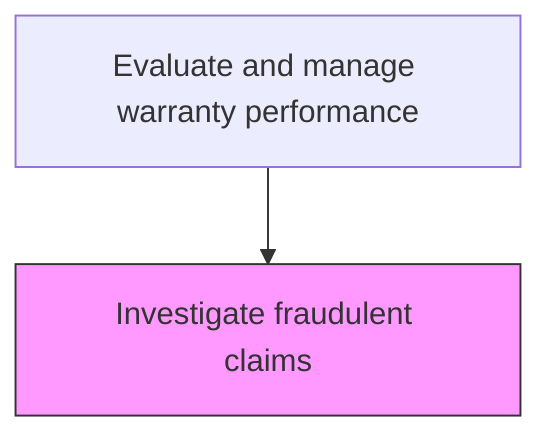
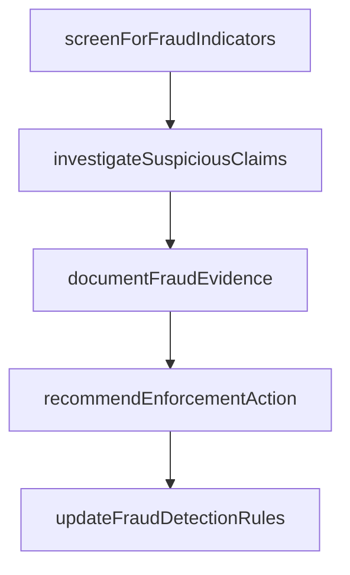

# Investigate fraudulent claims

> Business-as-Code definition for fraudulent warranty claim investigation. Models the detection, investigation, and resolution of potentially fraudulent warranty claims.

## Overview

Detecting, investigating, and resolving potentially fraudulent warranty claims to protect the organization from financial losses and maintain program integrity. Apply automated fraud detection rules and pattern-matching algorithms to screen incoming claims for anomalies such as duplicate submissions, excessive claim frequency, altered documentation, or out-of-warranty repairs disguised as covered events. Conduct detailed investigations of flagged claims by reviewing supporting documentation, interviewing claimants and service providers, and cross-referencing repair records. Document evidence for confirmed fraud cases, recommend enforcement actions including claim denial, dealer or supplier penalties, or referral to legal counsel, and continuously refine fraud detection criteria based on investigation findings.

## Process Hierarchy



## GraphDL

```yaml
investigate:
  object: Fraudulent Claims
  actor: WarrantyFraudInvestigator
  result: WarrantyFraudResult
```

## Actions

| Action | Description |
|--------|-------------|
| screenForFraudIndicators | Apply fraud detection rules and patterns to identify suspicious warranty claims |
| investigateSuspiciousClaims | Conduct detailed examination of flagged claims for evidence of fraud |
| documentFraudEvidence | Compile evidence and findings for confirmed fraudulent claim cases |
| recommendEnforcementAction | Propose actions such as claim denial, dealer penalties, or legal referral |
| updateFraudDetectionRules | Refine fraud screening criteria based on investigation findings |

## Events

| Event | Description |
|-------|-------------|
| fraudIndicatorsScreened | Fraud detection rules applied to identify suspicious warranty claims |
| suspiciousClaimsInvestigated | Flagged claims examined for evidence of fraud |
| fraudEvidenceDocumented | Evidence and findings for confirmed fraud cases compiled |
| enforcementActionRecommended | Actions such as claim denial or legal referral proposed |
| fraudDetectionRulesUpdated | Fraud screening criteria refined based on investigation findings |

## Searches

| Search | Description |
|--------|-------------|
| getFlaggedClaims | List warranty claims flagged for potential fraud by indicator type |
| getInvestigationCases | Retrieve active fraud investigation cases and their status |
| getFraudPatterns | Query known fraud patterns and detection rules |
| getFraudStatistics | Retrieve fraud detection and conviction statistics by period |

## Process Flow



## RACI Matrix

| Activity | Responsible | Accountable | Consulted | Informed |
|----------|-------------|-------------|-----------|----------|
| screenForFraudIndicators | Fraud Analytics Specialist | Warranty Fraud Investigation Manager | IT | Claims Team |
| investigateSuspiciousClaims | Warranty Fraud Investigator | Warranty Fraud Investigation Manager | Legal | Finance |
| recommendEnforcementAction | Warranty Fraud Investigator | Warranty Fraud Investigation Manager | Legal | Executive Team |

## Related Processes

| Process | Relationship |
|---------|-------------|
| 6.5.6.3 Identify opportunities to eliminate warranty waste | Related - fraud reduction eliminates warranty waste |
| 6.3.2 Process warranty claims | Upstream - claims data feeds fraud screening |
| 6.5.6.2 Monitor and report on warranty management metrics | Related - fraud metrics feed warranty performance reporting |

## Related Departments

| Department | Role |
|-----------|------|
| Fraud Investigation | Detects and investigates fraudulent warranty claims |
| Legal | Supports enforcement actions for confirmed fraud cases |
| Finance | Validates fraud cost avoidance calculations |

## Related Occupations

| Occupation | Involvement |
|-----------|-------------|
| Warranty Fraud Investigator | Investigates suspicious warranty claims for fraud |
| Fraud Analytics Specialist | Develops and maintains fraud detection rules and patterns |
| Legal Counsel | Advises on enforcement actions for confirmed fraud |

## KPIs

| KPI | Description | Unit |
|-----|-------------|------|
| Fraud Detection Rate | Percentage of fraudulent claims detected before payment | % |
| Investigation Closure Time | Average days to complete a fraud investigation | Days |
| False Positive Rate | Percentage of flagged claims determined to be legitimate | % |
| Fraud Cost Avoidance | Total warranty costs avoided through fraud detection | Currency |

## Usage

```typescript
import { investigateFraudulentClaims } from '@headlessly/investigate-fraudulent-claims'

const client = investigateFraudulentClaims()

// Screen claims for fraud indicators
const flagged = await client.screenForFraudIndicators({
  claimBatch: 'BATCH-2025-04',
  rules: ['duplicate-serial', 'excessive-frequency', 'geographic-anomaly']
})

// Investigate suspicious claim
const investigation = await client.investigateSuspiciousClaim({
  claimId: flagged[0].claimId,
  investigationType: 'full',
  gatherEvidence: true
})
```
