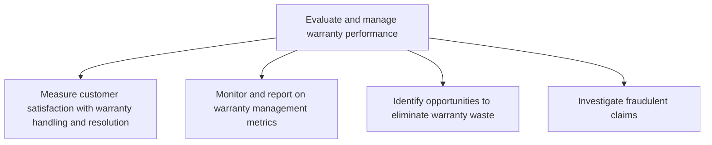
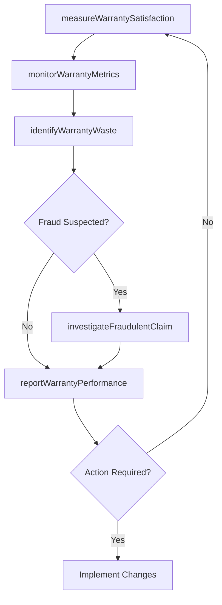

# Evaluate and manage warranty performance

> Business-as-Code definition for warranty performance evaluation and management. Models warranty satisfaction measurement, metrics reporting, waste elimination, and fraudulent claim investigation.

## Overview

Evaluating and managing the performance of warranty programs to ensure effective claim handling and cost control. Measure customer satisfaction with warranty processes, monitor warranty management metrics, identify opportunities to eliminate warranty waste, and investigate potentially fraudulent claims.

## Process Hierarchy



## GraphDL

```yaml
evaluate:
  object: And Manage Warranty Performance
  actor: WarrantyPerformanceAnalyst
  result: WarrantyPerformanceReport
```

## Actions

| Action | Description |
|--------|-------------|
| measureWarrantySatisfaction | Assess customer satisfaction with warranty claim handling and resolution |
| monitorWarrantyMetrics | Track and report on key warranty management performance indicators |
| identifyWarrantyWaste | Analyze warranty portfolios to find cost reduction and elimination opportunities |
| investigateFraudulentClaim | Examine suspicious warranty claims for potential fraud indicators |
| reportWarrantyPerformance | Compile warranty program performance data into executive reports |

## Events

| Event | Description |
|-------|-------------|
| warrantySatisfactionMeasured | Customer satisfaction with warranty handling assessed |
| warrantyMetricsMonitored | Warranty performance metrics collected and reported |
| warrantyWasteIdentified | Warranty cost reduction or elimination opportunity discovered |
| fraudulentClaimInvestigated | Suspicious warranty claim investigation completed |
| warrantyPerformanceReported | Warranty program performance report delivered |

## Searches

| Search | Description |
|--------|-------------|
| getWarrantyMetrics | Retrieve warranty performance metrics by product, period, or region |
| getWarrantySatisfactionScores | Query customer satisfaction data for warranty interactions |
| getFraudulentClaimCases | List investigated or flagged fraudulent warranty claims |
| getWarrantyCostAnalysis | Retrieve warranty cost data by product line or claim type |

## Process Flow



## RACI Matrix

| Activity | Responsible | Accountable | Consulted | Informed |
|----------|-------------|-------------|-----------|----------|
| measureWarrantySatisfaction | Warranty Analyst | VP After-Sales | CX Team | Product Management |
| monitorWarrantyMetrics | Warranty Analyst | Warranty Manager | Finance | Operations |
| identifyWarrantyWaste | Warranty Manager | VP After-Sales | Product, Supply Chain | Finance |
| investigateFraudulentClaim | Fraud Investigator | Warranty Manager | Legal | Finance, Compliance |

## Sub-Processes

| ID | Name | Description |
|----|------|-------------|
| 6.5.6.1 | Measure customer satisfaction with warranty handling and resolution | Assessing customer fulfillment with how warranty claims are handled and resolved |
| 6.5.6.2 | Monitor and report on warranty management metrics | Comparing warranties by using applicable metrics to see how they are handled and resolved. Develop a |
| 6.5.6.3 | Identify opportunities to eliminate warranty waste | Finding ways to phase out unused or seldom used warranties. |
| 6.5.6.4 | Investigate fraudulent claims | Examining suspicious warranty claims to detect and prevent fraud |

## Related Processes

| Process | Relationship |
|---------|-------------|
| 6.3.2 Process warranty claims | Upstream - warranty claim processing data feeds performance evaluation |
| 6.1.6 Define and manage warranty offering | Upstream - warranty policies define evaluation parameters |
| 6.3.3 Manage supplier recovery | Downstream - warranty waste findings inform supplier recovery actions |

## Related Departments

| Department | Role |
|-----------|------|
| After-Sales Service | Manages warranty operations and performance evaluation |
| Finance | Tracks warranty costs and financial impact |
| Quality Assurance | Links warranty data to product quality improvements |
| Legal | Supports fraud investigation and compliance |

## Related Occupations

| Occupation | Involvement |
|-----------|-------------|
| Warranty Performance Analyst | Monitors metrics and identifies waste reduction opportunities |
| Fraud Investigator | Examines suspicious claims and documents findings |
| Warranty Manager | Oversees warranty program performance and reporting |

## KPIs

| KPI | Description | Unit |
|-----|-------------|------|
| Warranty Cost as Percentage of Revenue | Total warranty costs relative to product revenue | % |
| Warranty Satisfaction Score | Customer rating of warranty claim experience | Score (1-5) |
| Fraudulent Claim Detection Rate | Percentage of fraudulent claims identified before payout | % |
| Warranty Waste Reduction | Year-over-year reduction in unnecessary warranty costs | % |

## Usage

```typescript
import { evaluateAndManageWarrantyPerformance } from '@headlessly/evaluate-and-manage-warranty-performance'

const warranty = evaluateAndManageWarrantyPerformance()

// Monitor warranty metrics
const metrics = await warranty.monitorWarrantyMetrics({
  productLines: ['electronics', 'appliances'],
  period: '2025-Q2',
  metrics: ['cost-per-claim', 'resolution-time', 'satisfaction']
})

// Investigate a flagged claim
const investigation = await warranty.investigateFraudulentClaim({
  claimId: 'WC-2025-4567',
  flaggedReason: 'duplicate-serial-number',
  priority: 'high'
})
```
