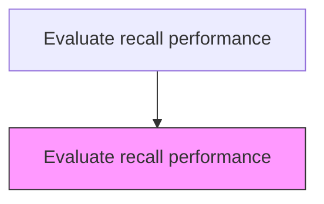
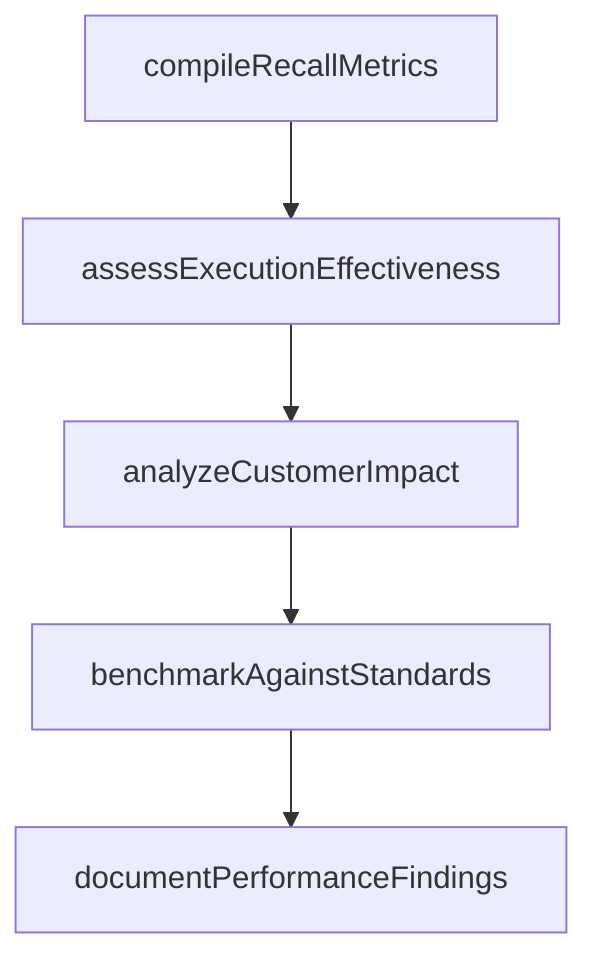

# Evaluate recall performance

> Business-as-Code definition for recall performance evaluation. Models the post-recall assessment of execution effectiveness, cost management, and customer impact to improve future recall readiness.

## Overview

Reviewing customer service feedback to identify areas in which improvements can be made. Engage with management to discuss issues.

## Process Hierarchy



## GraphDL

```yaml
evaluate:
  object: Recall Performance
  actor: RecallPerformanceAnalyst
  result: RecallPerformanceResult
```

## Actions

| Action | Description |
|--------|-------------|
| compileRecallMetrics | Gather completion rates, cost data, and timeline performance for the recall |
| assessExecutionEffectiveness | Evaluate how well the recall achieved its recovery and notification targets |
| analyzeCustomerImpact | Measure customer satisfaction and brand perception impact of the recall |
| benchmarkAgainstStandards | Compare recall performance against regulatory expectations and industry norms |
| documentPerformanceFindings | Publish the recall performance evaluation report with improvement recommendations |

## Events

| Event | Description |
|-------|-------------|
| recallMetricsCompiled | Completion rates, cost data, and timeline performance gathered |
| executionEffectivenessAssessed | Recall recovery and notification target achievement evaluated |
| customerImpactAnalyzed | Customer satisfaction and brand perception impact measured |
| standardsBenchmarked | Recall performance compared against regulatory and industry norms |
| performanceFindingsDocumented | Recall performance evaluation report published |

## Searches

| Search | Description |
|--------|-------------|
| getRecallPerformanceMetrics | Retrieve recall performance metrics by recall ID or period |
| getRecallCostAnalysis | Query cost breakdown for a completed recall |
| getCustomerImpactData | Retrieve customer satisfaction impact data for a recall |
| getRecallBenchmarks | Query industry benchmark data for recall performance |

## Process Flow



## RACI Matrix

| Activity | Responsible | Accountable | Consulted | Informed |
|----------|-------------|-------------|-----------|----------|
| compileRecallMetrics | Recall Performance Analyst | VP Quality | Finance | Regulatory Affairs |
| assessExecutionEffectiveness | Recall Performance Analyst | VP Quality | Service Operations | Executive Team |
| analyzeCustomerImpact | Customer Experience Analyst | VP Customer Service | Customer Insights | Marketing |

## Related Processes

| Process | Relationship |
|---------|-------------|
| 6.4.6 Monitor and audit recall effectiveness | Upstream - effectiveness data feeds performance evaluation |
| 6.4.8 Review recall strategy | Related - performance evaluation supports strategy review |
| 6.4.7 Manage recall termination | Upstream - terminated recall triggers performance evaluation |

## Related Departments

| Department | Role |
|-----------|------|
| Quality Assurance | Evaluates recall execution performance and produces reports |
| Finance | Provides cost data for recall performance assessment |
| Customer Insights | Measures customer satisfaction impact of the recall |

## Related Occupations

| Occupation | Involvement |
|-----------|-------------|
| Recall Performance Analyst | Evaluates recall metrics and produces performance reports |
| Financial Analyst | Analyzes recall cost performance against budget |
| Customer Experience Analyst | Measures customer and brand impact of the recall |

## KPIs

| KPI | Description | Unit |
|-----|-------------|------|
| Final Completion Rate | Percentage of affected units successfully remediated | % |
| Total Recall Cost | Total cost incurred for the recall execution | Currency |
| Customer Satisfaction Impact | Change in customer satisfaction scores attributable to the recall | Score delta |
| Timeline Adherence | Percentage of recall milestones completed on schedule | % |

## Usage

```typescript
import { evaluateRecallPerformance } from '@headlessly/evaluate-recall-performance'

const client = evaluateRecallPerformance()

// Compile recall performance metrics
const metrics = await client.compileRecallMetrics({
  recallId: 'RCL-2025-001',
  includeFinancials: true,
  includeCustomerImpact: true
})

// Assess execution effectiveness
const assessment = await client.assessExecutionEffectiveness({
  recallId: 'RCL-2025-001',
  targetCompletionRate: 95,
  targetTimeline: 90
})
```
