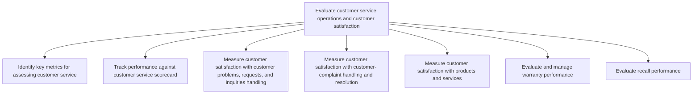
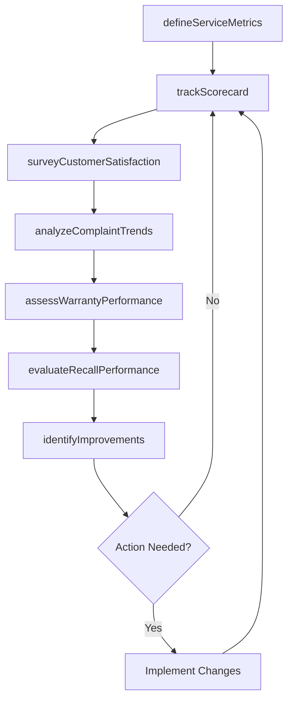

# Evaluate customer service operations and customer satisfaction

> Business-as-Code definition for customer service evaluation and satisfaction measurement. Models metrics identification, scorecard tracking, satisfaction surveys, complaint analysis, warranty performance, and recall effectiveness assessment.

## Overview

Calculating and assessing the operational activities of the customer service function. Evaluation is achieved through the customer requests/inquiries handling process, the customer complaint handling process, and product and services quality. Examine activities to ensure high levels of customer service.

## Process Hierarchy



## GraphDL

```yaml
evaluate:
  object: Customer Service Operations And Customer Satisfaction
  actor: CustomerInsightsAnalyst
  result: ServicePerformanceReport
```

## Actions

| Action | Description |
|--------|-------------|
| defineServiceMetrics | Identify and configure key metrics for customer service assessment |
| trackScorecard | Monitor and report performance against customer service scorecard |
| surveyCustomerSatisfaction | Collect customer feedback through surveys and feedback mechanisms |
| analyzeComplaintTrends | Identify patterns and root causes in customer complaint data |
| assessWarrantyPerformance | Evaluate warranty claim processing efficiency and cost metrics |
| evaluateRecallPerformance | Review recall execution effectiveness and customer impact |
| identifyImprovements | Analyze data to recommend operational improvement actions |

## Events

| Event | Description |
|-------|-------------|
| serviceMetricsDefined | Customer service KPIs and metrics framework established |
| scorecardTracked | Performance scorecard updated with current period data |
| customerSatisfactionSurveyed | Satisfaction survey results collected and tabulated |
| complaintTrendsAnalyzed | Complaint pattern analysis completed with findings |
| warrantyPerformanceAssessed | Warranty metrics review completed and reported |
| recallPerformanceEvaluated | Recall effectiveness assessment completed |
| improvementsIdentified | Service improvement recommendations delivered to stakeholders |

## Searches

| Search | Description |
|--------|-------------|
| getSatisfactionScores | Query CSAT, NPS, or CES scores by segment, channel, or period |
| getScorecardResults | Retrieve scorecard performance data against targets |
| getComplaintAnalysis | Query complaint trend data by category, product, or time period |
| getWarrantyMetrics | Retrieve warranty performance metrics and cost data |
| getImprovementRecommendations | List open improvement recommendations by priority |

## Process Flow



## RACI Matrix

| Activity | Responsible | Accountable | Consulted | Informed |
|----------|-------------|-------------|-----------|----------|
| defineServiceMetrics | Customer Insights Analyst | VP Customer Service | Operations, Finance | Executive Team |
| trackScorecard | Service Reporting Analyst | VP Customer Service | IT | Department Heads |
| surveyCustomerSatisfaction | Customer Insights Analyst | VP Customer Service | Marketing | Product Management |
| analyzeComplaintTrends | Data Analyst | VP Customer Service | Quality Assurance | Operations |
| identifyImprovements | Continuous Improvement Manager | VP Customer Service | All Service Teams | Executive Team |

## Sub-Processes

| ID | Name | Description |
|----|------|-------------|
| 6.5.1 | Identify key metrics for assessing customer service | Defining and selecting the performance indicators, benchmarks, and measurement criteria used to evaluate customer service effectiveness. |
| 6.5.2 | Track performance against customer service scorecard | Collecting, calculating, and reporting scorecard metrics to monitor service operations performance against established targets. |
| 6.5.3 | Measure customer satisfaction with customer problems, requests, and inquiries handling | Calculating satisfaction levels of customers by effectively evaluating the process of handling reque |
| 6.5.4 | Measure customer satisfaction with customer- complaint handling and resolution | Measuring the satisfaction level of customers as pertains to how their complaints are handled and re |
| 6.5.5 | Measure customer satisfaction with products and services | Calculating satisfaction levels of customers with products/services. Obtain customer feedback on pro |
| 6.5.6 | Evaluate and manage warranty performance | Measuring warranty program effectiveness including claim resolution quality, cost management, fraud detection, and opportunities to reduce warranty waste. |
| 6.5.7 | Evaluate recall performance | Reviewing customer service feedback to identify areas in which improvements can be made. Engage with |

## Related Processes

| Process | Relationship |
|---------|-------------|
| 6.1 Develop customer care/customer service strategy | Feedback loop - evaluation findings drive strategy updates |
| 6.2 Plan and manage customer service operations | Upstream - operations data feeds evaluation |
| 6.3 Service products after sales | Upstream - warranty and service data feeds evaluation |
| 6.4 Manage product recalls and regulatory audits | Upstream - recall execution data feeds evaluation |

## Related Departments

| Department | Role |
|-----------|------|
| Customer Insights | Primary owner of satisfaction measurement and analysis |
| Customer Service | Provides operational data and participates in improvement initiatives |
| Quality Assurance | Collaborates on quality metrics and process improvements |
| Product Management | Receives product satisfaction feedback for development decisions |
| Marketing | Uses satisfaction data to inform brand and messaging strategies |

## Related Occupations

| Occupation | Involvement |
|-----------|-------------|
| Customer Insights Analyst | Designs surveys and analyzes satisfaction data |
| Service Quality Manager | Monitors operational quality and drives improvements |
| Data Analyst | Produces dashboards and trend analyses |
| Voice of Customer Manager | Synthesizes feedback into actionable recommendations |

## KPIs

| KPI | Description | Unit |
|-----|-------------|------|
| Net Promoter Score (NPS) | Customer likelihood to recommend based on service experience | Score (-100 to 100) |
| Customer Satisfaction Score (CSAT) | Average satisfaction rating across service interactions | Score (1-5) |
| Customer Effort Score (CES) | Ease of resolving issues as rated by customers | Score (1-7) |
| Survey Response Rate | Percentage of surveyed customers who provide feedback | % |
| Improvement Implementation Rate | Percentage of identified improvements that are implemented | % |

## Usage

```typescript
import { evaluateCustomerServiceOperationsAndCustomerSatisfaction } from '@headlessly/evaluate-customer-service-operations-and-customer-satisfaction'

const evaluation = evaluateCustomerServiceOperationsAndCustomerSatisfaction()

// Survey customer satisfaction
const surveyResults = await evaluation.surveyCustomerSatisfaction({
  segment: 'enterprise',
  channel: 'post-interaction',
  surveyType: 'CSAT',
  sampleSize: 500
})

// Analyze complaint trends
const trends = await evaluation.analyzeComplaintTrends({
  period: '2025-Q4',
  groupBy: 'category',
  minOccurrences: 10
})
```
