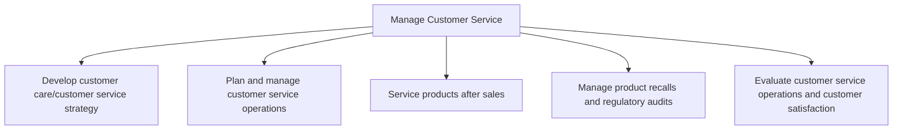
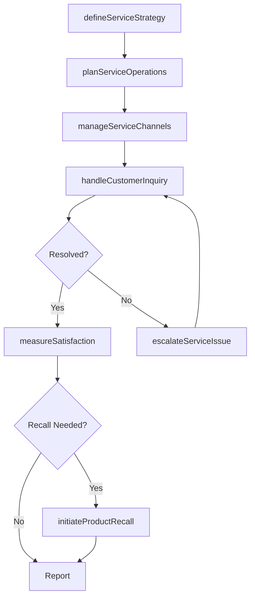

# Manage Customer Service

> Business-as-Code definition for end-to-end customer service management. Models the complete lifecycle of customer care strategy, service operations, post-sales support, product recalls, and satisfaction measurement.

## Overview

Managing customers before and after the delivery of services. This includes developing and planning customer service practices with an eye on steering processes relating to inquiries after sales, feedback, warranties, and recalls.

## Process Hierarchy



## GraphDL

```yaml
manage:
  object: Customer Service
  actor: CustomerServiceDirector
  result: ServiceExcellenceOutcome
```

## Actions

| Action | Description |
|--------|-------------|
| defineServiceStrategy | Establish customer care strategy aligned with business objectives |
| planServiceOperations | Plan and allocate resources for customer service delivery |
| handleCustomerInquiry | Receive and resolve customer problems, requests, and inquiries |
| processWarrantyClaim | Manage warranty claims from receipt through resolution |
| initiateProductRecall | Execute product recall procedures for safety or quality issues |
| measureSatisfaction | Collect and analyze customer satisfaction metrics |
| manageServiceChannels | Coordinate omnichannel customer service delivery |
| escalateServiceIssue | Escalate unresolved issues to appropriate resolution teams |

## Events

| Event | Description |
|-------|-------------|
| serviceStrategyDefined | Customer service strategy established and communicated |
| serviceOperationsPlanned | Service operations plan approved and resourced |
| customerInquiryHandled | Customer inquiry received and resolved or escalated |
| warrantyClaimProcessed | Warranty claim adjudicated and outcome communicated |
| productRecallInitiated | Product recall activated and customer notifications sent |
| satisfactionMeasured | Customer satisfaction survey completed and scored |
| serviceChannelsManaged | Service channel performance reviewed and optimized |
| serviceIssueEscalated | Unresolved issue escalated to higher-tier support |

## Searches

| Search | Description |
|--------|-------------|
| findOpenCases | Retrieve open customer service cases filtered by channel, priority, or agent |
| getCustomerHistory | Retrieve full service interaction history for a customer |
| getSatisfactionScores | Query customer satisfaction scores by segment, period, or channel |
| getWarrantyClaims | List warranty claims filtered by status, product, or date range |
| getRecallStatus | Retrieve current product recall status and affected customer counts |

## Process Flow



## RACI Matrix

| Activity | Responsible | Accountable | Consulted | Informed |
|----------|-------------|-------------|-----------|----------|
| defineServiceStrategy | VP Customer Service | Chief Customer Officer | Marketing, Sales | Executive Team |
| planServiceOperations | Service Operations Manager | VP Customer Service | IT, Finance | HR |
| handleCustomerInquiry | Customer Service Agent | Service Operations Manager | Product Team | Quality Assurance |
| processWarrantyClaim | Warranty Specialist | VP Customer Service | Legal, Engineering | Finance |
| measureSatisfaction | Customer Insights Analyst | VP Customer Service | Marketing | Executive Team |

## Sub-Processes

| ID | Name | Description |
|----|------|-------------|
| 6.1 | Develop customer care/customer service strategy | Defining a plan that removes customer obstacles by gathering operational insight and competitive ins |
| 6.2 | Plan and manage customer service operations | Planning and managing customer service operations including workforce scheduling, complaint handling, returns processing, and incident reporting to deliver consistent service quality. |
| 6.3 | Service products after sales | Assigning post-sales policies and paying claims on purchased products.  This is a process that is an |
| 6.4 | Manage product recalls and regulatory audits | Managing effective product recalls. To effectively manage product recalls, develop and initiate a cl |
| 6.5 | Evaluate customer service operations and customer satisfaction | Calculating and assessing the operational activities of the customer service function. Evaluation is |

## Related Processes

| Process | Relationship |
|---------|-------------|
| 3.0 Market and Sell Products and Services | Upstream - generates customer relationships requiring service |
| 4.0 Deliver Products and Services | Upstream - delivery issues drive service interactions |
| 5.0 Manage Customer Service | Parallel - shared customer lifecycle management |
| 8.0 Manage Information Technology | Enabling - provides CRM and service platform infrastructure |

## Related Departments

| Department | Role |
|-----------|------|
| Customer Service | Primary owner of all service operations and customer interactions |
| Quality Assurance | Monitors service quality standards and compliance |
| Product Management | Provides product expertise and manages recalls |
| Sales | Collaborates on upsell opportunities and customer retention |
| Information Technology | Maintains CRM systems and service delivery platforms |

## Related Occupations

| Occupation | Involvement |
|-----------|-------------|
| Customer Service Manager | Oversees day-to-day service operations and team performance |
| Customer Service Representative | Frontline handler of inquiries, complaints, and requests |
| Quality Assurance Analyst | Evaluates service interactions and identifies improvement areas |
| Warranty Claims Specialist | Processes and adjudicates warranty and return claims |

## KPIs

| KPI | Description | Unit |
|-----|-------------|------|
| Customer Satisfaction Score (CSAT) | Average satisfaction rating across all service interactions | Score (1-5) |
| First Contact Resolution Rate | Percentage of inquiries resolved on first interaction | % |
| Average Handle Time | Mean duration of customer service interactions | Minutes |
| Net Promoter Score (NPS) | Customer likelihood to recommend based on service experience | Score (-100 to 100) |
| Service Level Agreement Compliance | Percentage of cases resolved within SLA targets | % |

## Usage

```typescript
import { manageCustomerService } from '@headlessly/manage-customer-service'

const service = manageCustomerService()

// Handle a customer inquiry
const case = await service.handleCustomerInquiry({
  customerId: 'cust_12345',
  channel: 'phone',
  category: 'billing',
  priority: 'high'
})

// Measure satisfaction for a segment
const scores = await service.measureSatisfaction({
  segment: 'enterprise',
  period: 'Q4-2025',
  channels: ['phone', 'email', 'chat']
})
```
