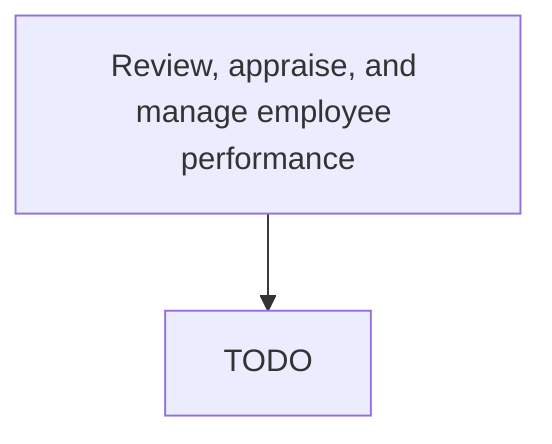

# Review, appraise, and manage employee performance

> TODO: Business-as-Code definition for review, appraise, and manage employee performance (automotive)

## Overview

Refurbishing, appraising, and managing the performance of employees. Create performance reviews for all the employees by qualitatively and quantitatively measuring them. Use the reviews to provide performance appraisals. Monitor under-performing employees.

## Process Hierarchy



## GraphDL

```yaml
review,:
  object: Appraise, And Manage Employee Performance
  actor: TODO
  result: TODO
```

## Actions

| Action | Description |
|--------|-------------|
| TODO | TODO |

## Events

| Event | Description |
|-------|-------------|
| TODO | TODO |

## Searches

| Search | Description |
|--------|-------------|
| TODO | TODO |

## Process Flow


## RACI Matrix

| Activity | Responsible | Accountable | Consulted | Informed |
|----------|-------------|-------------|-----------|----------|
| TODO | TODO | TODO | TODO | TODO |

## Related Processes

| Process | Relationship |
|---------|-------------|
| TODO | TODO |

## Related Departments

| Department | Role |
|-----------|------|
| TODO | TODO |

## Related Occupations

| Occupation | Involvement |
|-----------|-------------|
| TODO | TODO |

## KPIs

| KPI | Description | Unit |
|-----|-------------|------|
| TODO | TODO | TODO |

## Usage

```typescript
import { TODO } from '@headlessly/review,-appraise,-and-manage-employee-performance'

const client = TODO()

// TODO: Example action calls
```
