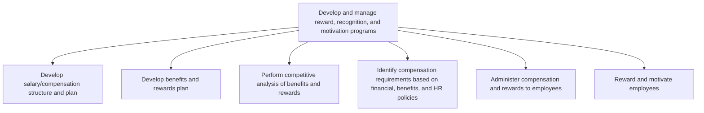

# Develop and manage reward, recognition, and motivation programs

> TODO: Business-as-Code definition for develop and manage reward, recognition, and motivation programs (automotive)

## Overview

Developing a salary/compensation structure and plan; developing a benefits and reward plan; develop commission plan; performing competitive analyses of benefits and rewards; identifying compensation requirements based on compensation, benefits, and HR policies; administering compensation, commission, and rewards to employees; and rewarding and motivating employees.

## Process Hierarchy



## GraphDL

```yaml
develop:
  object: And Manage Reward, Recognition, And Motivation Programs
  actor: TODO
  result: TODO
```

## Actions

| Action | Description |
|--------|-------------|
| TODO | TODO |

## Events

| Event | Description |
|-------|-------------|
| TODO | TODO |

## Searches

| Search | Description |
|--------|-------------|
| TODO | TODO |

## Process Flow


## RACI Matrix

| Activity | Responsible | Accountable | Consulted | Informed |
|----------|-------------|-------------|-----------|----------|
| TODO | TODO | TODO | TODO | TODO |

## Sub-Processes

| ID | Name | Description |
|----|------|-------------|
| 7.5.1.1 | Develop salary/compensation structure and plan | Creating the framework for the provision of salary/compensation to employees. Break down the salary  |
| 7.5.1.2 | Develop benefits and rewards plan | Developing a plan for provision of rewards, commission, and benefits to employees. Plan health benef |
| 7.5.1.3 | Perform competitive analysis of benefits and rewards | Analyzing and evaluating the organization's benefits and rewards plan. Compare/Benchmark the benefit |
| 7.5.1.4 | Identify compensation requirements based on financial, benefits, and HR policies | Recognizing the employee requirements for compensation on the basis of the financial, benefits, and  |
| 7.5.1.5 | Administer compensation and rewards to employees | Managing the provision of compensations and rewards to the employees while maintaining consistency w |
| 7.5.1.6 | Reward and motivate employees | Rewarding and stimulating the performance efforts of employees. Create methods for motivating employ |

## Related Processes

| Process | Relationship |
|---------|-------------|
| TODO | TODO |

## Related Departments

| Department | Role |
|-----------|------|
| TODO | TODO |

## Related Occupations

| Occupation | Involvement |
|-----------|-------------|
| TODO | TODO |

## KPIs

| KPI | Description | Unit |
|-----|-------------|------|
| TODO | TODO | TODO |

## Usage

```typescript
import { TODO } from '@headlessly/develop-and-manage-reward,-recognition,-and-motivation-programs'

const client = TODO()

// TODO: Example action calls
```
