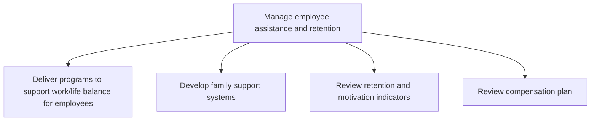

# Manage employee assistance and retention

> TODO: Business-as-Code definition for manage employee assistance and retention (consumer-products)

## Overview

Managing activities centered around delivering programs to support work/life balance for employees; developing family support systems; reviewing retention and motivation indicators; and reviewing compensation plans.

## Process Hierarchy



## GraphDL

```yaml
manage:
  object: Employee Assistance And Retention
  actor: TODO
  result: TODO
```

## Actions

| Action | Description |
|--------|-------------|
| TODO | TODO |

## Events

| Event | Description |
|-------|-------------|
| TODO | TODO |

## Searches

| Search | Description |
|--------|-------------|
| TODO | TODO |

## Process Flow


## RACI Matrix

| Activity | Responsible | Accountable | Consulted | Informed |
|----------|-------------|-------------|-----------|----------|
| TODO | TODO | TODO | TODO | TODO |

## Sub-Processes

| ID | Name | Description |
|----|------|-------------|
| 7.5.3.1 | Deliver programs to support work/life balance for employees | Designing programs that prompt proper balance between work (i.e., career and ambition) and lifestyle |
| 7.5.3.2 | Develop family support systems | Creating a support structure that aligns with local and federal laws that allow for support for fami |
| 7.5.3.3 | Review retention and motivation indicators | Reassessing the indicators for retention and motivation of employees. Monitor the indicators that si |
| 7.5.3.4 | Review compensation plan | Analyzing existing compensation plans and making changes necessary to continue to retain employees. |

## Related Processes

| Process | Relationship |
|---------|-------------|
| TODO | TODO |

## Related Departments

| Department | Role |
|-----------|------|
| TODO | TODO |

## Related Occupations

| Occupation | Involvement |
|-----------|-------------|
| TODO | TODO |

## KPIs

| KPI | Description | Unit |
|-----|-------------|------|
| TODO | TODO | TODO |

## Usage

```typescript
import { TODO } from '@headlessly/manage-employee-assistance-and-retention'

const client = TODO()

// TODO: Example action calls
```
