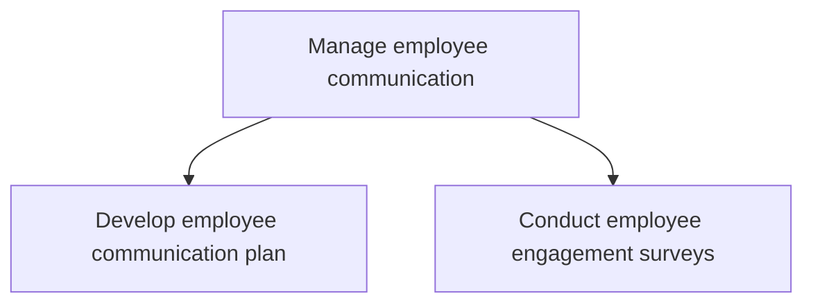

# Manage employee communication

> TODO: Business-as-Code definition for manage employee communication (life-sciences)

## Overview

Creating an effective plan that initiates and promotes communication and engagement among the employees and between employees and management.

## Process Hierarchy



## GraphDL

```yaml
manage:
  object: Employee Communication
  actor: TODO
  result: TODO
```

## Actions

| Action | Description |
|--------|-------------|
| TODO | TODO |

## Events

| Event | Description |
|-------|-------------|
| TODO | TODO |

## Searches

| Search | Description |
|--------|-------------|
| TODO | TODO |

## Process Flow


## RACI Matrix

| Activity | Responsible | Accountable | Consulted | Informed |
|----------|-------------|-------------|-----------|----------|
| TODO | TODO | TODO | TODO | TODO |

## Sub-Processes

| ID | Name | Description |
|----|------|-------------|
| 7.8.1 | Develop employee communication plan | Creating a plan for managing communication among employees. Inform employees of direction. Counter r |
| 7.8.2 | Conduct employee engagement surveys | Questioning employees to ascertain overall workplace satisfaction. |

## Related Processes

| Process | Relationship |
|---------|-------------|
| TODO | TODO |

## Related Departments

| Department | Role |
|-----------|------|
| TODO | TODO |

## Related Occupations

| Occupation | Involvement |
|-----------|-------------|
| TODO | TODO |

## KPIs

| KPI | Description | Unit |
|-----|-------------|------|
| TODO | TODO | TODO |

## Usage

```typescript
import { TODO } from '@headlessly/manage-employee-communication'

const client = TODO()

// TODO: Example action calls
```
