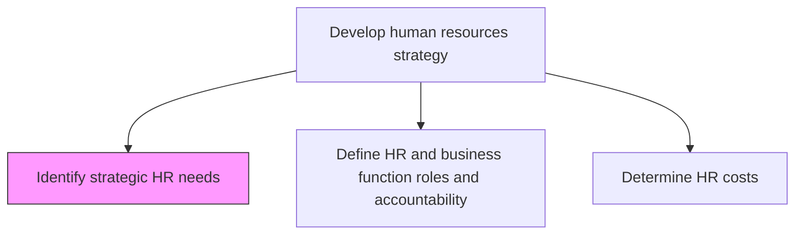
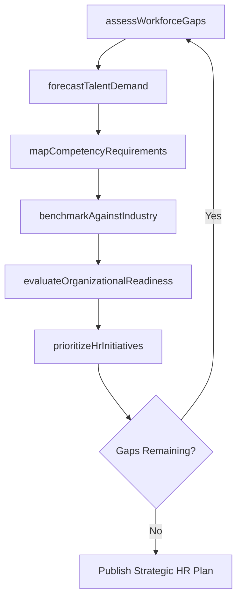

# Identify strategic HR needs

> Business-as-Code definition for strategic human resources needs identification. Models the process of assessing current workforce capabilities, forecasting future talent demands, and aligning human capital priorities with business strategy.

## Overview

Strategically defining the current and future needs for developing an efficient HR strategy. Analyze the organization's workforce against its strategic plan to surface capability gaps, anticipate leadership pipeline shortfalls, and quantify talent demand across business units and geographies. The output drives downstream planning for roles, costs, and measures.

## Process Hierarchy



## GraphDL

```yaml
identify:
  object: Strategic HR Needs
  actor: HrStrategyDirector
  result: StrategicNeedsAssessment
```

## Actions

| Action | Description |
|--------|-------------|
| assessWorkforceGaps | Analyze gaps between current workforce capabilities and strategic requirements |
| forecastTalentDemand | Project future headcount and skill needs based on business growth plans |
| evaluateOrganizationalReadiness | Gauge the organization's ability to execute strategy with existing talent |
| prioritizeHrInitiatives | Rank HR initiatives by strategic impact and implementation urgency |
| mapCompetencyRequirements | Identify critical competencies needed across business units and role families |
| benchmarkAgainstIndustry | Compare workforce composition and capability metrics to industry peers |

## Events

| Event | Description |
|-------|-------------|
| workforceGapsAssessed | Workforce gap analysis completed and documented |
| talentDemandForecasted | Future talent demand projections published for planning period |
| organizationalReadinessEvaluated | Organizational readiness assessment finalized |
| hrInitiativesPrioritized | HR initiative ranking approved by leadership |
| competencyRequirementsMapped | Competency requirements mapped to business units |
| industryBenchmarked | Industry benchmark comparison report delivered |

## Searches

| Search | Description |
|--------|-------------|
| findWorkforceGaps | Retrieve workforce gaps filtered by department, role, or skill area |
| getTalentForecast | Get talent demand projections for a given planning period |
| getCompetencyMap | Retrieve competency requirements by business unit or role family |
| listHrInitiatives | List prioritized HR initiatives filtered by status or impact level |

## Process Flow



## RACI Matrix

| Activity | Responsible | Accountable | Consulted | Informed |
|----------|-------------|-------------|-----------|----------|
| assessWorkforceGaps | HrAnalyst | CHRO | DepartmentHeads | CEO |
| forecastTalentDemand | WorkforcePlanner | VP HR | FinanceDirector | BusinessUnitLeaders |
| mapCompetencyRequirements | TalentManagementLead | CHRO | LineManagers | LearningTeam |
| prioritizeHrInitiatives | HrStrategyDirector | CHRO | ExecutiveTeam | AllEmployees |

## Related Processes

| Process | Relationship |
|---------|-------------|
| 7.1.1.2 Define HR and business function roles and accountability | Downstream - roles informed by strategic needs |
| 7.1.1.3 Determine HR costs | Downstream - cost projections driven by identified needs |
| 7.1.2 Develop and implement workforce strategy and policies | Consumer - translates needs into workforce plans |

## Related Departments

| Department | Role |
|-----------|------|
| Human Resources | Primary owner of strategic HR needs identification |
| Finance | Provides budget constraints and financial projections |
| Strategy | Supplies organizational strategic direction and goals |
| Operations | Communicates operational workforce requirements |

## Related Occupations

| Occupation | Involvement |
|-----------|-------------|
| HR Strategy Director | Leads strategic needs assessment |
| Workforce Planner | Develops talent demand forecasts |
| Organizational Development Specialist | Evaluates organizational readiness |

## KPIs

| KPI | Description | Unit |
|-----|-------------|------|
| Workforce Gap Ratio | Percentage of roles with identified skill gaps | % |
| Forecast Accuracy | Accuracy of talent demand predictions vs. actuals | % |
| Strategic Alignment Score | Degree to which HR priorities align with business strategy | Score (1-10) |
| Time to Identify Needs | Average cycle time for completing needs assessment | Days |

## Usage

```typescript
import { identifyStrategicHrNeeds } from '@headlessly/identify-strategic-hr-needs'

const hrNeeds = identifyStrategicHrNeeds()

// Assess workforce gaps across all departments
const gaps = await hrNeeds.assessWorkforceGaps({
  scope: 'organization',
  planningHorizon: '3-year',
  includeContingent: true
})

// Forecast talent demand for engineering
const forecast = await hrNeeds.forecastTalentDemand({
  department: 'Engineering',
  period: 'FY2026',
  growthScenario: 'moderate'
})
```
