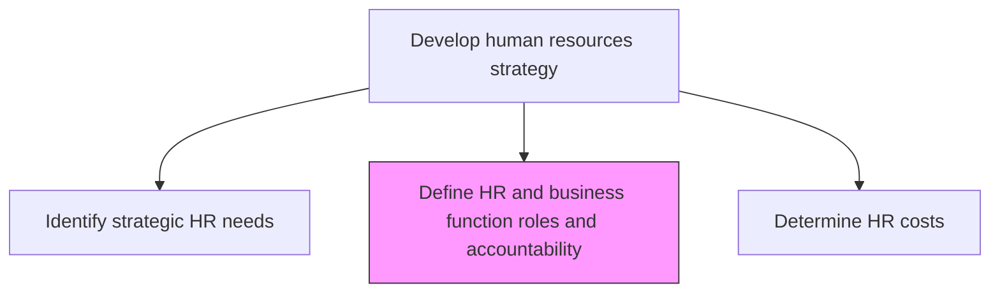
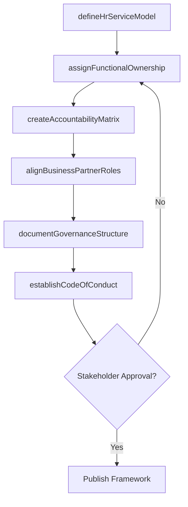

# Define HR and business function roles and accountability

> Business-as-Code definition for establishing responsibilities, governance structures, and accountability frameworks for the HR function and its interaction with business units.

## Overview

Outlining the charge and duty of the HR function by defining its responsibility areas, as well as ensuring its accountability. Establish the HR function by laying out the roles and responsibilities for this function and the rules and regulations guiding HR. Define the goals and objectives of the HR, as well as a mission and vision for this function. Create a mechanism involving a set of policies, code of conduct, and institutional procedure to ensure HR accountability.

## Process Hierarchy



## GraphDL

```yaml
define:
  object: HR And Business Function Roles And Accountability
  actor: HrDirector
  result: RolesAndAccountabilityFramework
```

## Actions

| Action | Description |
|--------|-------------|
| defineHrServiceModel | Establish the operating model for HR service delivery (shared services, COEs, embedded) |
| assignFunctionalOwnership | Allocate ownership of HR processes to specific roles and teams |
| createAccountabilityMatrix | Build a RACI matrix mapping HR activities to responsible parties |
| documentGovernanceStructure | Formalize the decision-making hierarchy and escalation paths |
| alignBusinessPartnerRoles | Define how HR business partners interface with line management |
| establishCodeOfConduct | Create behavioral standards and ethical guidelines for HR operations |

## Events

| Event | Description |
|-------|-------------|
| hrServiceModelDefined | HR service delivery model documented and approved |
| functionalOwnershipAssigned | Process ownership allocated to designated roles |
| accountabilityMatrixCreated | Accountability matrix published and distributed |
| governanceStructureDocumented | Governance framework ratified by executive leadership |
| businessPartnerRolesAligned | HR business partner roles mapped to business units |
| codeOfConductEstablished | HR code of conduct approved and communicated |

## Searches

| Search | Description |
|--------|-------------|
| findRoleDefinitions | Retrieve HR role definitions filtered by function or business unit |
| getAccountabilityMatrix | Get the current accountability matrix for a given HR process area |
| listGovernanceDecisions | List governance decisions filtered by date, topic, or authority level |
| getServiceModelDetails | Retrieve details of the current HR service delivery model |

## Process Flow



## RACI Matrix

| Activity | Responsible | Accountable | Consulted | Informed |
|----------|-------------|-------------|-----------|----------|
| defineHrServiceModel | HrDirector | CHRO | COO | AllManagers |
| assignFunctionalOwnership | HrOperationsManager | HrDirector | DepartmentHeads | HrStaff |
| createAccountabilityMatrix | HrBusinessPartner | HrDirector | LegalCounsel | ExecutiveTeam |
| documentGovernanceStructure | HrDirector | CHRO | CEO | BoardOfDirectors |

## Related Processes

| Process | Relationship |
|---------|-------------|
| 7.1.1.1 Identify strategic HR needs | Upstream - strategic needs drive role definitions |
| 7.1.1.3 Determine HR costs | Downstream - cost modeling depends on operating model |
| 7.1.2.10 Develop HR policies | Downstream - policies codify accountability rules |

## Related Departments

| Department | Role |
|-----------|------|
| Human Resources | Primary owner defining HR roles and accountability |
| Legal | Ensures compliance of governance structures with regulations |
| Executive Office | Approves high-level governance and accountability frameworks |
| Operations | Collaborates on business function role delineation |

## Related Occupations

| Occupation | Involvement |
|-----------|-------------|
| HR Director | Leads role and accountability definition |
| HR Business Partner | Translates roles into business unit partnerships |
| Organizational Development Specialist | Designs governance structures |

## KPIs

| KPI | Description | Unit |
|-----|-------------|------|
| Role Clarity Score | Percentage of HR roles with documented responsibilities | % |
| Governance Compliance Rate | Adherence to documented governance procedures | % |
| Accountability Matrix Coverage | Proportion of HR processes mapped to RACI assignments | % |
| Stakeholder Satisfaction | Satisfaction rating from business unit leaders on HR accountability | Score (1-5) |

## Usage

```typescript
import { defineHrAndBusinessFunctionRolesAndAccountability } from '@headlessly/define-hr-and-business-function-roles-and-accountability'

const roles = defineHrAndBusinessFunctionRolesAndAccountability()

// Define the HR service delivery model
const serviceModel = await roles.defineHrServiceModel({
  modelType: 'shared-services',
  businessUnits: ['Engineering', 'Sales', 'Operations'],
  centralizedFunctions: ['payroll', 'compliance', 'benefits']
})

// Create accountability matrix for talent acquisition
const matrix = await roles.createAccountabilityMatrix({
  processArea: 'talent-acquisition',
  stakeholders: ['HiringManager', 'Recruiter', 'HRBP', 'CHRO']
})
```
