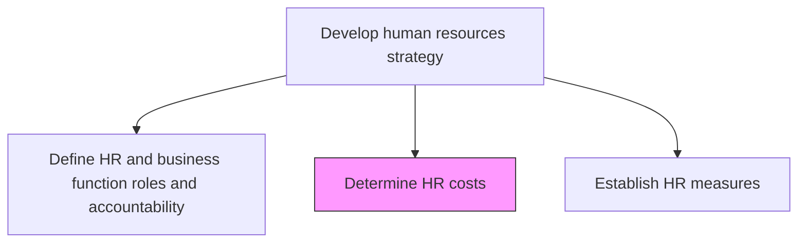
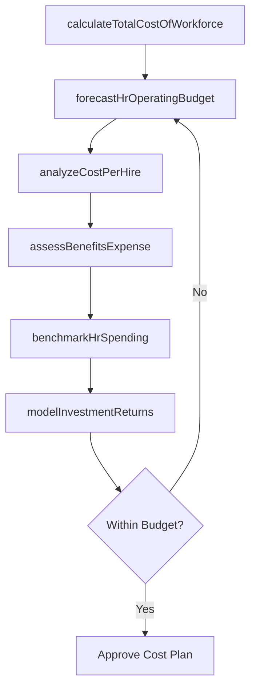

# Determine HR costs

> Business-as-Code definition for calculating and forecasting the total cost of human resources operations, programs, and investments.

## Overview

Ascertaining the costs and expenses of the HR function. Identify and report HR investments using, for example, a cost approach or a present value of future earnings approach. Encompasses fully-loaded labor costs, benefits expense, program spend, technology investments, and HR departmental overhead.

## Process Hierarchy



## GraphDL

```yaml
determine:
  object: HR Costs
  actor: HrFinanceAnalyst
  result: HrCostModel
```

## Actions

| Action | Description |
|--------|-------------|
| calculateTotalCostOfWorkforce | Compute fully-loaded labor costs including salary, benefits, and overhead |
| forecastHrOperatingBudget | Project the annual HR department operating budget by line item |
| analyzeCostPerHire | Calculate the average cost to recruit and onboard a new employee |
| assessBenefitsExpense | Evaluate the total cost of employee benefits programs and trends |
| benchmarkHrSpending | Compare HR spend ratios against industry benchmarks and peers |
| modelInvestmentReturns | Project the ROI of proposed HR programs and technology investments |

## Events

| Event | Description |
|-------|-------------|
| totalCostCalculated | Total cost of workforce analysis completed |
| operatingBudgetForecasted | HR operating budget forecast published |
| costPerHireAnalyzed | Cost-per-hire analysis updated with current data |
| benefitsExpenseAssessed | Benefits cost evaluation finalized |
| hrSpendingBenchmarked | HR spending comparison report delivered |
| investmentReturnsModeled | HR investment ROI projections completed |

## Searches

| Search | Description |
|--------|-------------|
| getCostBreakdown | Retrieve HR cost breakdown by category, department, or program |
| findCostTrends | Analyze HR cost trends over specified time periods |
| getBenchmarkComparisons | Get industry benchmark comparisons for HR spending ratios |
| getCostPerHireHistory | Retrieve historical cost-per-hire data by role or department |

## Process Flow



## RACI Matrix

| Activity | Responsible | Accountable | Consulted | Informed |
|----------|-------------|-------------|-----------|----------|
| calculateTotalCostOfWorkforce | HrFinanceAnalyst | VP HR | CFO | CHRO |
| forecastHrOperatingBudget | HrFinanceAnalyst | CHRO | FinanceDirector | DepartmentHeads |
| benchmarkHrSpending | CompensationAnalyst | VP HR | ExternalConsultant | ExecutiveTeam |
| modelInvestmentReturns | HrFinanceAnalyst | CHRO | CFO | Board |

## Related Processes

| Process | Relationship |
|---------|-------------|
| 7.1.1.1 Identify strategic HR needs | Upstream - needs inform cost projections |
| 7.1.1.4 Establish HR measures | Downstream - measures include cost efficiency metrics |
| 7.1.2.12 Plan employee benefits | Related - benefits are a major HR cost driver |

## Related Departments

| Department | Role |
|-----------|------|
| Human Resources | Provides HR program cost data and forecasts |
| Finance | Validates cost models and budget assumptions |
| Accounting | Tracks actual HR expenditures against budget |
| Executive Office | Approves HR budget allocations |

## Related Occupations

| Occupation | Involvement |
|-----------|-------------|
| HR Finance Analyst | Primary executor of cost analysis |
| Compensation and Benefits Manager | Provides benefits cost data |
| Financial Controller | Validates financial models and assumptions |

## KPIs

| KPI | Description | Unit |
|-----|-------------|------|
| HR Cost as Percentage of Revenue | Total HR spend relative to organizational revenue | % |
| Cost per Employee | Annual HR operating cost divided by total headcount | USD |
| Cost per Hire | Average total cost to fill an open position | USD |
| Budget Variance | Difference between forecasted and actual HR spend | % |

## Usage

```typescript
import { determineHrCosts } from '@headlessly/determine-hr-costs'

const costs = determineHrCosts()

// Calculate total cost of workforce
const totalCost = await costs.calculateTotalCostOfWorkforce({
  fiscalYear: 'FY2026',
  includeContingent: true,
  costComponents: ['salary', 'benefits', 'overhead', 'training']
})

// Benchmark HR spending against industry
const benchmark = await costs.benchmarkHrSpending({
  industry: 'Technology',
  companySize: '1000-5000',
  metrics: ['costPerEmployee', 'hrToRevenueRatio']
})
```
