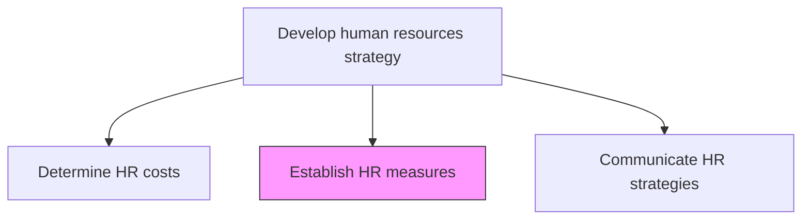
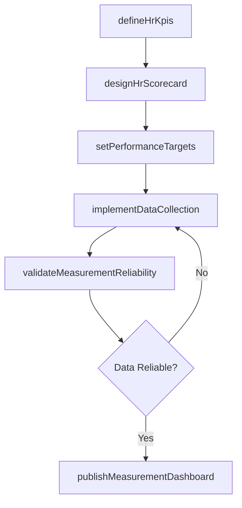

# Establish HR measures

> Business-as-Code definition for defining key performance indicators, scorecards, and measurement frameworks to evaluate the effectiveness of human resources programs and operations.

## Overview

Evaluating the performance of the HR function. Lay out the course of HR procedures that would formulate a plan of action needed to fulfill strategic HR needs. Deploy measures such as hiring policies, leave management, internal code of conducts, and compensation structure. Design balanced scorecards linking HR outcomes to business results, and implement the data collection and reporting infrastructure to support ongoing measurement.

## Process Hierarchy



## GraphDL

```yaml
establish:
  object: HR Measures
  actor: HrAnalyticsManager
  result: HrMeasurementFramework
```

## Actions

| Action | Description |
|--------|-------------|
| defineHrKpis | Identify and define key performance indicators for each HR process area |
| designHrScorecard | Create a balanced scorecard linking HR metrics to business outcomes |
| setPerformanceTargets | Establish target values and thresholds for each HR metric |
| implementDataCollection | Set up systems and processes to capture HR measurement data |
| validateMeasurementReliability | Test and confirm the accuracy and consistency of HR measurements |
| publishMeasurementDashboard | Deploy dashboards for ongoing monitoring of HR performance |

## Events

| Event | Description |
|-------|-------------|
| hrKpisDefined | HR key performance indicators documented and approved |
| hrScorecardDesigned | HR balanced scorecard created and validated |
| performanceTargetsSet | Metric targets and thresholds established |
| dataCollectionImplemented | HR data collection processes activated |
| measurementReliabilityValidated | Measurement reliability testing completed |
| dashboardPublished | HR performance dashboard deployed to stakeholders |

## Searches

| Search | Description |
|--------|-------------|
| findHrKpis | Retrieve HR KPIs filtered by process area, business unit, or category |
| getScorecardResults | Get current balanced scorecard results for a given period |
| getTargetVsActual | Retrieve target versus actual performance for specified metrics |
| listMeasurementGaps | Identify HR areas without adequate measurement coverage |

## Process Flow



## RACI Matrix

| Activity | Responsible | Accountable | Consulted | Informed |
|----------|-------------|-------------|-----------|----------|
| defineHrKpis | HrAnalyticsManager | CHRO | BusinessUnitLeaders | HrTeam |
| designHrScorecard | HrAnalyticsManager | VP HR | StrategyDirector | ExecutiveTeam |
| setPerformanceTargets | HrDirector | CHRO | CFO | DepartmentHeads |
| publishMeasurementDashboard | HrisAnalyst | HrAnalyticsManager | IT | AllManagers |

## Related Processes

| Process | Relationship |
|---------|-------------|
| 7.1.1.1 Identify strategic HR needs | Upstream - needs define what to measure |
| 7.1.1.5 Communicate HR strategies | Downstream - measures communicated alongside strategy |
| 7.1.3.1 Measure realization of objectives | Consumer - uses established measures to track objectives |

## Related Departments

| Department | Role |
|-----------|------|
| Human Resources | Defines and owns HR measurement frameworks |
| Business Intelligence | Supports dashboard development and data analysis |
| Finance | Aligns HR measures with financial performance indicators |
| IT | Provides technical infrastructure for data collection |

## Related Occupations

| Occupation | Involvement |
|-----------|-------------|
| HR Analytics Manager | Leads measurement framework design |
| HRIS Analyst | Implements data collection and reporting |
| Compensation Analyst | Provides input on compensation-related metrics |

## KPIs

| KPI | Description | Unit |
|-----|-------------|------|
| Measurement Coverage | Percentage of HR processes with defined KPIs | % |
| Data Quality Score | Accuracy and completeness of HR measurement data | Score (1-100) |
| Dashboard Adoption Rate | Percentage of HR leaders actively using measurement dashboards | % |
| Target Achievement Rate | Proportion of HR KPIs meeting or exceeding targets | % |

## Usage

```typescript
import { establishHrMeasures } from '@headlessly/establish-hr-measures'

const measures = establishHrMeasures()

// Define HR KPIs for talent acquisition
const kpis = await measures.defineHrKpis({
  processArea: 'talent-acquisition',
  categories: ['efficiency', 'quality', 'cost'],
  alignedTo: 'strategic-plan-FY2026'
})

// Design an HR balanced scorecard
const scorecard = await measures.designHrScorecard({
  perspectives: ['financial', 'customer', 'process', 'learning'],
  reportingFrequency: 'quarterly'
})
```
