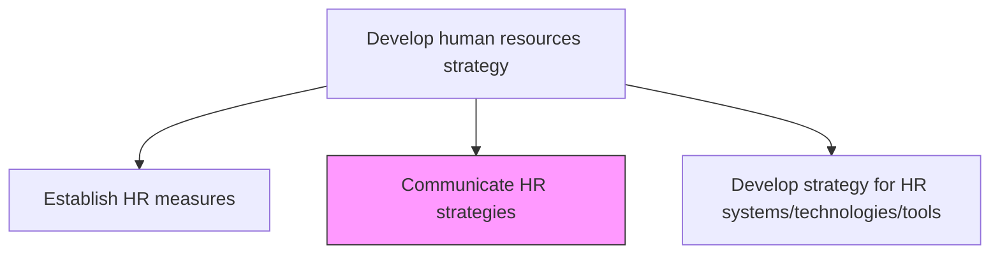
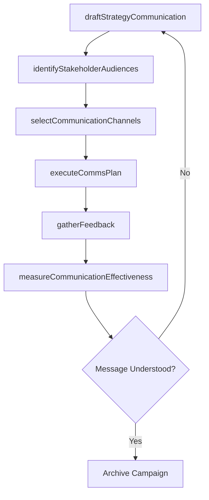

# Communicate HR strategies

> Business-as-Code definition for disseminating HR strategic plans, priorities, and program updates to employees, management, and external stakeholders.

## Overview

Conveying the strategies of the HR function to employees and management. Effectively explain the vision, plans, and anticipated benefits of the HR strategy to employees, as well as the public. Develop statements and messages that are easy to read, informative, and relevant to the audience. Tailor communication channels and cadence to stakeholder segments, then measure comprehension and buy-in.

## Process Hierarchy



## GraphDL

```yaml
communicate:
  object: HR Strategies
  actor: HrCommunicationsManager
  result: StrategyCommunicationPlan
```

## Actions

| Action | Description |
|--------|-------------|
| draftStrategyCommunication | Compose clear messaging articulating HR strategy vision and objectives |
| identifyStakeholderAudiences | Segment audiences by their information needs and communication preferences |
| selectCommunicationChannels | Choose appropriate channels for reaching each stakeholder audience |
| executeCommsPlan | Deploy strategy communications through scheduled campaigns |
| gatherFeedback | Collect stakeholder feedback on strategy comprehension and buy-in |
| measureCommunicationEffectiveness | Assess whether communications achieved desired awareness and understanding |

## Events

| Event | Description |
|-------|-------------|
| strategyCommunicationDrafted | HR strategy messaging created and reviewed |
| stakeholderAudiencesIdentified | Communication audience segments defined |
| communicationChannelsSelected | Delivery channels mapped to audiences |
| commsPlanExecuted | Strategy communications delivered to all target audiences |
| feedbackGathered | Stakeholder feedback on HR strategy collected |
| communicationEffectivenessMeasured | Communication impact assessment completed |

## Searches

| Search | Description |
|--------|-------------|
| findCommunicationPlans | Retrieve communication plans filtered by strategy area or audience |
| getFeedbackSummary | Get aggregated feedback results for a given communication campaign |
| getChannelEffectiveness | Retrieve effectiveness metrics by communication channel |
| listPendingCommunications | List scheduled but not yet delivered communications |

## Process Flow



## RACI Matrix

| Activity | Responsible | Accountable | Consulted | Informed |
|----------|-------------|-------------|-----------|----------|
| draftStrategyCommunication | HrCommunicationsManager | CHRO | VP HR | ExecutiveTeam |
| identifyStakeholderAudiences | HrCommunicationsManager | VP HR | MarketingComms | DepartmentHeads |
| executeCommsPlan | InternalCommsSpecialist | HrCommunicationsManager | IT | AllEmployees |
| measureCommunicationEffectiveness | HrAnalyst | HrCommunicationsManager | SurveyTeam | CHRO |

## Related Processes

| Process | Relationship |
|---------|-------------|
| 7.1.1.4 Establish HR measures | Upstream - measures communicated alongside strategy |
| 7.1.1.6 Develop strategy for HR systems/technologies/tools | Parallel - technology strategy communicated in tandem |
| 7.1.3.3 Communicate plans and provide updates to stakeholders | Downstream - ongoing communication cadence |

## Related Departments

| Department | Role |
|-----------|------|
| Human Resources | Authors HR strategy content and messaging |
| Corporate Communications | Supports messaging quality and channel deployment |
| Marketing | Provides brand guidelines and creative support |
| IT | Enables digital communication platforms |

## Related Occupations

| Occupation | Involvement |
|-----------|-------------|
| HR Communications Manager | Leads strategy communication efforts |
| Internal Communications Specialist | Executes communication campaigns |
| Change Management Consultant | Advises on messaging for organizational change |

## KPIs

| KPI | Description | Unit |
|-----|-------------|------|
| Strategy Awareness Rate | Percentage of employees aware of current HR strategy | % |
| Message Comprehension Score | Survey-based understanding of communicated strategy | Score (1-5) |
| Communication Reach | Proportion of target audience reached by communications | % |
| Feedback Response Rate | Percentage of recipients providing feedback | % |

## Usage

```typescript
import { communicateHrStrategies } from '@headlessly/communicate-hr-strategies'

const comms = communicateHrStrategies()

// Draft strategy communication for annual plan
const message = await comms.draftStrategyCommunication({
  strategyArea: 'annual-hr-plan',
  tone: 'professional',
  keyMessages: ['talent-growth', 'dei-commitment', 'digital-transformation']
})

// Execute communication plan across channels
const campaign = await comms.executeCommsPlan({
  messageId: message.id,
  channels: ['email', 'intranet', 'townHall'],
  schedule: '2026-03-01'
})
```
