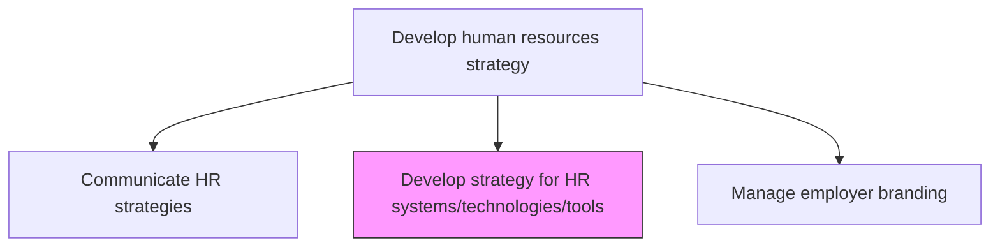
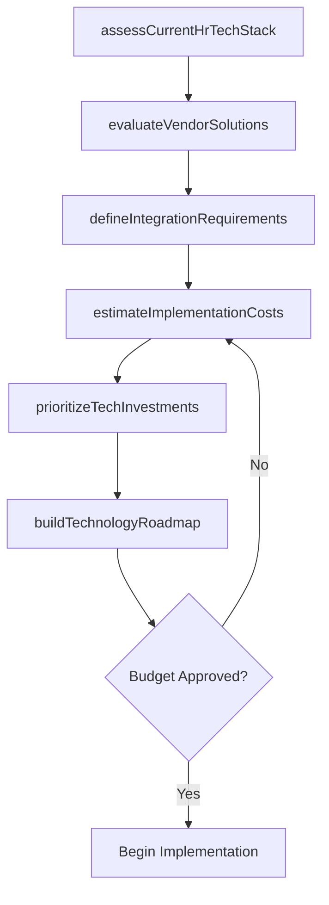

# Develop strategy for HR systems/technologies/tools

> Business-as-Code definition for planning the selection, deployment, and management of HR technology platforms, tools, and systems that enable efficient human capital operations.

## Overview

Creating a strategy for the use of systems/technologies/tools in operating the HR function. Create a strategy concerning the use and utility of HR support tools and technologies. Decide what specific tools to use and in what quantity. Determine the levels of technology required for HR management, including HRIS, ATS, LMS, payroll, and analytics platforms. Build a multi-year technology roadmap aligned with the broader HR strategy.

## Process Hierarchy



## GraphDL

```yaml
develop:
  object: Strategy For HR Systems/technologies/tools
  actor: HrTechnologyDirector
  result: HrTechnologyRoadmap
```

## Actions

| Action | Description |
|--------|-------------|
| assessCurrentHrTechStack | Evaluate existing HR systems for capability gaps and integration issues |
| evaluateVendorSolutions | Research and compare HR technology vendors and platforms |
| defineIntegrationRequirements | Specify how HR systems must connect with enterprise applications |
| buildTechnologyRoadmap | Create a phased plan for HR technology deployment and upgrades |
| estimateImplementationCosts | Calculate total cost of ownership for proposed technology investments |
| prioritizeTechInvestments | Rank technology initiatives based on business impact and feasibility |

## Events

| Event | Description |
|-------|-------------|
| techStackAssessed | HR technology assessment completed with gap analysis |
| vendorSolutionsEvaluated | Vendor evaluation scorecards finalized |
| integrationRequirementsDefined | System integration specifications documented |
| technologyRoadmapBuilt | Multi-year HR technology roadmap approved |
| implementationCostsEstimated | Technology investment cost estimates published |
| techInvestmentsPrioritized | Technology initiative priority ranking finalized |

## Searches

| Search | Description |
|--------|-------------|
| findHrSystems | Retrieve inventory of current HR systems filtered by function or vendor |
| getVendorComparisons | Get vendor evaluation results by category or capability |
| getTechRoadmap | Retrieve the current HR technology roadmap and milestone status |
| listIntegrationGaps | Identify systems lacking required integrations |

## Process Flow



## RACI Matrix

| Activity | Responsible | Accountable | Consulted | Informed |
|----------|-------------|-------------|-----------|----------|
| assessCurrentHrTechStack | HrisManager | HrTechnologyDirector | IT | HrTeam |
| evaluateVendorSolutions | HrisManager | HrTechnologyDirector | Procurement | CHRO |
| buildTechnologyRoadmap | HrTechnologyDirector | CHRO | CIO | ExecutiveTeam |
| estimateImplementationCosts | HrFinanceAnalyst | HrTechnologyDirector | CFO | VP HR |

## Related Processes

| Process | Relationship |
|---------|-------------|
| 7.1.1.5 Communicate HR strategies | Upstream - technology strategy supports broader HR strategy communication |
| 7.1.1.7 Manage employer branding | Parallel - employer brand leverages HR technology platforms |
| 7.1.1.3 Determine HR costs | Related - technology costs are a major budget component |

## Related Departments

| Department | Role |
|-----------|------|
| Human Resources | Defines functional requirements for HR technology |
| Information Technology | Provides infrastructure and integration support |
| Procurement | Manages vendor selection and contract negotiation |
| Finance | Approves technology investment budgets |

## Related Occupations

| Occupation | Involvement |
|-----------|-------------|
| HR Technology Director | Leads HR technology strategy development |
| HRIS Manager | Manages day-to-day HR system operations |
| Enterprise Architect | Ensures alignment with enterprise technology standards |
| IT Project Manager | Oversees HR technology implementation projects |

## KPIs

| KPI | Description | Unit |
|-----|-------------|------|
| System Utilization Rate | Percentage of licensed HR system capacity actively used | % |
| Technology ROI | Return on investment for HR technology spend | % |
| Integration Completion Rate | Percentage of planned system integrations completed | % |
| User Satisfaction Score | Employee satisfaction rating with HR technology tools | Score (1-5) |

## Usage

```typescript
import { developStrategyForHrSystemsTechnologiesTools } from '@headlessly/develop-strategy-for-hr-systems-technologies-tools'

const techStrategy = developStrategyForHrSystemsTechnologiesTools()

// Assess current HR technology stack
const assessment = await techStrategy.assessCurrentHrTechStack({
  scope: 'enterprise',
  evaluationCriteria: ['functionality', 'scalability', 'userExperience', 'cost']
})

// Build the technology roadmap
const roadmap = await techStrategy.buildTechnologyRoadmap({
  planningHorizon: '3-year',
  phases: ['foundation', 'optimization', 'innovation'],
  budgetConstraint: 2500000
})
```
