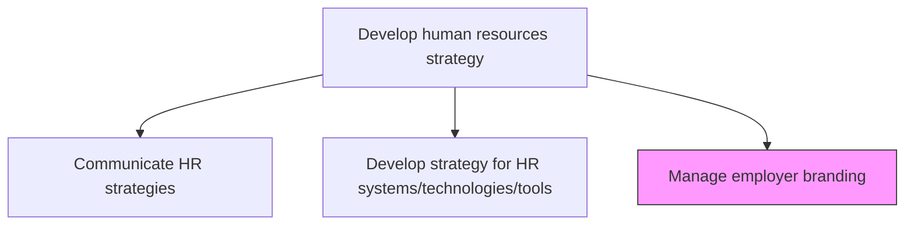
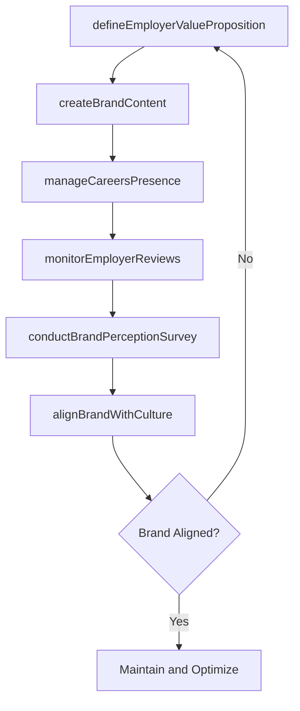

# Manage employer branding

> Business-as-Code definition for building, maintaining, and communicating the organization's reputation as an employer of choice to attract and retain top talent.

## Overview

Creating, maintaining and communicating the company's reputation and values to keep current employees and attract potential hires. Define the employer value proposition, produce brand content across careers channels, monitor third-party review platforms, and ensure that external messaging authentically reflects internal culture and employee experience.

## Process Hierarchy



## GraphDL

```yaml
manage:
  object: Employer Branding
  actor: EmployerBrandManager
  result: EmployerBrandStrategy
```

## Actions

| Action | Description |
|--------|-------------|
| defineEmployerValueProposition | Articulate the unique benefits and culture the organization offers employees |
| createBrandContent | Develop marketing content showcasing the employee experience |
| manageCareersPresence | Maintain careers website, social media profiles, and review site responses |
| conductBrandPerceptionSurvey | Measure internal and external perceptions of the employer brand |
| monitorEmployerReviews | Track and respond to employer reviews on platforms like Glassdoor |
| alignBrandWithCulture | Ensure employer brand messaging authentically reflects organizational culture |

## Events

| Event | Description |
|-------|-------------|
| employerValuePropositionDefined | EVP documented and approved by leadership |
| brandContentPublished | New employer brand content published across channels |
| careersPresenceUpdated | Careers website and social profiles refreshed |
| brandPerceptionSurveyed | Employer brand perception survey completed |
| employerReviewsAddressed | Review monitoring cycle completed with response plan |
| brandCultureAligned | Brand-culture alignment audit finalized |

## Searches

| Search | Description |
|--------|-------------|
| getBrandMetrics | Retrieve employer brand performance metrics by channel |
| findBrandContent | List employer brand content filtered by type, platform, or date |
| getPerceptionScores | Get internal and external brand perception scores over time |
| listReviewResponses | Retrieve employer review responses by platform or sentiment |

## Process Flow



## RACI Matrix

| Activity | Responsible | Accountable | Consulted | Informed |
|----------|-------------|-------------|-----------|----------|
| defineEmployerValueProposition | EmployerBrandManager | CHRO | MarketingDirector | ExecutiveTeam |
| createBrandContent | ContentSpecialist | EmployerBrandManager | RecruitingTeam | AllEmployees |
| conductBrandPerceptionSurvey | HrAnalyst | EmployerBrandManager | ExternalResearchFirm | VP HR |
| monitorEmployerReviews | EmployerBrandManager | VP HR | LegalCounsel | PublicRelations |

## Related Processes

| Process | Relationship |
|---------|-------------|
| 7.1.1.5 Communicate HR strategies | Related - brand messaging aligns with HR strategy communications |
| 7.1.1.6 Develop strategy for HR systems/technologies/tools | Upstream - technology platforms enable brand delivery |
| 7.1.2.8 Develop recruitment program | Downstream - employer brand drives candidate attraction |

## Related Departments

| Department | Role |
|-----------|------|
| Human Resources | Owns employer brand strategy and employee experience alignment |
| Marketing | Provides creative direction and brand consistency |
| Corporate Communications | Manages external messaging and media relations |
| Recruiting | Leverages employer brand in talent attraction |

## Related Occupations

| Occupation | Involvement |
|-----------|-------------|
| Employer Brand Manager | Primary executor of brand strategy |
| Talent Acquisition Director | Applies brand in recruiting campaigns |
| Content Marketing Specialist | Creates employer brand content |

## KPIs

| KPI | Description | Unit |
|-----|-------------|------|
| Employer Net Promoter Score | Employee willingness to recommend the organization as an employer | Score (-100 to 100) |
| Career Site Conversion Rate | Percentage of career site visitors who apply | % |
| Glassdoor Rating | Average employer rating on review platforms | Score (1-5) |
| Offer Acceptance Rate | Proportion of job offers accepted by candidates | % |

## Usage

```typescript
import { manageEmployerBranding } from '@headlessly/manage-employer-branding'

const brand = manageEmployerBranding()

// Define the employer value proposition
const evp = await brand.defineEmployerValueProposition({
  pillars: ['growth', 'innovation', 'inclusivity', 'flexibility'],
  targetAudiences: ['software-engineers', 'data-scientists', 'product-managers']
})

// Monitor employer reviews across platforms
const reviews = await brand.monitorEmployerReviews({
  platforms: ['glassdoor', 'indeed', 'linkedin'],
  sentimentThreshold: 'negative',
  responseRequired: true
})
```
