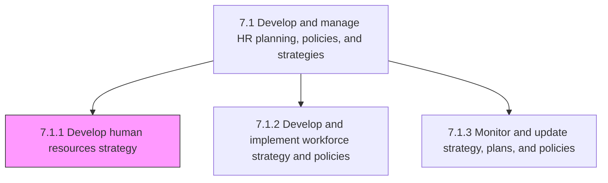
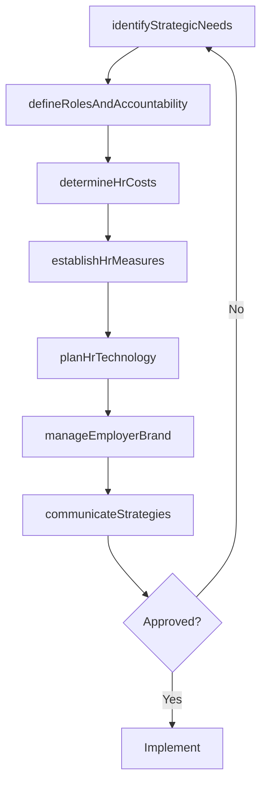

# Develop human resources strategy

> Business-as-Code definition for HR strategy development. Models strategic needs identification, role definition, cost determination, performance measurement, strategy communication, technology planning, and employer branding.

## Overview

Creating a long-term plan to associate human resource requirements with the strategic goals of the company to ensure that there is enough qualified staffing to achieve those goals, to maintain competitive advantage and to reduce employee turnover.

## Process Hierarchy



## GraphDL

```yaml
develop:
  object: Human Resources Strategy
  actor: HRStrategyDirector
  result: HRStrategicPlan
```

## Actions

| Action | Description |
|--------|-------------|
| identifyStrategicNeeds | Assess current and future HR requirements aligned with business objectives |
| defineRolesAndAccountability | Establish HR function roles and business partnership accountability |
| determineHrCosts | Analyze and forecast HR operating costs and investment requirements |
| establishHrMeasures | Define performance metrics and KPIs for the HR function |
| communicateStrategies | Present HR strategies to employees, management, and stakeholders |
| planHrTechnology | Develop strategy for HR systems, tools, and technology investments |
| manageEmployerBrand | Build and maintain the organization's employer value proposition |

## Events

| Event | Description |
|-------|-------------|
| strategicNeedsIdentified | HR strategic requirements assessed and documented |
| rolesAndAccountabilityDefined | HR function roles and accountability structure established |
| hrCostsDetermined | HR cost analysis and forecast completed |
| hrMeasuresEstablished | HR performance metrics and KPIs defined |
| strategiesCommunicated | HR strategies presented and communicated to stakeholders |
| hrTechnologyPlanned | HR technology roadmap approved |
| employerBrandManaged | Employer branding strategy updated and activated |

## Searches

| Search | Description |
|--------|-------------|
| getHrStrategyDocuments | Retrieve current HR strategy documents and plans |
| getHrCostForecasts | Query HR cost projections by category and period |
| getHrPerformanceMetrics | Retrieve HR function performance data against established measures |

## Process Flow



## RACI Matrix

| Activity | Responsible | Accountable | Consulted | Informed |
|----------|-------------|-------------|-----------|----------|
| identifyStrategicNeeds | HR Strategy Director | CHRO | CEO, CFO | Business Unit Heads |
| defineRolesAndAccountability | HR Strategy Director | CHRO | Legal | All HR Staff |
| determineHrCosts | HR Finance Analyst | CHRO | CFO | VP HR |
| communicateStrategies | HR Communications Lead | CHRO | Marketing | All Employees |
| manageEmployerBrand | Employer Brand Manager | CHRO | Marketing, Talent Acquisition | All Employees |

## Sub-Processes

| ID | Name | Description |
|----|------|-------------|
| 7.1.1.1 | Identify strategic HR needs | Strategically defining the current and future needs for developing an efficient HR strategy. |
| 7.1.1.2 | Define HR and business function roles and accountability | Outlining the charge and duty of the HR function by defining its responsibility areas, as well as en |
| 7.1.1.3 | Determine HR costs | Ascertaining the costs and expenses of the HR function. Identify and report HR investments using, fo |
| 7.1.1.4 | Establish HR measures | Evaluating the performance of HR function. Lay out the course of HR procedures that would formulate  |
| 7.1.1.5 | Communicate HR strategies | Conveying the strategies of HR function to employees and management. Effectively explain the vision, |
| 7.1.1.6 | Develop strategy for HR systems/technologies/tools | Creating a strategy for the use of systems/technologies/tools in operating the HR function. Create a |
| 7.1.1.7 | Manage employer branding | Creating, maintaining and communicating company's reputation and values to keep current employees an |

## Related Processes

| Process | Relationship |
|---------|-------------|
| 7.1.2 Develop and implement workforce strategy and policies | Downstream - HR strategy drives workforce policy development |
| 7.1.3 Monitor and update strategy, plans, and policies | Downstream - strategy monitored and revised |
| 1.0 Develop Vision and Strategy | Upstream - corporate strategy drives HR strategy |

## Related Departments

| Department | Role |
|-----------|------|
| Human Resources | Primary owner of HR strategy development |
| Finance | Partners on HR cost modeling and budgeting |
| Executive Leadership | Sets strategic direction and approves HR strategy |
| Marketing | Supports employer branding initiatives |

## Related Occupations

| Occupation | Involvement |
|-----------|-------------|
| HR Strategy Director | Leads strategic planning for the HR function |
| HRIS Strategist | Plans technology investments for HR |
| Employer Brand Manager | Develops employer value proposition |

## KPIs

| KPI | Description | Unit |
|-----|-------------|------|
| HR Strategy Alignment Score | Degree of HR strategy alignment with business goals | Score (1-5) |
| HR Cost Efficiency | HR operating cost as percentage of total revenue | % |
| Employer Brand Index | External employer attractiveness rating | Score (1-100) |
| HR Technology Adoption Rate | Percentage of planned HR technology initiatives deployed | % |

## Usage

```typescript
import { developHumanResourcesStrategy } from '@headlessly/develop-human-resources-strategy'

const hrStrategy = developHumanResourcesStrategy()

// Identify strategic HR needs
const needs = await hrStrategy.identifyStrategicNeeds({
  planningHorizon: '5-year',
  businessObjectives: ['global-expansion', 'digital-transformation'],
  currentHeadcount: 5000
})

// Establish HR measures
const measures = await hrStrategy.establishHrMeasures({
  categories: ['talent-acquisition', 'retention', 'development', 'engagement'],
  benchmarkSource: 'industry-median'
})
```
