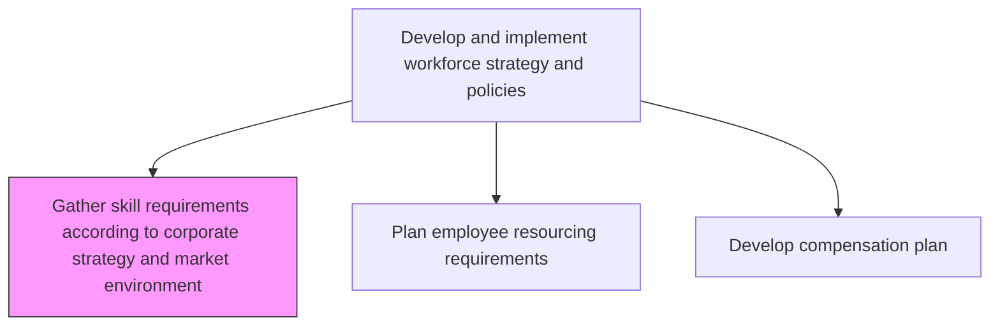
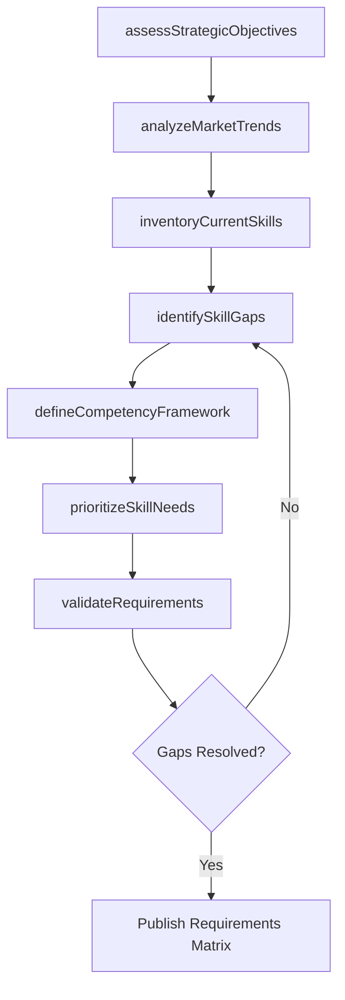

# Gather skill requirements according to corporate strategy and market environment

> Business-as-Code definition for gathering skill requirements aligned with corporate strategy and market environment. Models the complete process of analyzing strategic objectives, assessing labor market trends, and defining the competencies needed across the organization.

## Overview

Evaluating the current and future skill requirements of the organization with regard to the overall corporate strategy of the organization and market conditions. Identify and establish the minimum skills needed for the requisite HR needs.

## Process Hierarchy



## GraphDL

```yaml
gather:
  object: Skill Requirements According To Corporate Strategy And Market Environment
  actor: WorkforcePlanningAnalyst
  result: SkillRequirementsMatrix
```

## Actions

| Action | Description |
|--------|-------------|
| assessStrategicObjectives | Review corporate strategy to extract workforce capability implications |
| analyzeMarketTrends | Evaluate labor market conditions, emerging skills, and industry benchmarks |
| inventoryCurrentSkills | Catalog existing employee skills and competency levels across the organization |
| identifySkillGaps | Compare current capabilities against future strategic requirements |
| defineCompetencyFramework | Establish required competencies, proficiency levels, and role mappings |
| prioritizeSkillNeeds | Rank skill requirements by strategic urgency and business impact |
| validateRequirements | Confirm skill requirements with business unit leaders and subject matter experts |

## Events

| Event | Description |
|-------|-------------|
| strategicObjectivesAssessed | Corporate strategy reviewed and workforce implications extracted |
| marketTrendsAnalyzed | Labor market conditions and emerging skill trends evaluated |
| currentSkillsInventoried | Organization-wide skill inventory completed |
| skillGapsIdentified | Gap analysis between current and required capabilities finalized |
| competencyFrameworkDefined | Competency model with proficiency levels established |
| skillNeedsPrioritized | Skill requirements ranked by strategic impact |
| requirementsValidated | Skill requirements confirmed by business stakeholders |

## Searches

| Search | Description |
|--------|-------------|
| findSkillGaps | Retrieve skill gaps filtered by department, role, or strategic priority |
| getCompetencyFramework | List competencies with proficiency levels for a given role or business unit |
| getMarketBenchmarks | Retrieve labor market salary and skill availability data by region |
| findCriticalSkills | Identify skills with highest strategic importance and lowest internal supply |

## Process Flow



## RACI Matrix

| Activity | Responsible | Accountable | Consulted | Informed |
|----------|-------------|-------------|-----------|----------|
| assessStrategicObjectives | WorkforcePlanningAnalyst | CHRO | BusinessUnitLeaders | CEO |
| analyzeMarketTrends | WorkforcePlanningAnalyst | VP HR | TalentAcquisition | Finance |
| identifySkillGaps | HRBusinessPartner | VP HR | DepartmentManagers | Training |
| defineCompetencyFramework | OrgDevelopmentSpecialist | CHRO | SubjectMatterExperts | AllEmployees |
| prioritizeSkillNeeds | WorkforcePlanningAnalyst | CHRO | FinancePlanning | ExecutiveTeam |

## Related Processes

| Process | Relationship |
|---------|-------------|
| 7.1.2.2 Plan employee resourcing requirements per business unit/organization | Downstream - skill requirements feed headcount planning |
| 7.1.2.13 Develop workforce strategy models | Upstream - strategy models inform skill requirements |
| 7.3.4.3 Align learning programs with competencies | Consumer - uses skill gaps for training alignment |
| 7.1.4 Develop competency management models | Parallel - competency frameworks inform each other |

## Related Departments

| Department | Role |
|-----------|------|
| Human Resources | Leads skill requirements gathering and workforce planning |
| Strategy | Provides corporate strategy objectives and market positioning |
| Finance | Validates budget feasibility for skill acquisition and development |
| Operations | Supplies operational skill needs and capacity requirements |

## Related Occupations

| Occupation | Involvement |
|-----------|-------------|
| Workforce Planning Analyst | Primary executor of skill gap analysis |
| HR Business Partner | Liaisons with business units for requirements validation |
| Organizational Development Specialist | Designs competency frameworks |

## KPIs

| KPI | Description | Unit |
|-----|-------------|------|
| Skill Gap Closure Rate | Percentage of identified skill gaps addressed within planning cycle | % |
| Requirements Cycle Time | Average time from strategy release to skill requirements publication | Days |
| Competency Coverage | Percentage of roles with defined competency profiles | % |
| Forecast Accuracy | Alignment between predicted and actual skill needs over 12 months | % |

## Usage

```typescript
import { gatherSkillRequirements } from '@headlessly/gather-skill-requirements-according-to-corporate-strategy-and-market-environment'

const skills = gatherSkillRequirements()

// Assess strategic objectives for workforce implications
const implications = await skills.assessStrategicObjectives({
  strategyDocumentId: 'corp-strategy-2025',
  planningHorizon: '3-year'
})

// Identify skill gaps across the organization
const gaps = await skills.identifySkillGaps({
  businessUnit: 'Engineering',
  comparisonBasis: 'strategicRequirements'
})
```
