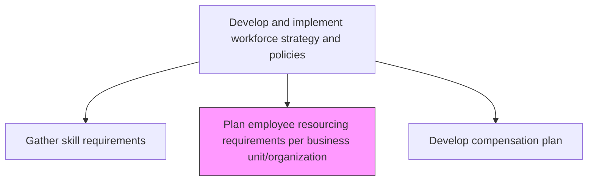
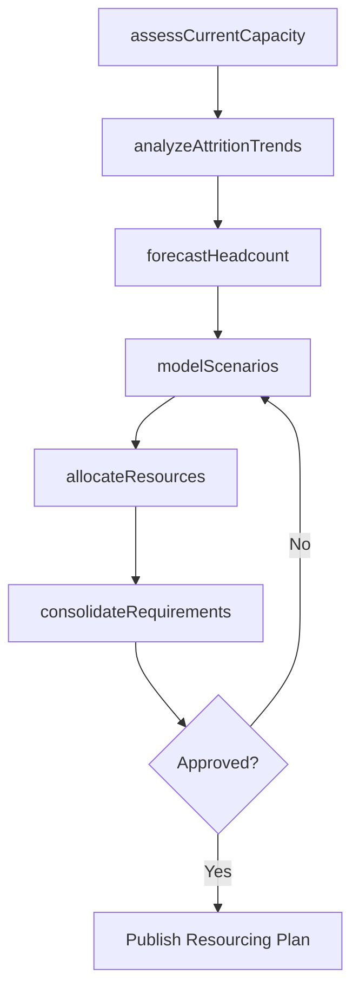

# Plan employee resourcing requirements per business unit/organization

> Business-as-Code definition for planning employee resourcing requirements by business unit. Models the process of forecasting headcount needs, analyzing capacity, and aligning staffing plans with organizational objectives.

## Overview

Determining the requirements for employees and the need for employee resourcing for each every unit/function. Lay out a plan detailing employee resourcing requirements of individual functions and the organization as a whole.

## Process Hierarchy



## GraphDL

```yaml
plan:
  object: Employee Resourcing Requirements Per Business Unit/organization
  actor: WorkforcePlanningAnalyst
  result: ResourcingPlan
```

## Actions

| Action | Description |
|--------|-------------|
| forecastHeadcount | Project future staffing needs based on business growth and attrition models |
| assessCurrentCapacity | Evaluate existing workforce capacity and utilization per business unit |
| analyzeAttritionTrends | Review historical turnover rates to predict future vacancies |
| allocateResources | Distribute headcount budgets across departments and roles |
| modelScenarios | Create workforce planning scenarios for different business growth assumptions |
| consolidateRequirements | Aggregate resourcing needs across all business units into a unified plan |

## Events

| Event | Description |
|-------|-------------|
| headcountForecasted | Staffing projections completed for planning period |
| currentCapacityAssessed | Workforce capacity analysis finalized for all units |
| attritionTrendsAnalyzed | Turnover analysis and vacancy predictions completed |
| resourcesAllocated | Headcount budgets distributed to business units |
| scenariosModeled | Workforce planning scenarios generated and evaluated |
| requirementsConsolidated | Unified resourcing plan published across the organization |

## Searches

| Search | Description |
|--------|-------------|
| getHeadcountForecast | Retrieve projected headcount by business unit, role, or time period |
| findOpenCapacity | Identify business units with surplus or underutilized workforce |
| getAttritionReport | Retrieve attrition trends filtered by department, tenure, or role |
| getResourcingPlan | List consolidated resourcing requirements with budget allocations |

## Process Flow



## RACI Matrix

| Activity | Responsible | Accountable | Consulted | Informed |
|----------|-------------|-------------|-----------|----------|
| forecastHeadcount | WorkforcePlanningAnalyst | VP HR | BusinessUnitLeaders | Finance |
| assessCurrentCapacity | HRBusinessPartner | VP HR | DepartmentManagers | Operations |
| allocateResources | WorkforcePlanningAnalyst | CHRO | CFO | RecruitingTeam |
| consolidateRequirements | HRBusinessPartner | CHRO | ExecutiveTeam | AllManagers |

## Related Processes

| Process | Relationship |
|---------|-------------|
| 7.1.2.1 Gather skill requirements according to corporate strategy | Upstream - skill needs feed resourcing plan |
| 7.2.1.1 Align staffing plan to workforce plan and business unit strategies | Downstream - resourcing plan drives staffing alignment |
| 7.1.2.13 Develop workforce strategy models | Parallel - strategy models inform resource planning |

## Related Departments

| Department | Role |
|-----------|------|
| Human Resources | Owns workforce planning and resourcing process |
| Finance | Provides budget constraints and headcount approvals |
| Operations | Articulates operational staffing requirements |
| Executive Leadership | Approves final resourcing plan |

## Related Occupations

| Occupation | Involvement |
|-----------|-------------|
| Workforce Planning Analyst | Develops forecasts and scenario models |
| HR Business Partner | Gathers requirements from business units |
| Financial Analyst | Validates budget alignment |

## KPIs

| KPI | Description | Unit |
|-----|-------------|------|
| Forecast Accuracy | Variance between planned and actual headcount needs | % |
| Plan Completion Rate | Percentage of business units with finalized resourcing plans | % |
| Time to Plan | Elapsed days from planning kickoff to approved resourcing plan | Days |
| Budget Utilization | Percentage of allocated headcount budget consumed | % |

## Usage

```typescript
import { planEmployeeResourcingRequirements } from '@headlessly/plan-employee-resourcing-requirements-per-business-unit-organization'

const resourcing = planEmployeeResourcingRequirements()

// Forecast headcount for next fiscal year
const forecast = await resourcing.forecastHeadcount({
  businessUnit: 'Product Engineering',
  planningPeriod: 'FY2026',
  growthAssumption: 'moderate'
})

// Model different resourcing scenarios
const scenarios = await resourcing.modelScenarios({
  baseHeadcount: forecast.projected,
  assumptions: ['high-growth', 'steady-state', 'contraction']
})
```
