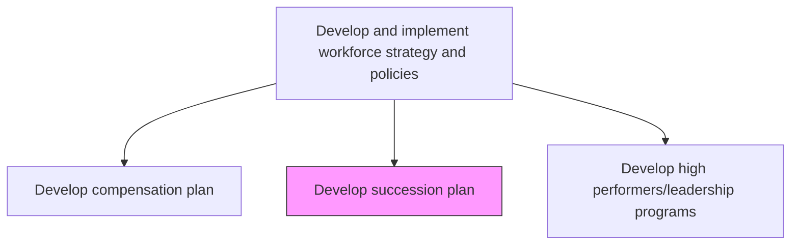
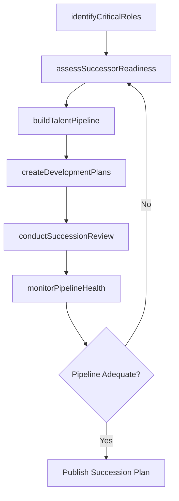

# Develop succession plan

> Business-as-Code definition for succession planning. Models the complete process of identifying critical roles, assessing leadership pipelines, and preparing successors for key positions across the organization.

## Overview

Creating and implementing the plan for continuation of key positions within the organization. Identify internal people with the potential to fill key business leadership positions. Provide critical development experiences to employees who can move into important roles. Engage leaders to support the development of high-potential leaders.

## Process Hierarchy



## GraphDL

```yaml
develop:
  object: Succession Plan
  actor: TalentManagementSpecialist
  result: SuccessionPlanDocument
```

## Actions

| Action | Description |
|--------|-------------|
| identifyCriticalRoles | Determine key positions where vacancies would significantly impact operations |
| assessSuccessorReadiness | Evaluate potential successors against role requirements and competency gaps |
| buildTalentPipeline | Develop pools of high-potential employees for critical leadership roles |
| createDevelopmentPlans | Design individualized development plans to accelerate successor readiness |
| conductSuccessionReview | Facilitate leadership reviews of succession plans with executive sponsors |
| monitorPipelineHealth | Track successor pipeline depth, diversity, and readiness metrics |

## Events

| Event | Description |
|-------|-------------|
| criticalRolesIdentified | Key positions requiring succession coverage cataloged |
| successorReadinessAssessed | Potential successor evaluations completed for a role |
| talentPipelineBuilt | Leadership talent pool established for critical positions |
| developmentPlansCreated | Individualized development plans assigned to successors |
| successionReviewConducted | Executive succession review meeting completed |
| pipelineHealthMonitored | Succession pipeline metrics updated and reported |

## Searches

| Search | Description |
|--------|-------------|
| findCriticalRoles | List critical roles filtered by business unit, risk level, or vacancy timeline |
| getSuccessorCandidates | Retrieve potential successors for a given role with readiness ratings |
| getPipelineMetrics | Return pipeline depth and diversity statistics by leadership level |
| findReadinessGaps | Identify successors needing accelerated development interventions |

## Process Flow



## RACI Matrix

| Activity | Responsible | Accountable | Consulted | Informed |
|----------|-------------|-------------|-----------|----------|
| identifyCriticalRoles | TalentManagementSpecialist | CHRO | BusinessUnitLeaders | ExecutiveTeam |
| assessSuccessorReadiness | HRBusinessPartner | VP TalentManagement | DepartmentManagers | Successors |
| buildTalentPipeline | TalentManagementSpecialist | CHRO | LeadershipDevelopment | Board |
| conductSuccessionReview | CHRO | CEO | ExecutiveTeam | HRTeam |

## Related Processes

| Process | Relationship |
|---------|-------------|
| 7.1.2.5 Develop high performers/leadership programs | Downstream - succession gaps drive leadership development |
| 7.3.3.2 Develop employee career plans and career paths | Parallel - career paths feed succession pipeline |
| 7.6.1 Manage promotion and demotion process | Consumer - succession plan informs promotion decisions |

## Related Departments

| Department | Role |
|-----------|------|
| Human Resources | Facilitates succession planning process and talent reviews |
| Executive Leadership | Sponsors succession plans and participates in reviews |
| Learning and Development | Delivers successor development programs |
| Business Units | Identifies critical roles and evaluates internal candidates |

## Related Occupations

| Occupation | Involvement |
|-----------|-------------|
| Talent Management Specialist | Designs and maintains succession plans |
| HR Business Partner | Facilitates business unit succession discussions |
| Executive Coach | Supports successor development |

## KPIs

| KPI | Description | Unit |
|-----|-------------|------|
| Pipeline Depth | Average number of ready-now successors per critical role | Ratio |
| Successor Readiness Rate | Percentage of successors rated ready-now or ready within one year | % |
| Critical Role Coverage | Percentage of critical roles with at least one identified successor | % |
| Internal Fill Rate | Percentage of leadership vacancies filled by internal successors | % |

## Usage

```typescript
import { developSuccessionPlan } from '@headlessly/develop-succession-plan'

const succession = developSuccessionPlan()

// Identify critical roles requiring succession coverage
const criticalRoles = await succession.identifyCriticalRoles({
  businessUnit: 'all',
  riskLevel: 'high',
  vacancyTimeline: '12-months'
})

// Assess successor readiness for a specific role
const readiness = await succession.assessSuccessorReadiness({
  roleId: criticalRoles[0].id,
  evaluationCriteria: 'competency-based'
})
```
