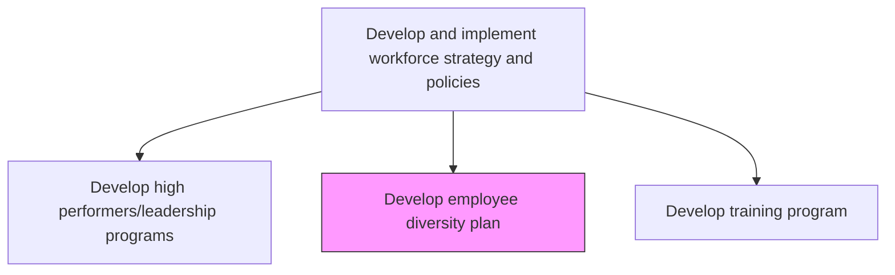
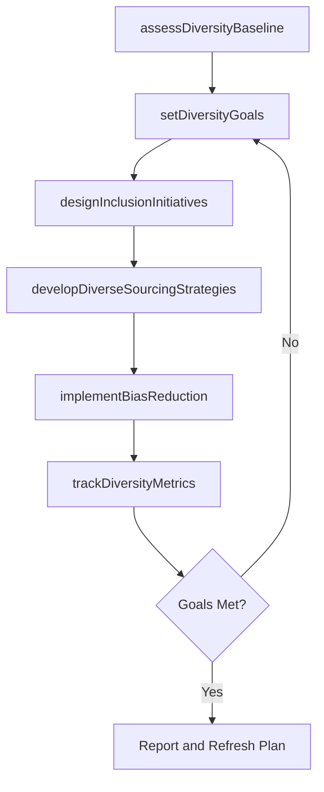

# Develop employee diversity plan

> Business-as-Code definition for developing employee diversity plans. Models the process of setting diversity goals, designing inclusion initiatives, and measuring representation across the workforce.

## Overview

Creating and implementing the plan for ensuring a diverse work force. Develop and hire employees with varying characteristics including, but not limited to, religious and political beliefs, gender, ethnicity, education, socioeconomic background, sexual orientation, and geographic location.

## Process Hierarchy



## GraphDL

```yaml
develop:
  object: Employee Diversity Plan
  actor: DiversityAndInclusionManager
  result: DiversityAndInclusionBlueprint
```

## Actions

| Action | Description |
|--------|-------------|
| assessDiversityBaseline | Analyze current workforce demographics and representation data |
| setDiversityGoals | Establish measurable diversity targets by role level, department, and category |
| designInclusionInitiatives | Create programs that promote belonging, equity, and inclusive culture |
| developDiverseSourcingStrategies | Build recruiting pipelines targeting underrepresented talent pools |
| implementBiasReduction | Deploy bias mitigation measures in hiring, promotion, and compensation |
| trackDiversityMetrics | Monitor and report representation, pay equity, and inclusion indicators |

## Events

| Event | Description |
|-------|-------------|
| diversityBaselineAssessed | Current workforce demographics analyzed and documented |
| diversityGoalsSet | Measurable diversity targets established for the planning period |
| inclusionInitiativesDesigned | Inclusion programs and activities defined |
| diverseSourcingStrategiesDeveloped | Recruiting strategies for underrepresented groups created |
| biasReductionImplemented | Bias mitigation measures deployed in talent processes |
| diversityMetricsTracked | Representation and inclusion metrics updated and reported |

## Searches

| Search | Description |
|--------|-------------|
| getDiversityDashboard | Retrieve workforce representation data by dimension and department |
| findPayEquityGaps | Identify compensation disparities across demographic categories |
| getInclusionSurveyResults | Retrieve employee inclusion and belonging survey scores |
| findDiversePipelines | List active diverse sourcing channels with candidate flow metrics |

## Process Flow



## RACI Matrix

| Activity | Responsible | Accountable | Consulted | Informed |
|----------|-------------|-------------|-----------|----------|
| assessDiversityBaseline | DiversityAndInclusionManager | CHRO | HRAnalytics | ExecutiveTeam |
| setDiversityGoals | DiversityAndInclusionManager | CEO | LegalCounsel | Board |
| designInclusionInitiatives | DiversityAndInclusionManager | CHRO | EmployeeResourceGroups | AllEmployees |
| trackDiversityMetrics | HRAnalyst | CHRO | Finance | Regulators |

## Related Processes

| Process | Relationship |
|---------|-------------|
| 7.1.2.10 Develop HR policies | Parallel - diversity goals embedded in HR policies |
| 7.2.2 Recruit/source candidates | Downstream - diverse sourcing strategies feed recruitment |
| 7.8.1 Develop employee communication plan | Consumer - communicates diversity initiatives |

## Related Departments

| Department | Role |
|-----------|------|
| Human Resources | Owns diversity planning and implementation |
| Legal | Ensures compliance with equal employment regulations |
| Executive Leadership | Sponsors diversity goals and accountability |
| Communications | Promotes diversity initiatives internally and externally |

## Related Occupations

| Occupation | Involvement |
|-----------|-------------|
| Diversity and Inclusion Manager | Primary owner of diversity plan development |
| HR Analyst | Provides demographic and pay equity analytics |
| Employment Attorney | Advises on legal compliance |

## KPIs

| KPI | Description | Unit |
|-----|-------------|------|
| Representation Index | Demographic diversity across leadership and workforce levels | % |
| Inclusion Score | Average employee belonging and inclusion survey rating | Score (1-5) |
| Diverse Hiring Rate | Percentage of new hires from underrepresented groups | % |
| Pay Equity Ratio | Adjusted pay ratio across demographic categories | Ratio |

## Usage

```typescript
import { developEmployeeDiversityPlan } from '@headlessly/develop-employee-diversity-plan'

const diversity = developEmployeeDiversityPlan()

// Assess current diversity baseline
const baseline = await diversity.assessDiversityBaseline({
  dimensions: ['gender', 'ethnicity', 'age', 'disability'],
  scope: 'organization-wide'
})

// Set diversity goals for next planning cycle
const goals = await diversity.setDiversityGoals({
  targetYear: 2026,
  benchmarkSource: 'industry-average',
  focusAreas: ['leadership', 'technical-roles']
})
```
