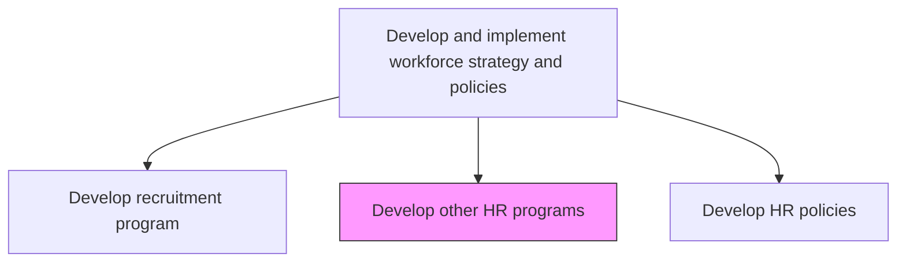
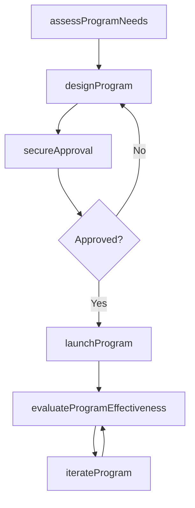

# Develop other HR programs

> Business-as-Code definition for developing supplementary HR programs. Models the design, launch, and management of wellness, flexible work, recognition, and other employee-focused programs.

## Overview

Creating HR programs and services such as employee engagements programs to promote positive employee behavior. Create a variety of programs and services to support employees' professional and personal needs at work and at home.

## Process Hierarchy



## GraphDL

```yaml
develop:
  object: Other HR Programs
  actor: HRProgramManager
  result: HRProgramPortfolio
```

## Actions

| Action | Description |
|--------|-------------|
| assessProgramNeeds | Identify employee needs through surveys, exit interviews, and benchmark data |
| designProgram | Structure program objectives, eligibility criteria, and delivery methods |
| secureApproval | Present business case and obtain budget and executive sponsorship |
| launchProgram | Deploy program with communications, enrollment, and support resources |
| evaluateProgramEffectiveness | Measure participation rates, satisfaction, and business impact |
| iterateProgram | Refine program based on feedback, utilization data, and outcomes |

## Events

| Event | Description |
|-------|-------------|
| programNeedsAssessed | Employee program needs analysis completed |
| programDesigned | Program structure, criteria, and delivery plan finalized |
| approvalSecured | Budget and executive sponsorship obtained for program |
| programLaunched | Program deployed and open for employee participation |
| programEffectivenessEvaluated | Program impact assessment completed |
| programIterated | Program refinements implemented based on evaluation |

## Searches

| Search | Description |
|--------|-------------|
| findActivePrograms | List current HR programs filtered by type, department, or status |
| getProgramParticipation | Retrieve enrollment and utilization metrics for a program |
| getEmployeeFeedback | Return satisfaction and feedback data for a specific program |
| benchmarkPrograms | Compare program offerings against industry peers |

## Process Flow



## RACI Matrix

| Activity | Responsible | Accountable | Consulted | Informed |
|----------|-------------|-------------|-----------|----------|
| assessProgramNeeds | HRProgramManager | VP HR | EmployeeCouncil | AllEmployees |
| designProgram | HRProgramManager | VP HR | LegalCounsel | Finance |
| launchProgram | HRProgramManager | CHRO | InternalComms | AllManagers |
| evaluateProgramEffectiveness | HRAnalyst | VP HR | DepartmentManagers | ExecutiveTeam |

## Related Processes

| Process | Relationship |
|---------|-------------|
| 7.1.2.12 Plan employee benefits | Parallel - benefits and programs often overlap |
| 7.5.3.1 Deliver programs to support work/life balance | Downstream - wellness programs operationalized here |
| 7.8.1 Develop employee communication plan | Consumer - programs require internal communications |

## Related Departments

| Department | Role |
|-----------|------|
| Human Resources | Designs and manages HR programs |
| Finance | Approves program budgets and tracks costs |
| Internal Communications | Promotes programs to employees |
| Facilities | Supports on-site wellness and flexible work infrastructure |

## Related Occupations

| Occupation | Involvement |
|-----------|-------------|
| HR Program Manager | Primary designer and executor of HR programs |
| Benefits Analyst | Evaluates program costs and vendor relationships |
| Internal Communications Specialist | Develops program awareness materials |

## KPIs

| KPI | Description | Unit |
|-----|-------------|------|
| Program Participation Rate | Percentage of eligible employees enrolled in programs | % |
| Employee Satisfaction Score | Average satisfaction rating for HR programs | Score (1-5) |
| Program ROI | Return on investment measured by retention and engagement impact | Ratio |
| Time to Launch | Average elapsed time from program concept to deployment | Days |

## Usage

```typescript
import { developOtherHrPrograms } from '@headlessly/develop-other-hr-programs'

const programs = developOtherHrPrograms()

// Assess program needs from employee feedback
const needs = await programs.assessProgramNeeds({
  dataSources: ['engagement-survey', 'exit-interviews', 'focus-groups'],
  categories: ['wellness', 'flexibility', 'recognition']
})

// Launch a new flexible work program
await programs.launchProgram({
  programId: 'flex-work-2025',
  eligibility: 'all-full-time',
  startDate: '2025-07-01'
})
```
