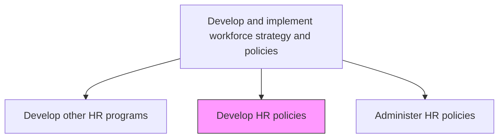
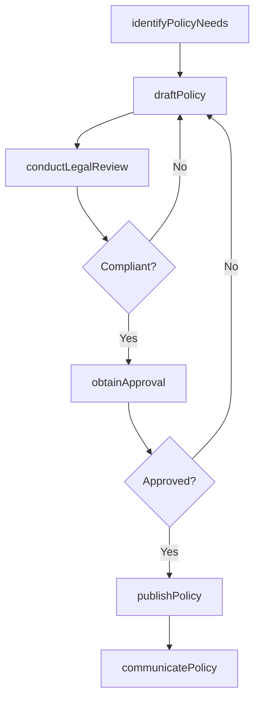

# Develop HR policies

> Business-as-Code definition for developing HR policies. Models the lifecycle of drafting, reviewing, approving, and publishing organizational policies governing the human resources function.

## Overview

Creating rules and regulations that govern the HR function. Develop a policy plan that serves as a guideline for setting rules and regulations that help in achieving the HR goals and objectives.

## Process Hierarchy



## GraphDL

```yaml
develop:
  object: HR Policies
  actor: HRPolicySpecialist
  result: ApprovedPolicyDocument
```

## Actions

| Action | Description |
|--------|-------------|
| identifyPolicyNeeds | Assess regulatory changes, organizational gaps, and best practices requiring new or updated policies |
| draftPolicy | Author policy language including scope, definitions, procedures, and enforcement provisions |
| conductLegalReview | Submit draft policies for legal and compliance review |
| obtainApproval | Route policy through executive and governance approval workflow |
| publishPolicy | Release approved policy to employees through the policy management system |
| communicatePolicy | Disseminate policy changes through training sessions, newsletters, and acknowledgment workflows |

## Events

| Event | Description |
|-------|-------------|
| policyNeedsIdentified | Gap analysis or regulatory trigger flagged policy creation need |
| policyDrafted | Initial policy document authored and ready for review |
| legalReviewCompleted | Legal and compliance review of draft policy finalized |
| policyApproved | Policy approved by governance body or executive sponsor |
| policyPublished | Approved policy released and accessible to all employees |
| policyCommunicated | Policy change notifications delivered to affected workforce |

## Searches

| Search | Description |
|--------|-------------|
| findPolicies | List HR policies filtered by category, status, or effective date |
| getPolicyHistory | Retrieve version history and change log for a specific policy |
| findPendingApprovals | List policies awaiting legal review or executive approval |
| getComplianceGaps | Identify areas where current policies do not meet regulatory requirements |

## Process Flow



## RACI Matrix

| Activity | Responsible | Accountable | Consulted | Informed |
|----------|-------------|-------------|-----------|----------|
| draftPolicy | HRPolicySpecialist | VP HR | LegalCounsel | HRBusinessPartners |
| conductLegalReview | EmploymentAttorney | GeneralCounsel | ComplianceOfficer | VP HR |
| obtainApproval | VP HR | CHRO | CEO | Board |
| publishPolicy | HRPolicySpecialist | VP HR | ITSystems | AllEmployees |

## Related Processes

| Process | Relationship |
|---------|-------------|
| 7.1.2.11 Administer HR policies | Downstream - developed policies are administered |
| 7.1.3 Monitor and update strategy, plans, and policies | Parallel - policy reviews feed revision cycle |
| 7.4.1 Manage labor relations | Consumer - labor policies require union consultation |

## Related Departments

| Department | Role |
|-----------|------|
| Human Resources | Authors and owns HR policies |
| Legal | Reviews policies for compliance and risk |
| Compliance | Ensures alignment with regulatory requirements |
| Internal Communications | Distributes policy updates to employees |

## Related Occupations

| Occupation | Involvement |
|-----------|-------------|
| HR Policy Specialist | Drafts and maintains policy documents |
| Employment Attorney | Conducts legal compliance review |
| Compliance Officer | Validates regulatory alignment |

## KPIs

| KPI | Description | Unit |
|-----|-------------|------|
| Policy Acknowledgment Rate | Percentage of employees who have acknowledged current policies | % |
| Policy Review Cycle Time | Average days from draft initiation to publication | Days |
| Compliance Gap Count | Number of identified regulatory gaps in current policies | Count |
| Policy Currency | Percentage of policies reviewed within their scheduled review period | % |

## Usage

```typescript
import { developHrPolicies } from '@headlessly/develop-hr-policies'

const policies = developHrPolicies()

// Identify policy needs based on regulatory changes
const gaps = await policies.identifyPolicyNeeds({
  triggers: ['regulatory-update', 'incident-review'],
  jurisdiction: 'US-Federal'
})

// Draft a new remote work policy
const draft = await policies.draftPolicy({
  category: 'work-arrangements',
  title: 'Remote Work Policy',
  effectiveDate: '2025-09-01'
})
```
