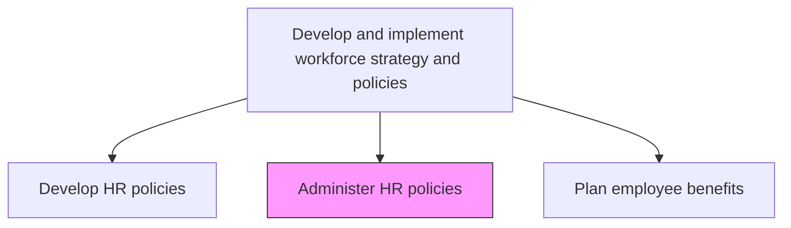
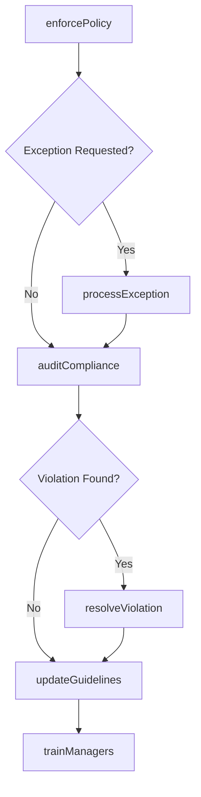

# Administer HR policies

> Business-as-Code definition for administering HR policies. Models the enforcement, exception handling, and ongoing compliance monitoring of established human resources policies.

## Overview

Ensuring rules and regulations are followed and are flexible enough to accommodate indispensable deviations.

## Process Hierarchy



## GraphDL

```yaml
administer:
  object: HR Policies
  actor: HRComplianceSpecialist
  result: PolicyComplianceReport
```

## Actions

| Action | Description |
|--------|-------------|
| enforcePolicy | Apply policy provisions consistently across employee actions and decisions |
| processException | Evaluate and adjudicate requests for policy exceptions or accommodations |
| auditCompliance | Conduct periodic reviews to verify policy adherence across departments |
| resolveViolation | Investigate policy violations and determine corrective actions |
| updateGuidelines | Revise administrative guidance and procedures when policy interpretation evolves |
| trainManagers | Educate managers on policy application, enforcement, and exception procedures |

## Events

| Event | Description |
|-------|-------------|
| policyEnforced | Policy provision applied to an employee action or decision |
| exceptionProcessed | Policy exception request evaluated and resolved |
| complianceAudited | Periodic compliance review completed for a policy area |
| violationResolved | Policy violation investigated and corrective action determined |
| guidelinesUpdated | Administrative guidelines revised for updated interpretation |
| managersTrained | Manager policy training session completed |

## Searches

| Search | Description |
|--------|-------------|
| findExceptions | List active policy exception requests by status, policy, or department |
| getComplianceStatus | Retrieve compliance audit results by department or policy category |
| findViolations | List policy violations filtered by severity, type, or time period |
| getTrainingCompletion | Retrieve manager policy training completion rates |

## Process Flow



## RACI Matrix

| Activity | Responsible | Accountable | Consulted | Informed |
|----------|-------------|-------------|-----------|----------|
| enforcePolicy | HRComplianceSpecialist | VP HR | LegalCounsel | DepartmentManagers |
| processException | HRBusinessPartner | VP HR | EmploymentAttorney | AffectedEmployee |
| auditCompliance | HRComplianceSpecialist | CHRO | InternalAudit | ExecutiveTeam |
| resolveViolation | EmployeeRelationsSpecialist | VP HR | LegalCounsel | CHRO |

## Related Processes

| Process | Relationship |
|---------|-------------|
| 7.1.2.10 Develop HR policies | Upstream - policies must be developed before administration |
| 7.4.4 Manage employee grievances | Downstream - policy enforcement may trigger grievances |
| 7.1.3.4 Review and revise HR plans | Parallel - compliance findings feed policy revision |

## Related Departments

| Department | Role |
|-----------|------|
| Human Resources | Administers and enforces HR policies |
| Legal | Advises on policy interpretation and violation resolution |
| Internal Audit | Supports compliance audit activities |
| Management | Applies policies to daily workforce decisions |

## Related Occupations

| Occupation | Involvement |
|-----------|-------------|
| HR Compliance Specialist | Audits and enforces policy adherence |
| Employee Relations Specialist | Handles violation investigations |
| HR Business Partner | Processes exceptions and supports managers |

## KPIs

| KPI | Description | Unit |
|-----|-------------|------|
| Compliance Rate | Percentage of audited areas in full policy compliance | % |
| Exception Turnaround | Average days to process a policy exception request | Days |
| Violation Recurrence Rate | Percentage of resolved violations that recur within 12 months | % |
| Manager Training Completion | Percentage of managers completing annual policy training | % |

## Usage

```typescript
import { administerHrPolicies } from '@headlessly/administer-hr-policies'

const admin = administerHrPolicies()

// Process a policy exception request
const exception = await admin.processException({
  policyId: 'remote-work-policy',
  employeeId: 'emp-4521',
  reason: 'medical-accommodation',
  requestedDuration: '6-months'
})

// Audit compliance across a department
const audit = await admin.auditCompliance({
  department: 'Sales',
  policyCategories: ['attendance', 'travel', 'expense']
})
```
