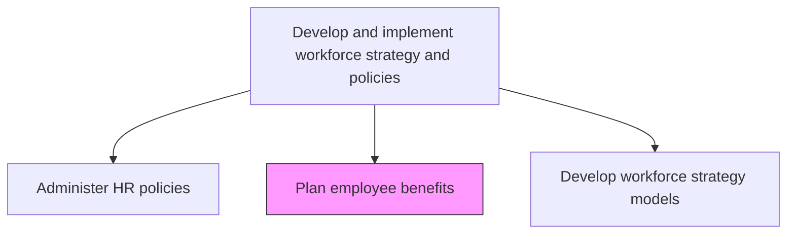
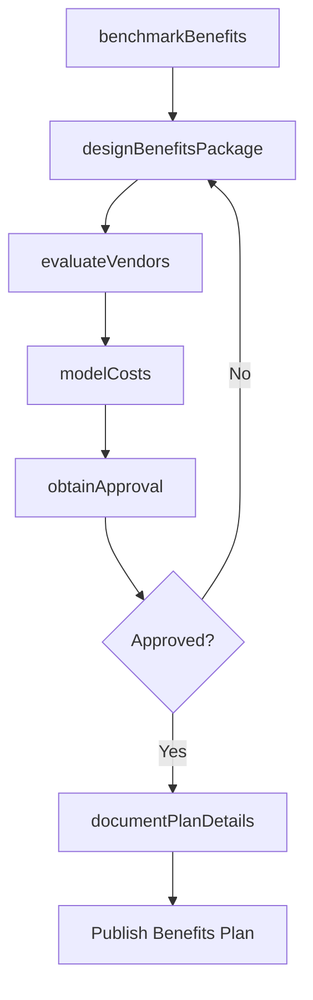

# Plan employee benefits

> Business-as-Code definition for planning employee benefits. Models the design, benchmarking, and budgeting of non-wage compensation packages including health, retirement, and supplementary benefits.

## Overview

Planning benefits in kind (also called fringe benefits, perquisites, or perks). Include various types of non-wage compensations provided to employees in addition to normal wages or salaries.

## Process Hierarchy



## GraphDL

```yaml
plan:
  object: Employee Benefits
  actor: BenefitsManager
  result: BenefitsPlan
```

## Actions

| Action | Description |
|--------|-------------|
| benchmarkBenefits | Compare current benefits offerings against industry and competitor data |
| designBenefitsPackage | Structure benefit tiers, eligibility rules, and coverage options |
| evaluateVendors | Assess and select insurance carriers, administrators, and benefits providers |
| modelCosts | Project total benefits costs under different plan design and participation scenarios |
| obtainApproval | Present benefits plan to finance and executive leadership for budget approval |
| documentPlanDetails | Finalize plan documents, summary plan descriptions, and employee guides |

## Events

| Event | Description |
|-------|-------------|
| benefitsBenchmarked | Market comparison of benefits offerings completed |
| benefitsPackageDesigned | Benefit tiers, eligibility, and coverage finalized |
| vendorsEvaluated | Benefits vendors assessed and selections made |
| costsModeled | Benefits cost projections completed under selected scenarios |
| approvalObtained | Executive and finance approval secured for benefits plan |
| planDetailsDocumented | Plan documents and employee communications finalized |

## Searches

| Search | Description |
|--------|-------------|
| getBenefitsBenchmark | Retrieve market benchmark data for benefits by industry and region |
| findVendorProposals | List vendor proposals filtered by benefit type, cost, or coverage |
| getCostProjection | Retrieve benefits cost models by plan design and participation rate |
| getPlanDocuments | Access current and historical plan documents and summaries |

## Process Flow



## RACI Matrix

| Activity | Responsible | Accountable | Consulted | Informed |
|----------|-------------|-------------|-----------|----------|
| benchmarkBenefits | BenefitsAnalyst | BenefitsManager | CompensationTeam | CHRO |
| designBenefitsPackage | BenefitsManager | CHRO | EmployeeFocusGroup | Finance |
| modelCosts | BenefitsAnalyst | CFO | Actuaries | ExecutiveTeam |
| obtainApproval | BenefitsManager | CHRO | CFO | Board |

## Related Processes

| Process | Relationship |
|---------|-------------|
| 7.5.2.1 Deliver employee benefits program | Downstream - benefits plan drives program delivery |
| 7.5.1.2 Develop benefits and rewards plan | Parallel - rewards and benefits planning overlap |
| 7.5.1.3 Perform competitive analysis of benefits and rewards | Upstream - competitive data informs benefits design |

## Related Departments

| Department | Role |
|-----------|------|
| Human Resources | Designs and manages benefits plans |
| Finance | Approves benefits budgets and cost projections |
| Legal | Ensures benefits compliance with ERISA and tax regulations |
| Procurement | Supports vendor evaluation and contract negotiation |

## Related Occupations

| Occupation | Involvement |
|-----------|-------------|
| Benefits Manager | Leads benefits planning and vendor management |
| Benefits Analyst | Conducts benchmarking and cost modeling |
| Actuary | Provides cost projection and risk analysis |

## KPIs

| KPI | Description | Unit |
|-----|-------------|------|
| Benefits Cost Per Employee | Total annual benefits spend divided by headcount | USD |
| Market Competitiveness Score | Percentile ranking of benefits versus market benchmark | Percentile |
| Employee Satisfaction with Benefits | Survey satisfaction score for benefits offerings | Score (1-5) |
| Benefits Budget Variance | Actual benefits spend versus planned budget | % |

## Usage

```typescript
import { planEmployeeBenefits } from '@headlessly/plan-employee-benefits'

const benefits = planEmployeeBenefits()

// Benchmark current benefits against market
const benchmark = await benefits.benchmarkBenefits({
  industry: 'Technology',
  region: 'US-National',
  companySize: '1000-5000'
})

// Model costs for proposed plan changes
const projection = await benefits.modelCosts({
  planDesign: 'enhanced-tier',
  participationRate: 0.85,
  fiscalYear: 'FY2026'
})
```
