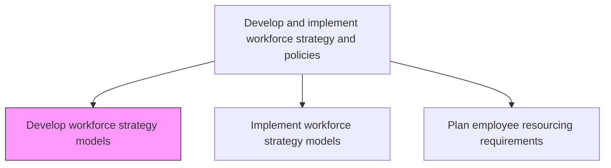
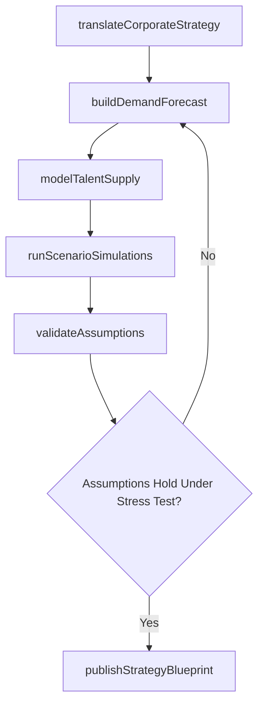

# Develop workforce strategy models

> Business-as-Code definition for developing workforce strategy models. Models the analytical frameworks, simulation tools, and strategic blueprints that drive long-term workforce planning and optimization.

## Overview

Creating and implementing models for effectively strategizing the work force of the organization. Develop a model that specifies the organization's overall approach for maximizing the performance of its work force by defining the goals, objectives, and expectations of the work force. Manage all aspects of performance required for the work force to function, including recruitment, selection, retention, and professional development.

## Process Hierarchy



## GraphDL

```yaml
develop:
  object: Workforce Strategy Models
  actor: WorkforceStrategyDirector
  result: StrategicWorkforceBlueprint
```

## Actions

| Action | Description |
|--------|-------------|
| translateCorporateStrategy | Decompose business growth, transformation, and market objectives into workforce capability requirements |
| buildDemandForecast | Create quantitative models projecting future headcount and skill needs by role family and geography |
| modelTalentSupply | Map internal pipeline, succession pools, and external labor market availability against demand |
| runScenarioSimulations | Simulate workforce outcomes under varying attrition, automation, restructuring, and growth assumptions |
| validateAssumptions | Stress-test model inputs against historical trends, exit interviews, and stakeholder knowledge |
| publishStrategyBlueprint | Package the approved strategy model into a distributable framework with implementation guidance |

## Events

| Event | Description |
|-------|-------------|
| corporateStrategyTranslated | Business objectives decomposed into measurable workforce capability requirements |
| demandForecastBuilt | Headcount and skill demand projections finalized across role families |
| talentSupplyModeled | Internal pipeline and external labor market supply mapped against projected demand |
| scenarioSimulationsCompleted | Workforce outcomes evaluated under multiple strategic assumption sets |
| assumptionsValidated | Model inputs confirmed against historical data and stakeholder review |
| strategyBlueprintPublished | Approved workforce strategy framework distributed to leadership and HR teams |

## Searches

| Search | Description |
|--------|-------------|
| getStrategyModels | List workforce strategy models by version, planning horizon, or business unit scope |
| getScenarioResults | Retrieve simulation outputs filtered by assumption set and forecast period |
| getDemandForecast | Access headcount and skill projections by role family, geography, or time period |
| getSupplyGapAnalysis | Retrieve talent supply-demand gap data by critical role or competency area |

## Process Flow



## RACI Matrix

| Activity | Responsible | Accountable | Consulted | Informed |
|----------|-------------|-------------|-----------|----------|
| translateCorporateStrategy | WorkforceStrategyDirector | CHRO | CEO | ExecutiveTeam |
| buildDemandForecast | WorkforcePlanningAnalyst | WorkforceStrategyDirector | BusinessUnitLeaders | Finance |
| runScenarioSimulations | WorkforcePlanningAnalyst | WorkforceStrategyDirector | HRAnalytics | Operations |
| publishStrategyBlueprint | WorkforceStrategyDirector | CHRO | AllHRLeaders | Board |

## Related Processes

| Process | Relationship |
|---------|-------------|
| 7.1.2.14 Implement workforce strategy models | Downstream - approved models are operationalized across the organization |
| 7.1.2.1 Gather skill requirements | Upstream - strategic skill analysis provides key inputs for demand modeling |
| 7.1.3.2 Measure contribution to business strategy | Consumer - strategy contribution metrics validate model effectiveness |

## Related Departments

| Department | Role |
|-----------|------|
| Human Resources | Owns workforce strategy model development and maintenance |
| Corporate Strategy | Provides business objectives and strategic direction inputs |
| Finance | Validates cost assumptions and budget feasibility of demand models |
| IT | Supports analytics platforms, data pipelines, and simulation tools |

## Related Occupations

| Occupation | Involvement |
|-----------|-------------|
| Workforce Strategy Director | Designs strategic models and owns scenario planning |
| Workforce Planning Analyst | Builds quantitative demand and supply forecasts |
| Data Scientist | Develops predictive analytics and simulation algorithms |

## KPIs

| KPI | Description | Unit |
|-----|-------------|------|
| Forecast Accuracy | Variance between predicted and actual workforce needs after 12 months | % |
| Scenario Coverage | Number of distinct strategic scenarios modeled per annual planning cycle | Count |
| Strategy Adoption Rate | Percentage of business units actively using workforce strategy outputs | % |
| Planning Cycle Time | Elapsed time from model development kickoff to executive sign-off | Weeks |

## Usage

```typescript
import { developWorkforceStrategyModels } from '@headlessly/develop-workforce-strategy-models'

const strategy = developWorkforceStrategyModels()

// Translate corporate strategy into workforce capability requirements
const requirements = await strategy.translateCorporateStrategy({
  corporateStrategy: 'growth-acceleration',
  planningHorizon: '5-year',
  focusAreas: ['digital-transformation', 'market-expansion', 'ai-adoption']
})

// Run scenario simulations with varying assumptions
const results = await strategy.runScenarioSimulations({
  demandModelId: requirements.demandForecastId,
  scenarios: [
    { name: 'high-attrition', attritionRate: 0.22, automationFactor: 0.15 },
    { name: 'rapid-growth', revenueGrowth: 0.35, hiringRamp: 'aggressive' },
    { name: 'recession', budgetCut: 0.20, hiringFreeze: true }
  ]
})
```
