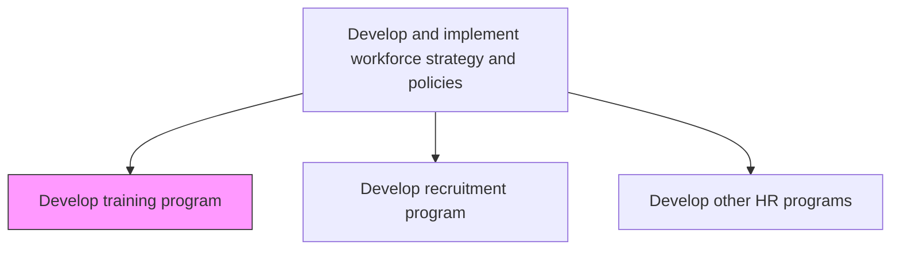
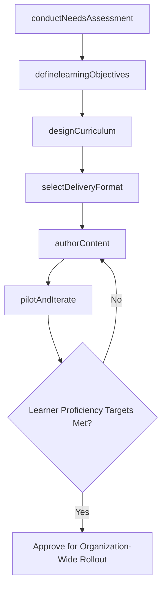

# Develop training program

> Business-as-Code definition for developing training programs. Models the instructional design lifecycle from needs analysis through curriculum development, delivery method selection, and pilot deployment.

## Overview

Identifying skills, knowledge, and attributes that need enhancement in order to perform a job. Develop the appropriate training programs. These programs can be computer-based, classroom, or on-the-job training, etc.

## Process Hierarchy



## GraphDL

```yaml
develop:
  object: Training Program
  actor: InstructionalDesigner
  result: TrainingCurriculum
```

## Actions

| Action | Description |
|--------|-------------|
| conductNeedsAssessment | Survey managers and employees to identify skill deficiencies, compliance gaps, and emerging capability needs |
| definelearningObjectives | Translate identified gaps into measurable learning outcomes with proficiency targets |
| designCurriculum | Structure content modules, sequencing, prerequisites, and assessment checkpoints |
| selectDeliveryFormat | Choose between e-learning, instructor-led, blended, on-the-job, or simulation-based delivery |
| authorContent | Develop course materials, exercises, case studies, and competency assessments |
| pilotAndIterate | Run trial sessions with a sample cohort, collect feedback, and refine content before full rollout |

## Events

| Event | Description |
|-------|-------------|
| needsAssessmentCompleted | Skill gap analysis finalized with prioritized training needs by department |
| learningObjectivesDefined | Measurable learning outcomes and proficiency targets established |
| curriculumDesigned | Module structure, sequencing, and assessment plan approved |
| deliveryFormatSelected | Training delivery methods chosen based on audience and content type |
| contentAuthored | Course materials, exercises, and assessments developed and reviewed |
| pilotCompleted | Trial delivery finished with participant feedback incorporated into final version |

## Searches

| Search | Description |
|--------|-------------|
| findTrainingGaps | List skill gaps by department, role, or competency requiring program development |
| getTrainingCatalog | Retrieve existing programs filtered by topic, delivery format, or proficiency level |
| getPilotFeedback | Access participant evaluations and effectiveness scores from trial sessions |
| findContentModules | Search reusable content modules by topic, format, or learning objective |

## Process Flow



## RACI Matrix

| Activity | Responsible | Accountable | Consulted | Informed |
|----------|-------------|-------------|-----------|----------|
| conductNeedsAssessment | InstructionalDesigner | VP LearningDevelopment | DepartmentManagers | CHRO |
| designCurriculum | InstructionalDesigner | VP LearningDevelopment | SubjectMatterExperts | HRBusinessPartners |
| authorContent | ContentDeveloper | InstructionalDesigner | SubjectMatterExperts | ITSystems |
| pilotAndIterate | TrainingFacilitator | VP LearningDevelopment | PilotParticipants | AllManagers |

## Related Processes

| Process | Relationship |
|---------|-------------|
| 7.3.4.4 Develop, conduct, and manage employee training programs | Downstream - completed programs are delivered and managed here |
| 7.1.2.1 Gather skill requirements | Upstream - strategic skill requirements define training priorities |
| 7.1.2.8 Develop recruitment program | Sibling - recruitment program addresses gaps training cannot close |

## Related Departments

| Department | Role |
|-----------|------|
| Learning and Development | Designs curricula and authors training content |
| Human Resources | Identifies organizational training priorities from workforce strategy |
| IT | Supports LMS platforms, virtual classrooms, and content hosting |
| Business Units | Provides subject matter expertise and pilot session participants |

## Related Occupations

| Occupation | Involvement |
|-----------|-------------|
| Instructional Designer | Architects learning experiences and curriculum structure |
| Training Facilitator | Delivers pilot and production sessions, collects learner feedback |
| Subject Matter Expert | Contributes domain knowledge and validates content accuracy |

## KPIs

| KPI | Description | Unit |
|-----|-------------|------|
| Program Development Cycle Time | Average elapsed time from needs assessment to program launch | Weeks |
| Learner Satisfaction Score | Average participant rating of training quality and relevance | Score (1-5) |
| Knowledge Retention Rate | Percentage of assessed knowledge retained 90 days post-training | % |
| Skill Gap Closure Rate | Percentage of identified skill gaps addressed by launched programs | % |

## Usage

```typescript
import { developTrainingProgram } from '@headlessly/develop-training-program'

const training = developTrainingProgram()

// Conduct needs assessment across engineering department
const gaps = await training.conductNeedsAssessment({
  scope: 'Engineering',
  methods: ['skills-inventory', 'manager-survey', 'performance-review-data'],
  benchmarkAgainst: 'role-competency-model'
})

// Design curriculum for the highest-priority gaps
const curriculum = await training.designCurriculum({
  targetGaps: gaps.prioritized.slice(0, 5),
  deliveryFormat: 'blended',
  modules: ['cloud-architecture', 'system-design', 'security-fundamentals'],
  durationWeeks: 8,
  assessmentCadence: 'bi-weekly'
})
```
