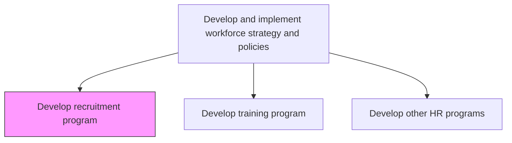
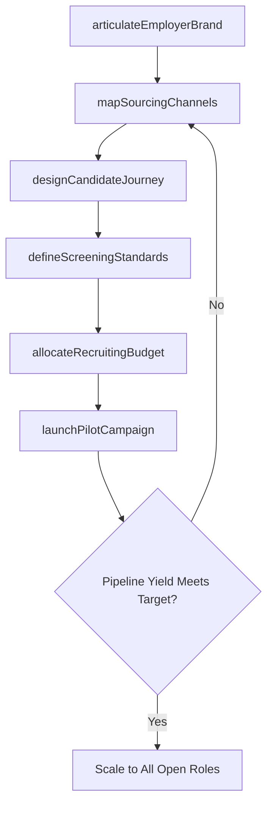

# Develop recruitment program

> Business-as-Code definition for developing recruitment programs. Models the strategic design of talent attraction initiatives including employer branding, sourcing channel strategy, and candidate experience optimization.

## Overview

Developing a program to entice prospective resources to engage with the organization for a position of employment.

## Process Hierarchy



## GraphDL

```yaml
develop:
  object: Recruitment Program
  actor: TalentAcquisitionManager
  result: TalentAttractionFramework
```

## Actions

| Action | Description |
|--------|-------------|
| articulateEmployerBrand | Craft the employee value proposition, culture narrative, and differentiating brand messages |
| mapSourcingChannels | Evaluate and prioritize job boards, university partnerships, referral networks, and agency relationships |
| designCandidateJourney | Architect the end-to-end experience from initial awareness through offer acceptance and pre-boarding |
| defineScreeningStandards | Establish competency-based evaluation rubrics, structured interview guides, and scorecard templates |
| allocateRecruitingBudget | Distribute spend across channels, recruiting events, technology tools, and agency fees |
| launchPilotCampaign | Activate the recruitment program in a target segment, measure yield, and refine before scaling |

## Events

| Event | Description |
|-------|-------------|
| employerBrandArticulated | Employee value proposition and brand messaging finalized and approved |
| sourcingChannelsMapped | Channel portfolio selected with projected cost-per-hire and yield estimates |
| candidateJourneyDesigned | Touchpoints from awareness to pre-boarding documented and validated |
| screeningStandardsDefined | Structured evaluation rubrics and interview guides published |
| recruitingBudgetAllocated | Spend distributed across channels, tools, and events with tracking codes |
| pilotCampaignLaunched | Recruitment program activated in target segment and accepting applicants |

## Searches

| Search | Description |
|--------|-------------|
| getSourcingChannels | List active sourcing channels with cost-per-hire, yield, and quality metrics |
| getCandidatePipelineStatus | Retrieve candidate volume by funnel stage, role family, and source |
| findRecruitmentMetrics | Access program KPIs filtered by channel, role, geography, or time period |
| getBrandSentiment | Retrieve employer brand awareness scores and candidate perception data |

## Process Flow



## RACI Matrix

| Activity | Responsible | Accountable | Consulted | Informed |
|----------|-------------|-------------|-----------|----------|
| articulateEmployerBrand | EmployerBrandSpecialist | TalentAcquisitionManager | Marketing | CHRO |
| mapSourcingChannels | TalentAcquisitionManager | VP HR | RecruitingTeam | HiringManagers |
| designCandidateJourney | RecruitingCoordinator | TalentAcquisitionManager | ITSystems | Candidates |
| allocateRecruitingBudget | TalentAcquisitionManager | CHRO | Finance | ExecutiveTeam |

## Related Processes

| Process | Relationship |
|---------|-------------|
| 7.2.2 Recruit/source candidates | Downstream - recruitment program governs how sourcing is executed |
| 7.2.1 Manage employee requisitions | Parallel - requisition volume drives recruitment program demand |
| 7.1.2.6 Develop employee diversity plan | Upstream - diversity targets shape sourcing channel selection |

## Related Departments

| Department | Role |
|-----------|------|
| Talent Acquisition | Designs and owns recruitment program strategy and execution |
| Marketing | Supports employer brand development, content, and campaign creative |
| Finance | Approves recruiting budget allocations and tracks spend efficiency |
| IT | Maintains applicant tracking system, career portal, and CRM integrations |

## Related Occupations

| Occupation | Involvement |
|-----------|-------------|
| Talent Acquisition Manager | Leads end-to-end recruitment program design |
| Employer Brand Specialist | Develops EVP messaging and brand campaigns |
| Recruiting Coordinator | Operationalizes candidate journey touchpoints |

## KPIs

| KPI | Description | Unit |
|-----|-------------|------|
| Cost Per Hire | Total recruitment spend divided by number of hires | USD |
| Time to Fill | Average days from requisition opening to offer acceptance | Days |
| Source of Hire | Hire distribution percentage across sourcing channels | % |
| Offer Acceptance Rate | Percentage of extended offers accepted by candidates | % |

## Usage

```typescript
import { developRecruitmentProgram } from '@headlessly/develop-recruitment-program'

const recruitment = developRecruitmentProgram()

// Articulate employer brand for technical talent
const brand = await recruitment.articulateEmployerBrand({
  valueProposition: 'innovation-driven-engineering-culture',
  targetPersonas: ['senior-engineers', 'product-managers', 'data-scientists'],
  channels: ['careers-site', 'linkedin', 'glassdoor', 'github-sponsorships']
})

// Map and prioritize sourcing channels for upcoming hiring wave
const channels = await recruitment.mapSourcingChannels({
  hiringTarget: 75,
  roleFamilies: ['engineering', 'data-science', 'product'],
  budgetRange: { min: 150000, max: 350000 },
  diversityTargets: { underrepresentedMinimum: 0.40 }
})
```
