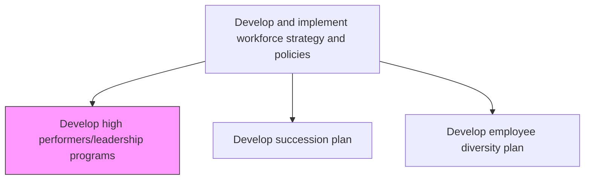
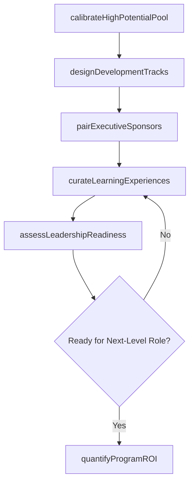

# Develop high performers/leadership programs

> Business-as-Code definition for developing high performer and leadership development programs. Models the identification of high-potential talent, design of accelerated development tracks, and executive sponsorship for leadership pipeline growth.

## Overview

Creating a program that incorporates incentives and compensation put forth by the organization to recognize high performing workers and excellence in leadership. Develop structured paths for high-potential employees to accelerate their readiness for critical leadership roles through stretch assignments, executive coaching, and action learning.

## Process Hierarchy



## GraphDL

```yaml
develop:
  object: High Performers/leadership Programs
  actor: LeadershipDevelopmentManager
  result: LeadershipPipelineProgram
```

## Actions

| Action | Description |
|--------|-------------|
| calibrateHighPotentialPool | Facilitate nine-box talent reviews to identify employees with both high performance and high potential |
| designDevelopmentTracks | Create tiered leadership tracks with rotational assignments, action learning projects, and executive education |
| pairExecutiveSponsors | Match high-potential participants with C-suite or VP-level sponsors for visibility and mentorship |
| curateLearningExperiences | Assemble stretch assignments, cross-functional projects, and external leadership programs |
| assessLeadershipReadiness | Evaluate participant progress through 360-degree feedback, assessment centers, and business case presentations |
| quantifyProgramROI | Calculate program return through promotion velocity, retention rates, and successor bench strength |

## Events

| Event | Description |
|-------|-------------|
| highPotentialPoolCalibrated | Talent review completed and high-potential designations confirmed for the cycle |
| developmentTracksDesigned | Tiered leadership development tracks approved with milestones and timelines |
| executiveSponsorsAssigned | Senior leader mentorship pairings confirmed and onboarded |
| learningExperiencesCurated | Rotational assignments and external programs scheduled for participants |
| leadershipReadinessAssessed | 360-degree feedback and assessment center results compiled for each participant |
| programROIQuantified | Promotion rates, retention impact, and bench strength improvements reported |

## Searches

| Search | Description |
|--------|-------------|
| findHighPotentials | List high-potential employees filtered by business unit, career level, or readiness tier |
| getLeadershipTracks | Retrieve available development tracks with enrollment capacity and participant status |
| getParticipantProgress | Access individual milestone completion, assessment scores, and sponsor feedback |
| getProgramOutcomes | Retrieve promotion velocity, retention rates, and engagement scores for program alumni |

## Process Flow



## RACI Matrix

| Activity | Responsible | Accountable | Consulted | Informed |
|----------|-------------|-------------|-----------|----------|
| calibrateHighPotentialPool | TalentManagementSpecialist | CHRO | BusinessUnitLeaders | Participants |
| designDevelopmentTracks | LeadershipDevelopmentManager | VP TalentManagement | ExecutiveCoach | HRBusinessPartners |
| pairExecutiveSponsors | LeadershipDevelopmentManager | CHRO | CEO | ExecutiveTeam |
| quantifyProgramROI | HRAnalyst | CHRO | Finance | Board |

## Related Processes

| Process | Relationship |
|---------|-------------|
| 7.1.2.4 Develop succession plan | Upstream - succession gaps identify which leadership levels need development |
| 7.3.3.2 Develop employee career plans and career paths | Parallel - individual career paths integrate with leadership development tracks |
| 7.1.2.7 Develop training program | Sibling - training programs address broad skill gaps while leadership programs target high-potentials |

## Related Departments

| Department | Role |
|-----------|------|
| Talent Management | Designs leadership programs and manages high-potential identification |
| Executive Leadership | Provides sponsorship, mentoring, and stretch assignment opportunities |
| Learning and Development | Delivers program content, coaching, and facilitation |
| Business Units | Nominates participants and hosts rotational assignments |

## Related Occupations

| Occupation | Involvement |
|-----------|-------------|
| Leadership Development Manager | Architects program structure and manages participant journey |
| Executive Coach | Provides individualized coaching and 360-degree feedback facilitation |
| Talent Management Specialist | Runs calibration sessions and tracks high-potential pool analytics |

## KPIs

| KPI | Description | Unit |
|-----|-------------|------|
| High-Potential Identification Rate | Percentage of total workforce designated as high-potential talent | % |
| Promotion Velocity | Average months from program enrollment to next-level promotion | Months |
| Participant Retention Rate | Percentage of program alumni retained after 3 years | % |
| Leadership Bench Strength | Ratio of ready-now successors to critical leadership positions | Ratio |

## Usage

```typescript
import { developHighPerformersLeadershipPrograms } from '@headlessly/develop-high-performers-leadership-programs'

const leadership = developHighPerformersLeadershipPrograms()

// Calibrate high-potential pool through talent review
const hipos = await leadership.calibrateHighPotentialPool({
  assessmentFramework: 'nine-box',
  minimumPerformanceRating: 4,
  scope: 'organization-wide',
  includeNewHires: false,
  tenureMinimumMonths: 12
})

// Design a director-to-VP leadership development track
const track = await leadership.designDevelopmentTracks({
  targetLevel: 'director-to-vp',
  durationMonths: 18,
  components: ['executive-coaching', 'cross-functional-rotation', 'action-learning-project'],
  cohortSize: 20,
  graduationCriteria: ['360-feedback-threshold', 'business-case-presentation', 'sponsor-endorsement']
})
```
