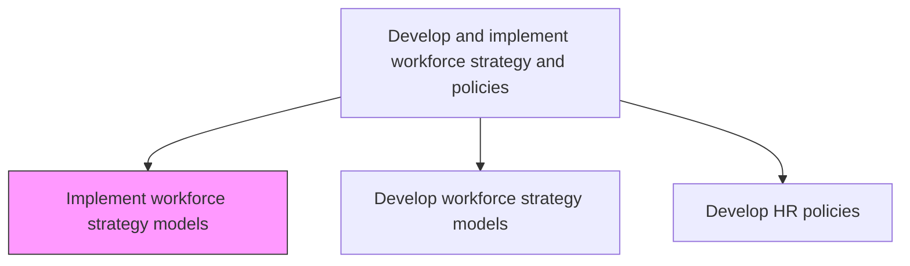
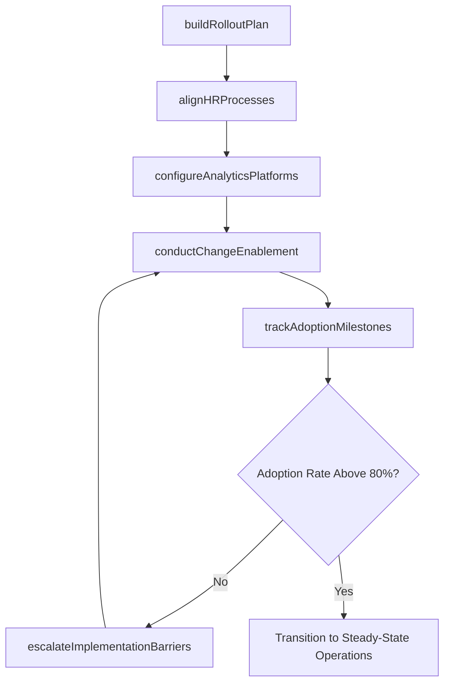

# Implement workforce strategy models

> Business-as-Code definition for implementing workforce strategy models. Models the operationalization of approved workforce strategies across recruitment, retention, and professional development functions.

## Overview

Implementing models for effectively strategizing the work force of the organization. Carry out all aspects of performance required for the work force to function, including recruitment, selection, retention, and professional development.

## Process Hierarchy



## GraphDL

```yaml
implement:
  object: Workforce Strategy Models
  actor: WorkforceStrategyDirector
  result: StrategyDeploymentPlan
```

## Actions

| Action | Description |
|--------|-------------|
| buildRolloutPlan | Sequence deployment phases by business unit, prioritizing high-impact areas and change readiness |
| alignHRProcesses | Reconfigure recruiting, onboarding, L&D, and retention workflows to reflect strategy model outputs |
| configureAnalyticsPlatforms | Set up HRIS dashboards, workforce planning tools, and automated reporting for strategy tracking |
| conductChangeEnablement | Train HR business partners and line managers on how to apply the strategy model in daily decisions |
| trackAdoptionMilestones | Measure business unit uptake through usage logs, process compliance checks, and feedback surveys |
| escalateImplementationBarriers | Surface blockers such as budget shortfalls, system gaps, or resistance to the steering committee |

## Events

| Event | Description |
|-------|-------------|
| rolloutPlanBuilt | Phased deployment schedule approved with business unit sequencing |
| hrProcessesAligned | Recruiting, onboarding, L&D, and retention workflows reconfigured to strategy specifications |
| analyticsPlatformsConfigured | HRIS dashboards and automated reporting activated for strategy tracking |
| changeEnablementConducted | HR partners and managers trained on applying workforce strategy models |
| adoptionMilestonesTracked | Business unit uptake rates and process compliance scores collected |
| implementationBarriersEscalated | Blockers surfaced to steering committee with proposed resolutions |

## Searches

| Search | Description |
|--------|-------------|
| getDeploymentStatus | Retrieve rollout progress by business unit, phase, or strategy component |
| findAdoptionMetrics | Access usage rates, process compliance scores, and feedback data by unit |
| getProcessAlignmentGaps | Identify HR workflows not yet reconfigured to strategy model specifications |
| getBarrierLog | Retrieve open implementation blockers with severity and resolution status |

## Process Flow



## RACI Matrix

| Activity | Responsible | Accountable | Consulted | Informed |
|----------|-------------|-------------|-----------|----------|
| buildRolloutPlan | WorkforceStrategyDirector | CHRO | BusinessUnitLeaders | AllHRTeams |
| alignHRProcesses | HRBusinessPartner | WorkforceStrategyDirector | ProcessOwners | Finance |
| conductChangeEnablement | LearningDevelopmentTeam | WorkforceStrategyDirector | HRBusinessPartners | AllManagers |
| trackAdoptionMilestones | HRAnalyst | WorkforceStrategyDirector | ITSystems | ExecutiveTeam |

## Related Processes

| Process | Relationship |
|---------|-------------|
| 7.1.2.13 Develop workforce strategy models | Upstream - provides the approved models being implemented |
| 7.1.3.1 Measure realization of objectives | Downstream - implementation outcomes feed into objective measurement |
| 7.1.2.11 Administer HR policies | Parallel - policy administration must align with strategy deployment |

## Related Departments

| Department | Role |
|-----------|------|
| Human Resources | Leads strategy implementation across all HR functions |
| IT | Configures HRIS, analytics platforms, and reporting infrastructure |
| Business Units | Adopts strategy models and applies them in workforce decisions |
| Finance | Monitors resource allocation and budget compliance during rollout |

## Related Occupations

| Occupation | Involvement |
|-----------|-------------|
| Workforce Strategy Director | Oversees phased strategy deployment and stakeholder alignment |
| HR Business Partner | Facilitates business unit adoption and process reconfiguration |
| HRIS Analyst | Configures systems, dashboards, and automated reporting |

## KPIs

| KPI | Description | Unit |
|-----|-------------|------|
| Model Adoption Rate | Percentage of business units actively using deployed strategy models | % |
| Implementation Cycle Time | Elapsed time from model approval to full organizational deployment | Weeks |
| Process Alignment Score | Percentage of HR workflows reconfigured to strategy specifications | % |
| Stakeholder Readiness | Percentage of trained managers passing strategy application assessment | % |

## Usage

```typescript
import { implementWorkforceStrategyModels } from '@headlessly/implement-workforce-strategy-models'

const implementation = implementWorkforceStrategyModels()

// Build phased rollout plan for approved strategy model
const rollout = await implementation.buildRolloutPlan({
  modelId: 'workforce-strategy-2026',
  phases: [
    { units: ['Engineering', 'Product'], startWeek: 1 },
    { units: ['Sales', 'Marketing'], startWeek: 6 },
    { units: ['Operations', 'Finance'], startWeek: 10 }
  ],
  changeReadinessThreshold: 0.7
})

// Track adoption milestones across deployed units
const adoption = await implementation.trackAdoptionMilestones({
  deploymentId: rollout.id,
  metrics: ['usage-frequency', 'process-compliance', 'manager-feedback'],
  reportingCadence: 'bi-weekly'
})
```
