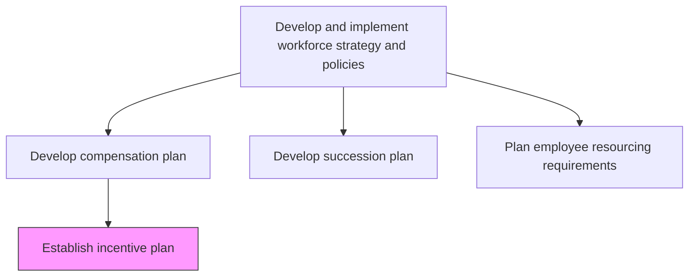
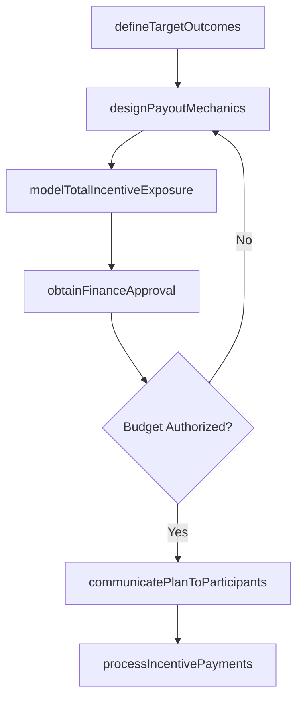

# Establish incentive plan

> Business-as-Code definition for establishing incentive plans. Models the design, approval, and deployment of variable compensation structures including bonuses, commissions, and performance-based awards.

## Overview

Creating a scheme of awards and recognition for sales employees to promote a results-based culture. Create specific incentives to reach desired outcomes, such as landing key clients, growing the customer base, providing exceptional servicing, and increasing profit margins.

## Process Hierarchy



## GraphDL

```yaml
establish:
  object: Incentive Plan
  actor: CompensationManager
  result: VariableCompensationPlan
```

## Actions

| Action | Description |
|--------|-------------|
| defineTargetOutcomes | Specify the business results the incentive plan is designed to drive, such as revenue targets, client acquisition, or margin improvement |
| designPayoutMechanics | Create commission tiers, bonus multipliers, accelerators, and clawback provisions |
| modelTotalIncentiveExposure | Project aggregate incentive payouts under conservative, target, and stretch performance scenarios |
| obtainFinanceApproval | Present cost models and ROI projections to CFO and executive leadership for budget authorization |
| communicatePlanToParticipants | Distribute plan documents, payout calculators, and worked examples to eligible employees |
| processIncentivePayments | Calculate earned incentive amounts at period end and submit to payroll for disbursement |

## Events

| Event | Description |
|-------|-------------|
| targetOutcomesDefined | Business results and performance metrics the incentive plan will reward finalized |
| payoutMechanicsDesigned | Commission tiers, multipliers, accelerators, and clawback rules documented |
| incentiveExposureModeled | Aggregate payout projections completed under multiple performance scenarios |
| financeApprovalObtained | Budget authorization granted for incentive plan costs |
| planCommunicatedToParticipants | Plan documents and calculators distributed to all eligible employees |
| incentivePaymentsProcessed | Earned incentive amounts calculated, validated, and submitted to payroll |

## Searches

| Search | Description |
|--------|-------------|
| getIncentivePlans | List active incentive plans filtered by role, department, or plan type |
| getPayoutProjections | Retrieve projected incentive costs under specified performance scenarios |
| findEligibleEmployees | List employees eligible for a specific incentive plan by department or role |
| getPayoutHistory | Access historical incentive payment records by employee, plan, or period |

## Process Flow



## RACI Matrix

| Activity | Responsible | Accountable | Consulted | Informed |
|----------|-------------|-------------|-----------|----------|
| designPayoutMechanics | CompensationManager | VP TotalRewards | SalesLeadership | Finance |
| modelTotalIncentiveExposure | CompensationAnalyst | CFO | CompensationManager | CHRO |
| obtainFinanceApproval | CompensationManager | CHRO | CFO | Board |
| processIncentivePayments | PayrollSpecialist | CompensationManager | Finance | EligibleEmployees |

## Related Processes

| Process | Relationship |
|---------|-------------|
| 7.5.1.1 Develop salary/compensation structure and plan | Upstream - base compensation structures inform incentive plan positioning |
| 7.5.1.6 Reward and motivate employees | Downstream - incentive payouts are delivered through reward mechanisms |
| 7.3.2.1 Define employee performance objectives | Parallel - performance objectives define the targets incentive plans reward |

## Related Departments

| Department | Role |
|-----------|------|
| Compensation and Benefits | Designs incentive plan mechanics and administers payouts |
| Finance | Approves budget exposure, validates cost models, and tracks actual spend |
| Sales | Primary consumer of sales incentive plans and quota-based compensation |
| Payroll | Processes incentive payment calculations and disbursements |

## Related Occupations

| Occupation | Involvement |
|-----------|-------------|
| Compensation Manager | Architects incentive structures and payout rules |
| Compensation Analyst | Models costs, projects exposure, and analyzes plan effectiveness |
| Payroll Specialist | Calculates earned amounts and processes incentive disbursements |

## KPIs

| KPI | Description | Unit |
|-----|-------------|------|
| Incentive Plan Participation | Percentage of eligible employees actively engaged with the plan | % |
| Payout Accuracy | Percentage of incentive payments processed without calculation errors | % |
| Incentive ROI | Incremental revenue or margin generated per dollar of incentive spend | Ratio |
| Quota Attainment Rate | Percentage of participants achieving target performance thresholds | % |

## Usage

```typescript
import { establishIncentivePlan } from '@headlessly/establish-incentive-plan'

const incentives = establishIncentivePlan()

// Design payout mechanics for sales commission plan
const plan = await incentives.designPayoutMechanics({
  planType: 'sales-commission',
  tiers: [
    { name: 'base', thresholdPercent: 80, commissionRate: 0.05 },
    { name: 'accelerator', thresholdPercent: 100, commissionRate: 0.08 },
    { name: 'super-accelerator', thresholdPercent: 120, commissionRate: 0.12 }
  ],
  clawbackWindow: '90-days',
  payoutFrequency: 'monthly'
})

// Model total incentive exposure across performance scenarios
const projection = await incentives.modelTotalIncentiveExposure({
  planId: plan.id,
  scenarios: ['conservative', 'target', 'stretch'],
  eligibleHeadcount: 150,
  averageQuota: 500000
})
```
