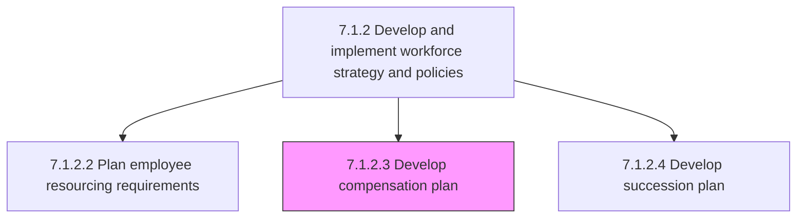
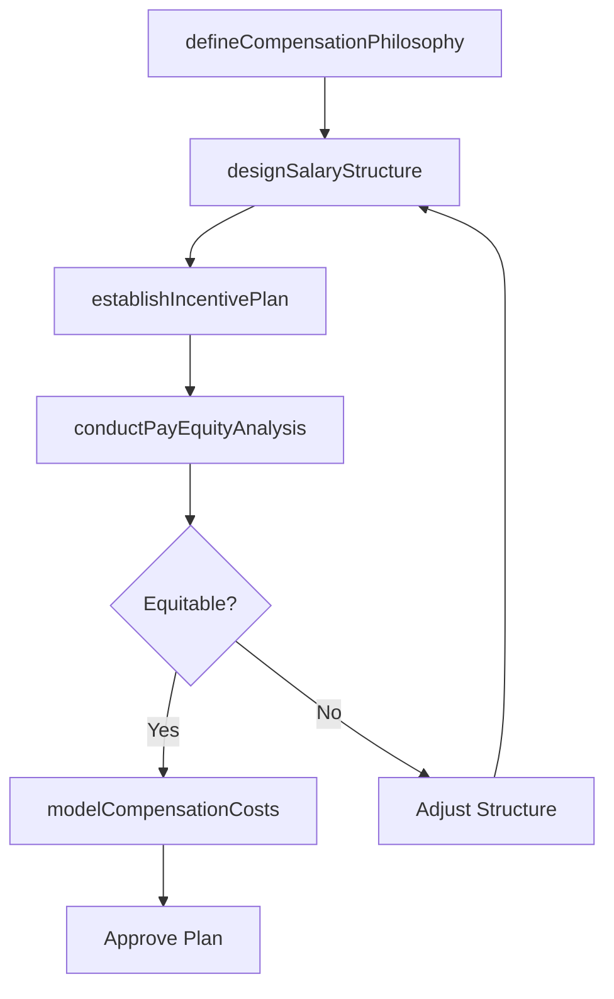

# Develop compensation plan

> Business-as-Code definition for compensation plan development. Models salary structure design, incentive plan creation, pay equity analysis, and total compensation framework definition.

## Overview

Designing a plan that specifies the combination of wages, salaries, and benefits the employees receive in exchange for work. Define the total amount of compensation, in addition to the manner in which the compensation is paid and the purposes for which employees can receive bonuses, salary increases, and incentives.

## Process Hierarchy



## GraphDL

```yaml
develop:
  object: Compensation Plan
  actor: CompensationDirector
  result: CompensationFramework
```

## Actions

| Action | Description |
|--------|-------------|
| designSalaryStructure | Define pay grades, salary bands, and geographic differentials |
| establishIncentivePlan | Create variable compensation programs including bonuses and commissions |
| conductPayEquityAnalysis | Analyze compensation data for internal equity and demographic fairness |
| defineCompensationPhilosophy | Establish the organization's market positioning strategy for pay |
| modelCompensationCosts | Forecast total compensation costs under proposed plan structures |

## Events

| Event | Description |
|-------|-------------|
| salaryStructureDesigned | Pay grades and salary bands defined and approved |
| incentivePlanEstablished | Variable compensation program created and documented |
| payEquityAnalysisConducted | Compensation equity review completed with findings |
| compensationPhilosophyDefined | Market positioning and pay strategy documented |
| compensationCostsModeled | Total compensation cost projections completed |

## Searches

| Search | Description |
|--------|-------------|
| getSalaryBands | Retrieve pay grade and salary range data by role family or level |
| getIncentivePlans | List active incentive plans by type, eligibility, or business unit |
| getPayEquityData | Query compensation equity metrics by demographic or role |
| getCompensationBudget | Retrieve compensation cost projections and budget allocations |

## Process Flow



## RACI Matrix

| Activity | Responsible | Accountable | Consulted | Informed |
|----------|-------------|-------------|-----------|----------|
| designSalaryStructure | Compensation Director | CHRO | Finance, Legal | Department Heads |
| establishIncentivePlan | Compensation Director | CHRO | Sales Leadership | Finance |
| conductPayEquityAnalysis | Compensation Analyst | Compensation Director | Legal | CHRO |
| modelCompensationCosts | Compensation Analyst | Compensation Director | Finance | CFO |

## Sub-Processes

| ID | Name | Description |
|----|------|-------------|
| 7.1.2.3.1 | Establish incentive plan | Creating a scheme of awards and recognition for sales employees to promote a results-based culture.  |

## Related Processes

| Process | Relationship |
|---------|-------------|
| 7.5.1 Develop and manage reward, recognition, and motivation programs | Downstream - compensation plan implemented through reward programs |
| 7.1.2.12 Plan employee benefits | Parallel - benefits plan complements compensation design |
| 7.1.2.1 Gather skill requirements according to corporate strategy | Upstream - skill market rates inform compensation levels |

## Related Departments

| Department | Role |
|-----------|------|
| Compensation and Benefits | Designs salary structures and incentive programs |
| Finance | Approves compensation budgets and cost models |
| Legal | Ensures compliance with pay equity and labor regulations |
| Executive Leadership | Approves compensation philosophy and total spend |

## Related Occupations

| Occupation | Involvement |
|-----------|-------------|
| Compensation Director | Leads compensation plan design and strategy |
| Compensation Analyst | Conducts market benchmarking and pay equity analysis |
| Financial Analyst | Models compensation costs and budget impact |

## KPIs

| KPI | Description | Unit |
|-----|-------------|------|
| Compa-Ratio | Average employee pay relative to midpoint of salary range | Ratio |
| Pay Equity Gap | Maximum unexplained pay variance across demographic groups | % |
| Compensation Cost as Percentage of Revenue | Total compensation spend relative to organizational revenue | % |
| Market Competitiveness Index | Organization pay positioning relative to target market percentile | Percentile |

## Usage

```typescript
import { developCompensationPlan } from '@headlessly/develop-compensation-plan'

const compensation = developCompensationPlan()

// Design salary structure
const structure = await compensation.designSalaryStructure({
  marketData: 'radford-2025',
  targetPercentile: 'p50',
  geographicZones: ['tier-1', 'tier-2', 'tier-3'],
  jobFamilies: ['engineering', 'sales', 'operations']
})

// Establish incentive plan
const incentive = await compensation.establishIncentivePlan({
  planType: 'annual-bonus',
  eligibility: 'all-exempt-employees',
  targetPayout: 0.15,
  performanceMetrics: ['revenue', 'customer-satisfaction', 'individual-goals']
})
```
