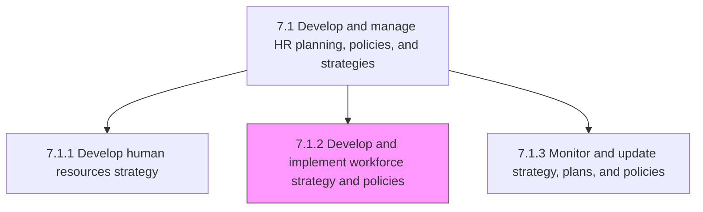
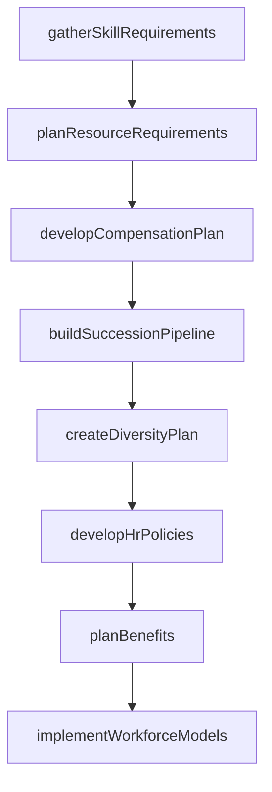

# Develop and implement workforce strategy and policies

> Business-as-Code definition for workforce strategy and policy development. Models skill requirements gathering, resource planning, compensation design, succession planning, diversity initiatives, training programs, and HR policy administration.

## Overview

Creating and executing strategies and policies for smooth administration of work force. Determine and gather skill requirements. Plan the requirements for employee resourcing per unit. Create compensation, succession, HR program, and employee diversity plans. Develop and administer policies for HR. Develop benefits for employees. Create models for work force strategies.

## Process Hierarchy



## GraphDL

```yaml
develop:
  object: And Implement Workforce Strategy And Policies
  actor: WorkforcePlanningManager
  result: WorkforceStrategyDocument
```

## Actions

| Action | Description |
|--------|-------------|
| gatherSkillRequirements | Assess skill needs based on corporate strategy and market conditions |
| planResourceRequirements | Determine headcount and resource needs per business unit |
| developCompensationPlan | Design salary structures, incentive plans, and total rewards packages |
| buildSuccessionPipeline | Identify critical roles and develop leadership succession plans |
| createDiversityPlan | Develop workforce diversity and inclusion initiatives |
| developHrPolicies | Draft and publish HR policies and compliance procedures |
| planBenefits | Design employee benefits programs and vendor relationships |
| implementWorkforceModels | Execute approved workforce strategy models across the organization |

## Events

| Event | Description |
|-------|-------------|
| skillRequirementsGathered | Skill gap analysis completed and requirements documented |
| resourceRequirementsPlanned | Headcount plan approved for each business unit |
| compensationPlanDeveloped | Salary and incentive structure finalized |
| successionPipelineBuilt | Succession candidates identified and development plans created |
| diversityPlanCreated | DEI strategy and targets established |
| hrPoliciesDeveloped | HR policies drafted and approved for publication |
| benefitsPlanned | Employee benefits programs designed and vendor contracts secured |
| workforceModelsImplemented | Workforce strategy models deployed in the organization |

## Searches

| Search | Description |
|--------|-------------|
| getSkillGapAnalysis | Retrieve skill gap data by department or role family |
| getResourcePlan | Query headcount plans by business unit and planning period |
| getCompensationBands | Retrieve salary bands by grade level and location |
| getSuccessionPipeline | List succession candidates by role readiness level |
| getHrPolicies | Query HR policies by category, effective date, or region |

## Process Flow



## RACI Matrix

| Activity | Responsible | Accountable | Consulted | Informed |
|----------|-------------|-------------|-----------|----------|
| gatherSkillRequirements | Workforce Planner | VP HR | Business Unit Heads | L&D |
| planResourceRequirements | Workforce Planner | VP HR | Finance, Department Heads | Talent Acquisition |
| developCompensationPlan | Compensation Manager | VP HR | Finance, Legal | Employees |
| buildSuccessionPipeline | Talent Management Lead | VP HR | Executive Team | HR Business Partners |
| developHrPolicies | HR Policy Manager | VP HR | Legal, Compliance | All Employees |

## Sub-Processes

| ID | Name | Description |
|----|------|-------------|
| 7.1.2.1 | Gather skill requirements according to corporate strategy and market environment | Evaluating the current and future skill requirements of the organization with regard to the overall  |
| 7.1.2.2 | Plan employee resourcing requirements per business unit/organization | Determining the requirements for employees and the need for employee resourcing for each every unit/ |
| 7.1.2.3 | Develop compensation plan | Designing a plan that specifies the combination of wages, salaries, and benefits the employees recei |
| 7.1.2.4 | Develop succession plan | Creating and implementing the plan for continuation of key positions within the organization. Identi |
| 7.1.2.5 | Develop high performers/leadership programs | Creating a program that incorporates incentives and compensation put forth by the organization to re |
| 7.1.2.6 | Develop employee diversity plan | Creating and implementing the plan for ensuring a diverse work force. Develop and hire employees wit |
| 7.1.2.7 | Develop training program | Identifying skills, knowledge, and attributes that need enhancement in order to perform a job. Devel |
| 7.1.2.8 | Develop recruitment program | Developing a program to entice prospective resources to engage with the organization for a position  |
| 7.1.2.9 | Develop other HR programs | Creating HR programs and services such as employee engagements programs to promote positive employee |
| 7.1.2.10 | Develop HR policies | Creating rules and regulations that govern the HR function. Develop a policy plan that serves as a g |
| 7.1.2.11 | Administer HR policies | Ensuring rules and regulations are followed and are flexible enough to accommodate indispensable dev |
| 7.1.2.12 | Plan employee benefits | Planning benefits in kind (also called fringe benefits, perquisites, or perks). Include various type |
| 7.1.2.13 | Develop workforce strategy models | Creating and implementing models for effectively strategizing the work force of the organization. De |
| 7.1.2.14 | Implement workforce strategy models | Implementing models for effectively strategizing the work force of the organization. Carry out all a |

## Related Processes

| Process | Relationship |
|---------|-------------|
| 7.1.1 Develop human resources strategy | Upstream - HR strategy guides workforce policy development |
| 7.2 Recruit, source, and select employees | Downstream - workforce plan drives hiring needs |
| 7.5 Reward and retain employees | Downstream - compensation plans guide rewards programs |

## Related Departments

| Department | Role |
|-----------|------|
| Human Resources | Develops and implements workforce strategies and policies |
| Finance | Approves compensation budgets and benefits costs |
| Legal | Reviews policies for labor law compliance |
| All Business Units | Provides input on resource needs and skill requirements |

## Related Occupations

| Occupation | Involvement |
|-----------|-------------|
| Workforce Planning Analyst | Develops resource plans and workforce models |
| Compensation and Benefits Manager | Designs total rewards programs |
| HR Policy Specialist | Drafts and maintains HR policies |

## KPIs

| KPI | Description | Unit |
|-----|-------------|------|
| Workforce Plan Accuracy | Deviation between planned and actual headcount | % |
| Compensation Market Position | Company pay position relative to market median | Percentile |
| Succession Coverage | Percentage of critical roles with ready-now successors | % |
| Policy Compliance Rate | Percentage of workforce operating within policy guidelines | % |

## Usage

```typescript
import { developAndImplementWorkforceStrategyAndPolicies } from '@headlessly/develop-and-implement-workforce-strategy-and-policies'

const workforce = developAndImplementWorkforceStrategyAndPolicies()

// Gather skill requirements
const skills = await workforce.gatherSkillRequirements({
  strategy: 'digital-transformation',
  departments: ['engineering', 'data-science', 'product'],
  horizon: '2-year'
})

// Develop compensation plan
const compPlan = await workforce.developCompensationPlan({
  marketData: 'radford-2025',
  targetPercentile: 75,
  gradeStructure: 'broadband'
})
```
