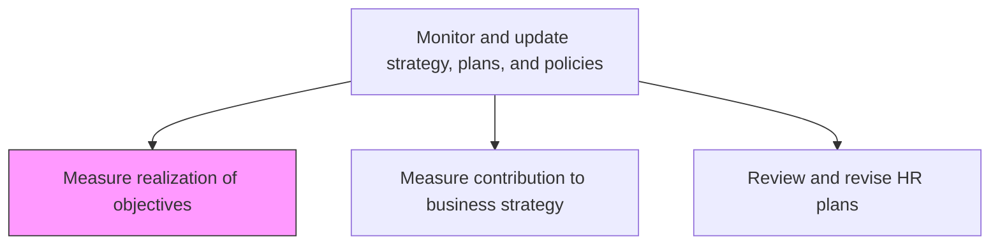
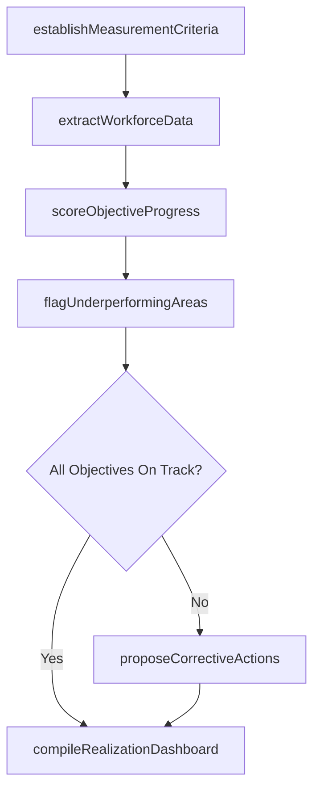

# Measure realization of objectives

> Business-as-Code definition for measuring the realization of HR objectives. Models the tracking, scoring, and reporting of progress against established workforce goals and strategic HR targets.

## Overview

Determining the accomplishment of HR goals and objectives. Evaluate the effectiveness of the HR function by estimating the present rate of achievement of the established objectives. Use metrics to determine if the objectives are being realized. Leverage measures such as turnover, training, return on human capital, costs of labor, and expenses per employee.

## Process Hierarchy



## GraphDL

```yaml
measure:
  object: Realization Of Objectives
  actor: HRAnalyst
  result: ObjectiveScorecard
```

## Actions

| Action | Description |
|--------|-------------|
| establishMeasurementCriteria | Define KPIs, data sources, baselines, and target thresholds for each HR objective |
| extractWorkforceData | Pull turnover rates, training completions, cost-per-hire, and engagement scores from HRIS and finance systems |
| scoreObjectiveProgress | Calculate achievement percentages and trend directions for each objective against its target |
| flagUnderperformingAreas | Identify objectives significantly below target with root cause annotations |
| compileRealizationDashboard | Assemble an executive scorecard showing objective status, trends, and variance highlights |
| proposeCorrectiveActions | Draft targeted interventions for underperforming objectives with estimated impact and timeline |

## Events

| Event | Description |
|-------|-------------|
| measurementCriteriaEstablished | KPIs, baselines, and thresholds defined for all tracked HR objectives |
| workforceDataExtracted | Turnover, training, cost, and engagement data pulled from source systems |
| objectiveProgressScored | Achievement percentages and trends calculated for each HR objective |
| underperformingAreasFlagged | Below-target objectives identified with root cause annotations |
| realizationDashboardCompiled | Executive scorecard assembled with status, trends, and variances |
| correctiveActionsProposed | Targeted interventions drafted for underperforming objectives |

## Searches

| Search | Description |
|--------|-------------|
| getObjectiveScorecard | Retrieve current achievement scores and trend directions for all HR objectives |
| findUnderperformingObjectives | List objectives below target threshold with variance magnitude and root cause |
| getHistoricalTrends | Access objective realization scores over multiple reporting periods |
| getMetricDefinitions | Retrieve KPI formulas, data sources, and baseline values |

## Process Flow



## RACI Matrix

| Activity | Responsible | Accountable | Consulted | Informed |
|----------|-------------|-------------|-----------|----------|
| establishMeasurementCriteria | HRAnalyst | VP HR | CHRO | BusinessUnitLeaders |
| extractWorkforceData | HRISAnalyst | HRAnalyst | ITSystems | Finance |
| scoreObjectiveProgress | HRAnalyst | VP HR | WorkforcePlanningAnalyst | ExecutiveTeam |
| compileRealizationDashboard | HRAnalyst | CHRO | Finance | Board |

## Related Processes

| Process | Relationship |
|---------|-------------|
| 7.1.3.2 Measure contribution to business strategy | Sibling - strategic contribution analysis uses objective realization data as an input |
| 7.1.3.4 Review and revise HR plans | Downstream - realization findings drive plan revision decisions |
| 7.1.3.3 Communicate plans and provide updates to stakeholders | Downstream - scorecard results are communicated to stakeholders |

## Related Departments

| Department | Role |
|-----------|------|
| Human Resources | Defines HR objectives and owns the measurement process |
| Finance | Provides labor cost, payroll, and budget data for workforce metrics |
| IT | Supports HRIS data extraction and dashboard infrastructure |
| Executive Leadership | Reviews objective realization reports and approves corrective actions |

## Related Occupations

| Occupation | Involvement |
|-----------|-------------|
| HR Analyst | Designs measurement frameworks and produces realization scorecards |
| HRIS Analyst | Extracts, validates, and integrates workforce data from source systems |
| Workforce Planning Analyst | Provides context for variance analysis and corrective action planning |

## KPIs

| KPI | Description | Unit |
|-----|-------------|------|
| Objective Achievement Rate | Percentage of HR objectives meeting or exceeding their targets | % |
| Reporting Timeliness | Percentage of scorecard reports delivered within scheduled deadlines | % |
| Variance Resolution Rate | Percentage of flagged underperforming objectives with implemented corrective actions | % |
| Data Accuracy | Percentage of workforce data passing quality validation checks before scoring | % |

## Usage

```typescript
import { measureRealizationOfObjectives } from '@headlessly/measure-realization-of-objectives'

const measurement = measureRealizationOfObjectives()

// Score progress against all FY2026 HR objectives
const scorecard = await measurement.scoreObjectiveProgress({
  objectiveSet: 'FY2026-HR-Objectives',
  reportingPeriod: 'Q3-2026',
  includeHistoricalTrend: true,
  compareToBaseline: true
})

// Flag underperforming areas and propose corrective actions
const interventions = await measurement.proposeCorrectiveActions({
  underperformingObjectives: scorecard.belowTarget,
  impactThreshold: 'high',
  budgetConstraint: 50000
})
```
