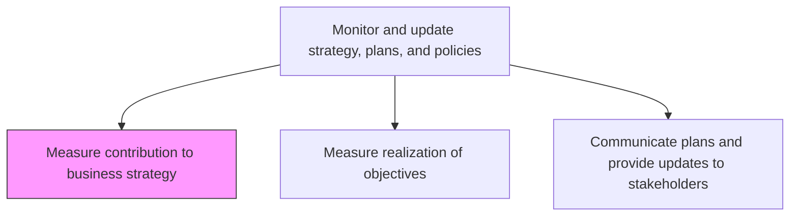
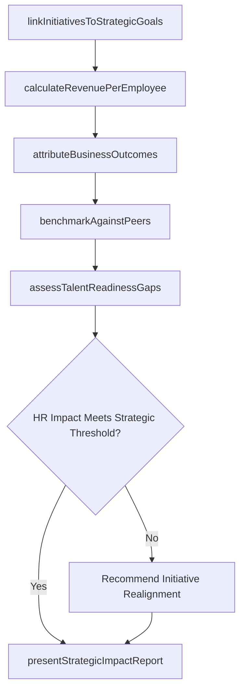

# Measure contribution to business strategy

> Business-as-Code definition for measuring HR contribution to business strategy. Models the correlation analysis between workforce initiatives and business performance outcomes.

## Overview

Determining the role of HR function in implementing the organizational strategy. Measure the correlation between the HR performance and the overall business strategy. Calculate the amount of contribution of the HR function to the overall business growth.

## Process Hierarchy



## GraphDL

```yaml
measure:
  object: Contribution To Business Strategy
  actor: HRStrategyAnalyst
  result: StrategicImpactAssessment
```

## Actions

| Action | Description |
|--------|-------------|
| linkInitiativesToStrategicGoals | Map each HR program, policy, and investment to the specific corporate strategic objective it supports |
| calculateRevenuePerEmployee | Compute revenue productivity and human capital value-add metrics against industry benchmarks |
| attributeBusinessOutcomes | Isolate the workforce contribution to revenue growth, margin improvement, and innovation output |
| benchmarkAgainstPeers | Compare HR effectiveness ratios and human capital ROI against industry and best-in-class organizations |
| assessTalentReadinessGaps | Evaluate whether the workforce possesses the capabilities required by the next phase of business strategy |
| presentStrategicImpactReport | Deliver an executive-level report quantifying HR contribution with recommendations for strategic realignment |

## Events

| Event | Description |
|-------|-------------|
| initiativesLinkedToStrategy | HR programs mapped to corporate strategic objectives with attribution logic |
| revenuePerEmployeeCalculated | Revenue productivity and human capital value-add metrics computed |
| businessOutcomesAttributed | Workforce contribution to revenue, margin, and innovation quantified |
| peerBenchmarkCompleted | HR effectiveness ratios compared against industry and best-in-class data |
| talentReadinessGapsAssessed | Workforce capability gaps relative to future strategy requirements identified |
| strategicImpactReportPresented | Executive report on HR strategic contribution delivered to leadership |

## Searches

| Search | Description |
|--------|-------------|
| getStrategicAlignment | Retrieve mapping of HR initiatives to corporate strategy objectives with attribution data |
| getHumanCapitalMetrics | Access revenue-per-employee, human capital ROI, and productivity index values |
| getBenchmarkComparisons | Retrieve HR effectiveness comparisons against industry medians and top quartile |
| getTalentReadinessScores | Access workforce capability readiness scores by strategic competency area |

## Process Flow



## RACI Matrix

| Activity | Responsible | Accountable | Consulted | Informed |
|----------|-------------|-------------|-----------|----------|
| linkInitiativesToStrategicGoals | HRStrategyAnalyst | CHRO | StrategyTeam | VP HR |
| attributeBusinessOutcomes | HRAnalyst | CHRO | Finance | CEO |
| benchmarkAgainstPeers | HRStrategyAnalyst | VP HR | ExternalConsultants | ExecutiveTeam |
| presentStrategicImpactReport | HRStrategyAnalyst | CHRO | CFO | Board |

## Related Processes

| Process | Relationship |
|---------|-------------|
| 7.1.3.1 Measure realization of objectives | Sibling - objective realization data feeds into strategic contribution analysis |
| 7.1.2.13 Develop workforce strategy models | Upstream - strategy models define which contributions to measure |
| 7.1.3.4 Review and revise HR plans | Downstream - strategic impact findings trigger plan revisions |

## Related Departments

| Department | Role |
|-----------|------|
| Human Resources | Measures and reports HR strategic contribution |
| Corporate Strategy | Provides strategic objectives and validates alignment logic |
| Finance | Supplies financial impact data and validates attribution calculations |
| Executive Leadership | Reviews strategic contribution reports and authorizes realignment |

## Related Occupations

| Occupation | Involvement |
|-----------|-------------|
| HR Strategy Analyst | Maps initiatives to strategy and quantifies contribution metrics |
| HR Analyst | Produces data analysis, benchmarking, and attribution calculations |
| Chief Human Resources Officer | Presents strategic contribution findings to executive team and board |

## KPIs

| KPI | Description | Unit |
|-----|-------------|------|
| Revenue Per Employee | Total revenue divided by full-time equivalent headcount | USD |
| Human Capital ROI | Net operating income minus operating expense divided by total compensation cost | Ratio |
| Strategic Initiative Alignment | Percentage of HR programs directly linked to corporate strategy objectives | % |
| Workforce Productivity Index | Output value generated per labor hour invested | USD/Hour |

## Usage

```typescript
import { measureContributionToBusinessStrategy } from '@headlessly/measure-contribution-to-business-strategy'

const contribution = measureContributionToBusinessStrategy()

// Link HR initiatives to strategic goals and calculate attribution
const alignment = await contribution.linkInitiativesToStrategicGoals({
  strategyPeriod: 'FY2026',
  includeAllActiveInitiatives: true,
  attributionMethod: 'weighted-contribution'
})

// Benchmark HR effectiveness against industry peers
const benchmark = await contribution.benchmarkAgainstPeers({
  metrics: ['revenue-per-employee', 'human-capital-roi', 'productivity-index'],
  peerGroup: 'technology-industry-500plus',
  compareTo: ['median', 'top-quartile']
})
```
