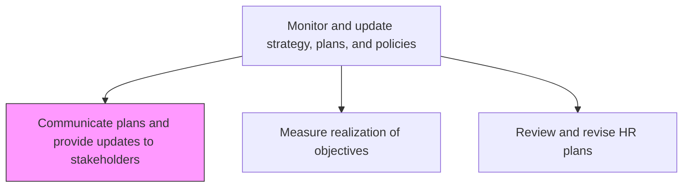
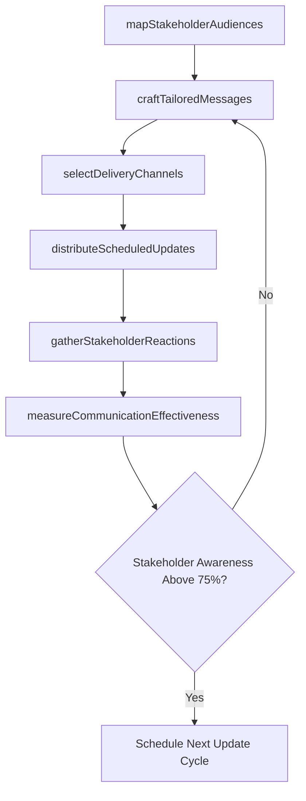

# Communicate plans and provide updates to stakeholders

> Business-as-Code definition for communicating HR plans and providing updates to stakeholders. Models the stakeholder engagement lifecycle from audience identification through message delivery and feedback collection.

## Overview

Conveying the plans for HR function to stakeholders. Ensure that the HR plans and strategy are effectively communicated to the people who can affect or be affected by the organization's actions, objectives, and policies such as the creditors, shareholders, employees, and suppliers. Provide regular updates to these stakeholders to ensure effective communication.

## Process Hierarchy



## GraphDL

```yaml
communicate:
  object: Plans And Provide Updates To Stakeholders
  actor: HRCommunicationsSpecialist
  result: StakeholderBriefing
```

## Actions

| Action | Description |
|--------|-------------|
| mapStakeholderAudiences | Identify stakeholder groups, their information needs, influence level, and preferred communication cadence |
| craftTailoredMessages | Develop audience-specific content translating HR plans into language relevant to each stakeholder group |
| selectDeliveryChannels | Choose channels such as town halls, intranet posts, executive briefings, or email digests for each audience |
| distributeScheduledUpdates | Deliver plan updates through selected channels on the established cadence |
| gatherStakeholderReactions | Collect questions, concerns, and sentiment feedback through surveys, Q&A sessions, and comment threads |
| measureCommunicationEffectiveness | Track open rates, attendance, acknowledgment rates, and sentiment to assess whether messages landed |

## Events

| Event | Description |
|-------|-------------|
| stakeholderAudiencesMapped | Stakeholder groups cataloged with information needs and communication preferences |
| tailoredMessagesCrafted | Audience-specific communications developed and approved for distribution |
| deliveryChannelsSelected | Communication channels assigned to each stakeholder group |
| scheduledUpdatesDistributed | Plan updates delivered to stakeholders on cadence |
| stakeholderReactionsGathered | Feedback, questions, and sentiment data collected from stakeholder groups |
| communicationEffectivenessMeasured | Open rates, attendance, and acknowledgment metrics compiled and reviewed |

## Searches

| Search | Description |
|--------|-------------|
| getStakeholderMap | Retrieve stakeholder groups with communication preferences, cadence, and channel assignments |
| findPendingUpdates | List scheduled communications not yet distributed by audience and due date |
| getEngagementMetrics | Access open rates, attendance, and acknowledgment data by communication and audience |
| getFeedbackSummary | Retrieve aggregated stakeholder feedback by topic, sentiment, or reporting period |

## Process Flow



## RACI Matrix

| Activity | Responsible | Accountable | Consulted | Informed |
|----------|-------------|-------------|-----------|----------|
| mapStakeholderAudiences | HRCommunicationsSpecialist | VP HR | CHRO | StakeholderGroups |
| craftTailoredMessages | HRCommunicationsSpecialist | VP HR | LegalCounsel | InternalComms |
| distributeScheduledUpdates | InternalCommunicationsTeam | HRCommunicationsSpecialist | ITSystems | AllStakeholders |
| gatherStakeholderReactions | HRCommunicationsSpecialist | VP HR | HRBusinessPartners | ExecutiveTeam |

## Related Processes

| Process | Relationship |
|---------|-------------|
| 7.1.3.1 Measure realization of objectives | Upstream - objective progress data feeds stakeholder update content |
| 7.1.3.4 Review and revise HR plans | Sibling - plan revisions trigger updated communications to stakeholders |
| 7.1.3.2 Measure contribution to business strategy | Upstream - strategic contribution findings are communicated to executive stakeholders |

## Related Departments

| Department | Role |
|-----------|------|
| Human Resources | Produces HR plan content and manages stakeholder relationships |
| Internal Communications | Supports content delivery, channel management, and engagement tracking |
| Legal | Reviews communications for regulatory and compliance implications |
| Executive Leadership | Approves strategic messaging and receives executive-level updates |

## Related Occupations

| Occupation | Involvement |
|-----------|-------------|
| HR Communications Specialist | Creates audience-tailored messages and manages distribution cadence |
| Internal Communications Manager | Oversees delivery channels and measures engagement effectiveness |
| HR Business Partner | Facilitates two-way feedback collection with business unit stakeholders |

## KPIs

| KPI | Description | Unit |
|-----|-------------|------|
| Stakeholder Awareness Rate | Percentage of target stakeholders who received and acknowledged updates | % |
| Update Timeliness | Percentage of scheduled communications delivered on or before due date | % |
| Stakeholder Satisfaction | Average satisfaction score for clarity and usefulness of HR communications | Score (1-5) |
| Feedback Response Rate | Percentage of stakeholders providing feedback when solicited | % |

## Usage

```typescript
import { communicatePlans } from '@headlessly/communicate-plans-and-provide-updates-to-stakeholders'

const comms = communicatePlans()

// Map stakeholder audiences for workforce strategy update
const stakeholders = await comms.mapStakeholderAudiences({
  planType: 'workforce-strategy',
  scope: 'organization-wide',
  includeExternalStakeholders: ['board-members', 'investors']
})

// Distribute quarterly HR plan update to all audiences
const delivery = await comms.distributeScheduledUpdates({
  content: { type: 'quarterly-progress', period: 'Q3-2026' },
  audiences: stakeholders.groups,
  channels: { executives: 'briefing-deck', managers: 'town-hall', employees: 'intranet-post' }
})
```
