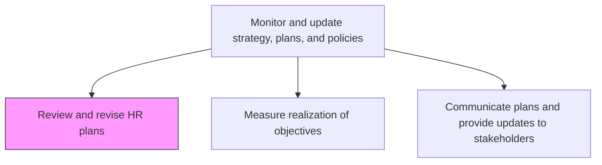
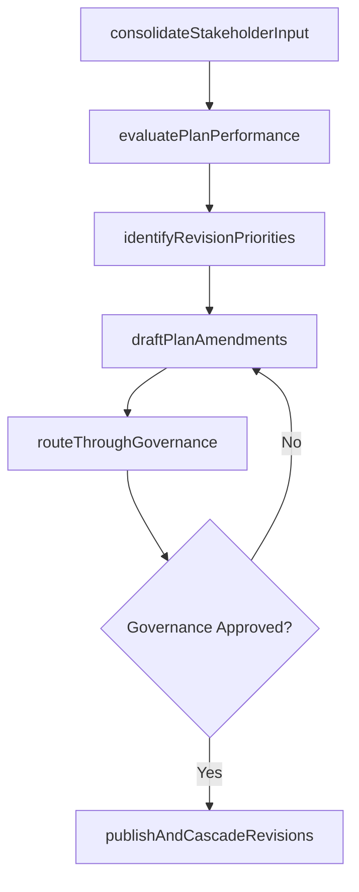

# Review and revise HR plans

> Business-as-Code definition for reviewing and revising HR plans. Models the periodic assessment of HR strategies, incorporation of stakeholder feedback, and formal revision of workforce plans.

## Overview

Reassessing the strategies, plans, and policies of the HR function, with the objective of revising them. Revisit the schematic plans for the HR function. Taking stock of any suggestions or feedback from the stakeholders, revamp the blueprint of HR strategies and plans.

## Process Hierarchy



## GraphDL

```yaml
review:
  object: And Revise HR Plans
  actor: HRStrategyManager
  result: RevisedWorkforcePlan
```

## Actions

| Action | Description |
|--------|-------------|
| consolidateStakeholderInput | Aggregate feedback from business leaders, employee surveys, and HR business partners on plan effectiveness |
| evaluatePlanPerformance | Compare current HR plan outcomes against objectives, environmental changes, and competitive landscape |
| identifyRevisionPriorities | Determine which plan components are outdated, underperforming, or misaligned with evolved business needs |
| draftPlanAmendments | Author revised plan language, updated targets, adjusted timelines, and reallocated resources |
| routeThroughGovernance | Submit revised plans through executive review, legal compliance check, and board approval |
| publishAndCascadeRevisions | Distribute approved plan revisions to all affected departments with implementation guidance |

## Events

| Event | Description |
|-------|-------------|
| stakeholderInputConsolidated | Feedback from business leaders, employees, and HR partners aggregated for review |
| planPerformanceEvaluated | Current plan outcomes assessed against objectives and environmental changes |
| revisionPrioritiesIdentified | Plan components requiring updates ranked by impact and urgency |
| planAmendmentsDrafted | Revised plan language, targets, and resource allocations authored |
| governanceApprovalObtained | Revised plans approved by executive leadership and compliance review |
| revisionsCascaded | Approved plan changes distributed to departments with implementation guidance |

## Searches

| Search | Description |
|--------|-------------|
| findPlansForReview | List HR plans due for scheduled review by category, date, or review cycle |
| getRevisionHistory | Retrieve the change log and version history for a specific HR plan |
| getStakeholderFeedback | Access aggregated feedback themes and sentiment for plan review discussions |
| findOpenAmendments | List plans with pending revisions awaiting governance approval |

## Process Flow



## RACI Matrix

| Activity | Responsible | Accountable | Consulted | Informed |
|----------|-------------|-------------|-----------|----------|
| evaluatePlanPerformance | HRStrategyManager | CHRO | HRAnalyst | ExecutiveTeam |
| draftPlanAmendments | HRStrategyManager | VP HR | LegalCounsel | HRBusinessPartners |
| routeThroughGovernance | VP HR | CHRO | CEO | Board |
| publishAndCascadeRevisions | HRCommunicationsSpecialist | VP HR | InternalComms | AllEmployees |

## Related Processes

| Process | Relationship |
|---------|-------------|
| 7.1.3.1 Measure realization of objectives | Upstream - objective measurement findings identify which plans need revision |
| 7.1.3.3 Communicate plans and provide updates to stakeholders | Downstream - revised plans require updated stakeholder communications |
| 7.1.2.10 Develop HR policies | Parallel - policy updates often accompany plan revisions for consistency |

## Related Departments

| Department | Role |
|-----------|------|
| Human Resources | Owns the plan review cycle and drafts revisions |
| Executive Leadership | Approves revised plans and provides strategic redirection |
| Legal | Reviews revisions for labor law, regulatory, and compliance implications |
| Finance | Validates budget and resource implications of plan amendments |

## Related Occupations

| Occupation | Involvement |
|-----------|-------------|
| HR Strategy Manager | Leads plan evaluation, drafts amendments, and manages governance routing |
| HR Analyst | Provides performance data, variance analysis, and trend context |
| HR Business Partner | Gathers business unit feedback and facilitates stakeholder input |

## KPIs

| KPI | Description | Unit |
|-----|-------------|------|
| Plan Review Completion Rate | Percentage of HR plans reviewed within their scheduled review cycle | % |
| Revision Cycle Time | Average days from review initiation to governance-approved revision | Days |
| Stakeholder Input Rate | Percentage of targeted stakeholders providing feedback during review | % |
| Plan Currency | Percentage of active HR plans revised within the last 12 months | % |

## Usage

```typescript
import { reviewAndReviseHrPlans } from '@headlessly/review-and-revise-hr-plans'

const plans = reviewAndReviseHrPlans()

// Evaluate performance of the current workforce plan
const assessment = await plans.evaluatePlanPerformance({
  planId: 'workforce-plan-2026',
  evaluationCriteria: ['objective-achievement', 'environmental-fit', 'stakeholder-satisfaction'],
  compareToOriginalTargets: true
})

// Draft amendments for underperforming plan components
const amendments = await plans.draftPlanAmendments({
  planId: 'workforce-plan-2026',
  revisionPriorities: assessment.areasForImprovement,
  effectiveDate: '2027-01-01',
  budgetReallocation: { from: 'external-recruiting', to: 'internal-mobility', amount: 200000 }
})
```
