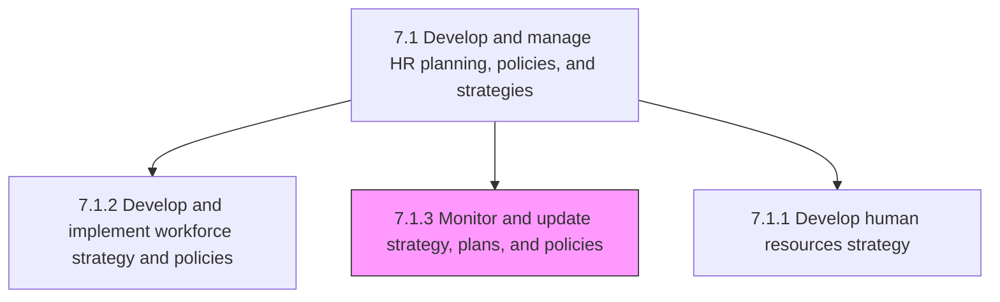
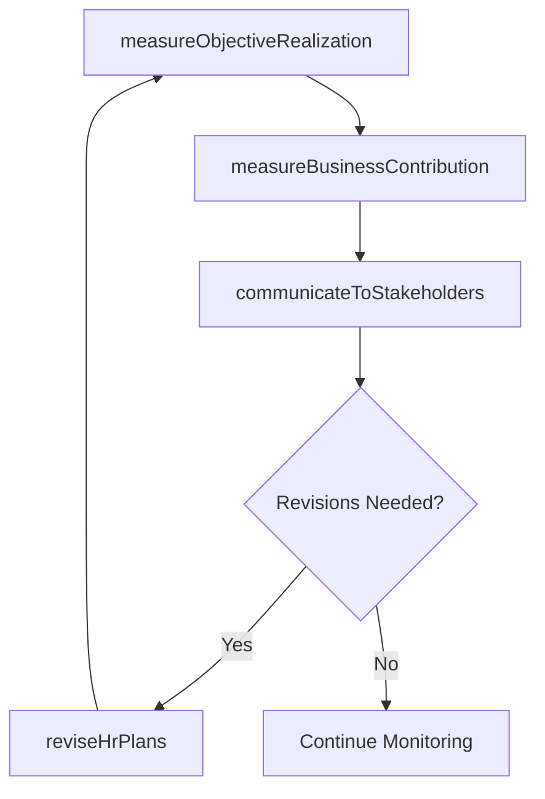

# Monitor and update strategy, plans, and policies

> Business-as-Code definition for HR strategy monitoring and revision. Models objective measurement, business strategy contribution assessment, stakeholder communication, and plan revision processes.

## Overview

Supervising the HR strategy, plans, and policies in order to refurbish them whenever needed. Determine the performance of HR plans and policies by measuring the objective achievement rate and its contribution to the overall business strategy. Ensure that information about these plans and strategies is effectively communicated to various stakeholders. Incorporate any suggestions by these stakeholders when revising HR plans and policies.

## Process Hierarchy



## GraphDL

```yaml
monitor:
  object: And Update Strategy, Plans, And Policies
  actor: HRPerformanceAnalyst
  result: StrategyReviewReport
```

## Actions

| Action | Description |
|--------|-------------|
| measureObjectiveRealization | Assess HR objective achievement against defined targets |
| measureBusinessContribution | Evaluate HR function impact on overall business strategy |
| communicateToStakeholders | Provide plan updates and performance reports to stakeholders |
| reviseHrPlans | Update HR strategies, plans, and policies based on findings |

## Events

| Event | Description |
|-------|-------------|
| objectiveRealizationMeasured | HR objective achievement assessment completed |
| businessContributionMeasured | HR function impact on business strategy evaluated |
| stakeholdersCommunicated | Plan updates delivered to stakeholders |
| hrPlansRevised | HR strategies and policies updated based on review |

## Searches

| Search | Description |
|--------|-------------|
| getObjectiveProgress | Query HR objective achievement data by category and period |
| getStrategyContribution | Retrieve HR contribution metrics to business outcomes |
| getStakeholderUpdates | List plan updates and communications by audience |

## Process Flow



## RACI Matrix

| Activity | Responsible | Accountable | Consulted | Informed |
|----------|-------------|-------------|-----------|----------|
| measureObjectiveRealization | HR Performance Analyst | VP HR | Finance | Executive Team |
| measureBusinessContribution | HR Strategy Director | CHRO | CEO | Board |
| communicateToStakeholders | HR Communications Lead | VP HR | Department Heads | All Employees |
| reviseHrPlans | HR Strategy Director | CHRO | Legal, Finance | HR Team |

## Sub-Processes

| ID | Name | Description |
|----|------|-------------|
| 7.1.3.1 | Measure realization of objectives | Determining the accomplishment of HR goals and objectives. Evaluate the effectiveness of the HR func |
| 7.1.3.2 | Measure contribution to business strategy | Determining the role of HR function in implementing the organizational strategy. Measure the correla |
| 7.1.3.3 | Communicate plans and provide updates to stakeholders | Conveying the plans for HR function to stakeholders. Ensure that the HR plans and strategy are effec |
| 7.1.3.4 | Review and revise HR plans | Reassessing the strategies, plans, and policies of the HR function, with the objective of revising t |

## Related Processes

| Process | Relationship |
|---------|-------------|
| 7.1.1 Develop human resources strategy | Upstream - strategy provides baseline for monitoring |
| 7.1.2 Develop and implement workforce strategy and policies | Parallel - policies subject to monitoring and revision |
| 7.7 Manage employee information and analytics | Supporting - analytics data feeds strategy monitoring |

## Related Departments

| Department | Role |
|-----------|------|
| Human Resources | Monitors strategy execution and proposes revisions |
| Finance | Provides financial performance data for evaluation |
| Executive Leadership | Reviews HR contribution and approves revisions |

## Related Occupations

| Occupation | Involvement |
|-----------|-------------|
| HR Performance Analyst | Measures objective achievement and business contribution |
| HR Strategy Director | Leads strategy review and revision cycles |

## KPIs

| KPI | Description | Unit |
|-----|-------------|------|
| Objective Achievement Rate | Percentage of HR objectives met within target timeframe | % |
| Strategy Revision Frequency | Number of strategy updates per planning cycle | Count |
| Stakeholder Satisfaction with HR | Stakeholder rating of HR function effectiveness | Score (1-5) |

## Usage

```typescript
import { monitorAndUpdateStrategyPlansAndPolicies } from '@headlessly/monitor-and-update-strategy-plans-and-policies'

const monitor = monitorAndUpdateStrategyPlansAndPolicies()

// Measure objective realization
const results = await monitor.measureObjectiveRealization({
  period: '2025-H1',
  objectives: ['reduce-turnover', 'improve-engagement', 'close-skill-gaps']
})

// Revise HR plans based on findings
await monitor.reviseHrPlans({
  reviewId: results.id,
  updates: [{ area: 'retention', action: 'increase-compensation-budget' }]
})
```
