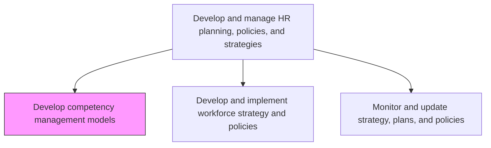
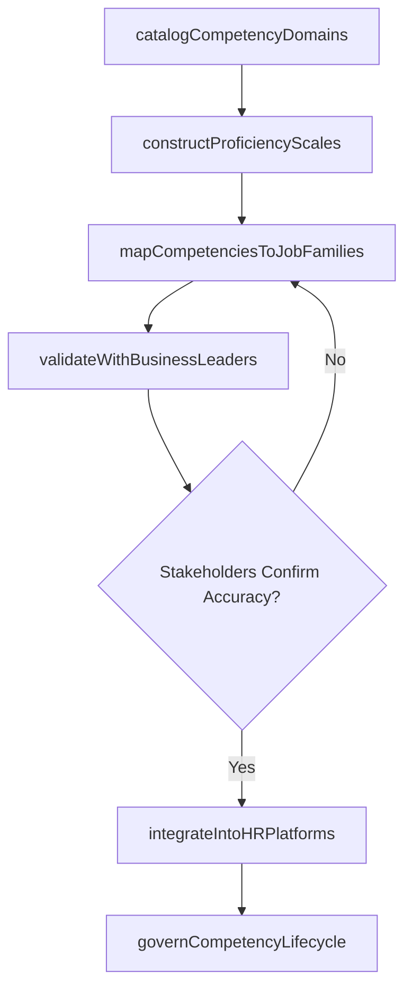

# Develop competency management models

> Business-as-Code definition for developing competency management models. Models the creation of competency frameworks, proficiency scales, and role-competency mappings that integrate with performance management, career development, and workforce planning.

## Overview

Creating and implementing the tools for managing the competency levels of HR. Design a model for integrating HR planning with business planning. Assess current HR capacity based on the competencies against the capacity needed to achieve the vision, mission, and business goals of the organization. Consider factors such as employee development, career path, compensation policies, and performance management.

## Process Hierarchy



## GraphDL

```yaml
develop:
  object: Competency Management Models
  actor: OrganizationalDevelopmentSpecialist
  result: CompetencyFramework
```

## Actions

| Action | Description |
|--------|-------------|
| catalogCompetencyDomains | Define core (organization-wide), functional (job-family-specific), and leadership competency categories |
| constructProficiencyScales | Build measurable proficiency levels (e.g., foundational, proficient, advanced, expert) for each competency |
| mapCompetenciesToJobFamilies | Assign required competencies and target proficiency levels to every job family and career level |
| validateWithBusinessLeaders | Confirm competency definitions and role mappings through workshops with hiring managers and subject matter experts |
| integrateIntoHRPlatforms | Connect the competency model to performance management, learning management, and career pathing systems |
| governCompetencyLifecycle | Establish review cadences, ownership, and sunset criteria to keep competency definitions current |

## Events

| Event | Description |
|-------|-------------|
| competencyDomainsCataloged | Core, functional, and leadership competency categories defined and documented |
| proficiencyScalesConstructed | Measurable proficiency levels created with behavioral anchors for each competency |
| competenciesMappedToJobFamilies | Required competencies and proficiency targets assigned to all job families |
| businessLeaderValidationComplete | Competency definitions confirmed through stakeholder workshops |
| hrPlatformsIntegrated | Competency model connected to performance, learning, and career systems |
| competencyLifecycleGoverned | Review cadences and ownership rules established for ongoing model maintenance |

## Searches

| Search | Description |
|--------|-------------|
| getCompetencyLibrary | Retrieve competencies filtered by domain, proficiency level, or job family |
| findRoleCompetencyProfile | List required competencies and target proficiency levels for a specific role |
| getCompetencyGapReport | Identify gaps between employee assessed proficiency and role requirements |
| getProficiencyDistribution | Retrieve organization-wide distribution of proficiency levels by competency |

## Process Flow



## RACI Matrix

| Activity | Responsible | Accountable | Consulted | Informed |
|----------|-------------|-------------|-----------|----------|
| catalogCompetencyDomains | OrgDevelopmentSpecialist | CHRO | BusinessUnitLeaders | AllHRTeams |
| mapCompetenciesToJobFamilies | OrgDevelopmentSpecialist | VP HR | HiringManagers | Compensation |
| validateWithBusinessLeaders | HRBusinessPartner | CHRO | SubjectMatterExperts | ExecutiveTeam |
| integrateIntoHRPlatforms | HRISAnalyst | VP HR | ITSystems | LearningDevelopment |

## Related Processes

| Process | Relationship |
|---------|-------------|
| 7.1.2.1 Gather skill requirements | Upstream - strategic skill needs inform which competency domains to build |
| 7.3.3.3 Manage employee skill and competency development | Downstream - competency models guide individual development programs |
| 7.1.2 Develop and implement workforce strategy and policies | Sibling - workforce strategy and competency models jointly shape talent architecture |

## Related Departments

| Department | Role |
|-----------|------|
| Organizational Development | Architects competency model structure and proficiency scales |
| Human Resources | Maintains competency library and oversees role-mapping process |
| IT | Supports HRIS integration and competency data management |
| Business Units | Validates role-specific competency requirements and proficiency expectations |

## Related Occupations

| Occupation | Involvement |
|-----------|-------------|
| Organizational Development Specialist | Designs competency frameworks and facilitates validation workshops |
| HR Business Partner | Liaises with business leaders to confirm role-competency mappings |
| HRIS Analyst | Integrates competency models into HR technology platforms |

## KPIs

| KPI | Description | Unit |
|-----|-------------|------|
| Role Coverage | Percentage of active roles with fully mapped competency profiles | % |
| Competency Assessment Completion | Percentage of employees assessed against the competency model within the cycle | % |
| Model Currency | Percentage of competency definitions reviewed and updated within the last 24 months | % |
| System Integration Depth | Number of HR processes (performance, learning, career, compensation) consuming competency data | Count |

## Usage

```typescript
import { developCompetencyManagementModels } from '@headlessly/develop-competency-management-models'

const competency = developCompetencyManagementModels()

// Catalog competency domains aligned to corporate strategy
const domains = await competency.catalogCompetencyDomains({
  categories: ['core', 'functional', 'leadership'],
  alignmentSource: 'corporate-strategy-2026',
  includeEmergingSkills: ['ai-fluency', 'data-literacy', 'change-leadership']
})

// Map competencies to the engineering job family
const mapping = await competency.mapCompetenciesToJobFamilies({
  jobFamily: 'Software Engineering',
  careerLevels: ['associate', 'mid', 'senior', 'staff', 'principal'],
  includeLeadershipCompetencies: true,
  differentiateByTrack: ['individual-contributor', 'management']
})
```
