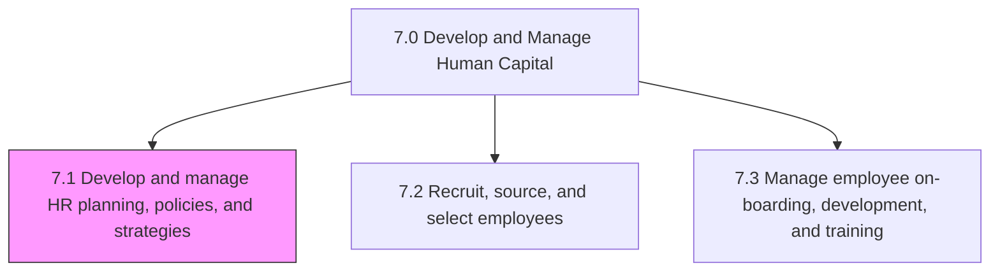
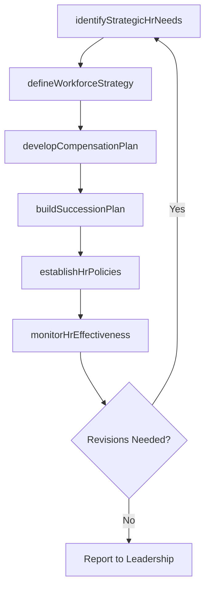

# Develop and manage human resources (HR) planning, policies, and strategies

> Business-as-Code definition for HR planning, policies, and strategies. Models the development of HR strategy, workforce planning, compensation design, succession planning, and competency frameworks.

## Overview

Creating strategies for the HR function. Create and implement strategies for managing the work force. Supervise and enhance the strategies, plans, and policies supporting the HR function. Developing models for managing competency levels of the HR of the organization.

## Process Hierarchy



## GraphDL

```yaml
develop:
  object: And Manage Human Resources (HR) Planning, Policies, And Strategies
  actor: VPHumanResources
  result: HRStrategyFramework
```

## Actions

| Action | Description |
|--------|-------------|
| identifyStrategicHrNeeds | Assess organizational requirements and align HR objectives |
| defineWorkforceStrategy | Create workforce planning models and staffing strategies |
| developCompensationPlan | Design salary structures, incentive plans, and benefits frameworks |
| buildSuccessionPlan | Identify key roles and develop leadership pipelines |
| establishHrPolicies | Create and publish HR policies and compliance procedures |
| monitorHrEffectiveness | Track HR strategy execution and measure outcomes |

## Events

| Event | Description |
|-------|-------------|
| strategicHrNeedsIdentified | HR requirements aligned with organizational strategy |
| workforceStrategyDefined | Workforce planning model and staffing strategy approved |
| compensationPlanDeveloped | Salary structure and incentive framework finalized |
| successionPlanBuilt | Leadership pipeline and succession plan documented |
| hrPoliciesEstablished | HR policies published and communicated to organization |
| hrEffectivenessMonitored | HR strategy performance review completed |

## Searches

| Search | Description |
|--------|-------------|
| getHrPolicies | Retrieve HR policies filtered by category, region, or effective date |
| getWorkforcePlan | Query workforce planning data by business unit or role family |
| getCompensationStructure | Retrieve salary bands and incentive plans by grade level |
| getSuccessionCandidates | List succession pipeline candidates by role or readiness level |

## Process Flow



## RACI Matrix

| Activity | Responsible | Accountable | Consulted | Informed |
|----------|-------------|-------------|-----------|----------|
| identifyStrategicHrNeeds | HR Strategy Manager | VP Human Resources | CEO, CFO | Department Heads |
| defineWorkforceStrategy | Workforce Planner | VP Human Resources | Business Unit Leaders | Finance |
| developCompensationPlan | Compensation Manager | VP Human Resources | Finance, Legal | Employees |
| buildSuccessionPlan | Talent Management Lead | VP Human Resources | Executive Team | HR Business Partners |
| establishHrPolicies | HR Policy Manager | VP Human Resources | Legal, Compliance | All Employees |

## Sub-Processes

| ID | Name | Description |
|----|------|-------------|
| 7.1.1 | Develop human resources strategy | Creating a long-term plan to associate human resource requirements with the strategic goals of the c |
| 7.1.2 | Develop and implement workforce strategy and policies | Creating and executing strategies and policies for smooth administration of work force. Determine an |
| 7.1.3 | Monitor and update strategy, plans, and policies | Supervising the HR strategy, plans, and policies in order to refurbish them whenever needed. Determi |
| 7.1.4 | Develop competency management models | Creating and implementing the tools for managing the competency levels of HR. Design a model for int |

## Related Processes

| Process | Relationship |
|---------|-------------|
| 7.2 Recruit, source, and select employees | Downstream - strategy defines hiring requirements |
| 7.5 Reward and retain employees | Downstream - compensation plans guide rewards |
| 1.0 Develop Vision and Strategy | Upstream - corporate strategy drives HR strategy |

## Related Departments

| Department | Role |
|-----------|------|
| Human Resources | Primary owner of HR strategy and policy development |
| Finance | Partners on compensation budgeting and cost modeling |
| Legal | Reviews policies for labor law compliance |
| Executive Leadership | Sets strategic direction and approves workforce plans |

## Related Occupations

| Occupation | Involvement |
|-----------|-------------|
| HR Strategy Director | Leads strategic HR planning and alignment |
| Workforce Planning Analyst | Develops workforce models and staffing forecasts |
| Compensation and Benefits Manager | Designs total rewards frameworks |

## KPIs

| KPI | Description | Unit |
|-----|-------------|------|
| HR Strategy Alignment Score | Degree of HR objectives aligned with business strategy | Score (1-5) |
| Policy Compliance Rate | Percentage of workforce operating within HR policy guidelines | % |
| Succession Pipeline Coverage | Percentage of critical roles with identified successors | % |
| HR Cost as Percentage of Revenue | Total HR spend relative to organizational revenue | % |

## Usage

```typescript
import { developAndManageHumanResourcesHrPlanningPoliciesAndStrategies } from '@headlessly/develop-and-manage-human-resources-hr-planning-policies-and-strategies'

const hrPlanning = developAndManageHumanResourcesHrPlanningPoliciesAndStrategies()

// Identify strategic HR needs
const needs = await hrPlanning.identifyStrategicHrNeeds({
  planningHorizon: '3-year',
  businessUnits: ['engineering', 'sales', 'operations'],
  growthScenario: 'moderate'
})

// Build succession plan
const succession = await hrPlanning.buildSuccessionPlan({
  criticalRoles: ['CTO', 'VP Engineering', 'VP Sales'],
  readinessLevels: ['ready-now', '1-2-years', '3-5-years']
})
```
