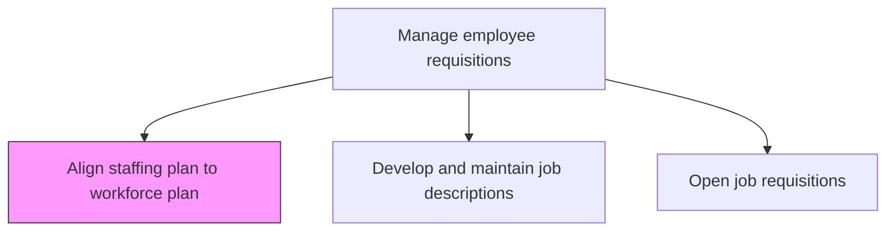
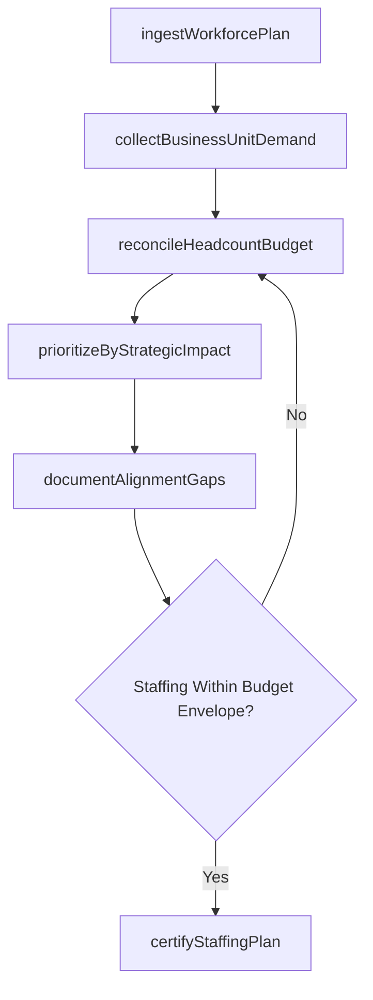

# Align staffing plan to work force plan and business unit strategies/resource needs

> Business-as-Code definition for aligning staffing plans to workforce plans and business unit strategies. Models the reconciliation of hiring targets with strategic headcount forecasts and operational resource needs.

## Overview

Creating a correspondence between the plan for hiring new employees and the desired employee requirements. Staff an adequate amount of people with the appropriate skills to effectively accomplish its legislative, regulatory, service, and production requirements.

## Process Hierarchy



## GraphDL

```yaml
align:
  object: Staffing Plan To Work Force Plan And Business Unit Strategies/resource Needs
  actor: TalentAcquisitionManager
  result: ReconciliatedStaffingPlan
```

## Actions

| Action | Description |
|--------|-------------|
| ingestWorkforcePlan | Import approved workforce plan headcount targets, skill requirements, and timeline milestones |
| collectBusinessUnitDemand | Gather resource requests, backfill needs, and growth projections from each business unit leader |
| reconcileHeadcountBudget | Compare aggregate hiring demand against approved headcount budget and identify overages or gaps |
| prioritizeByStrategicImpact | Rank requisitions by business criticality, revenue impact, and time sensitivity |
| documentAlignmentGaps | Catalog mismatches between staffing plan and workforce plan with remediation options |
| certifyStaffingPlan | Obtain executive sign-off on the final staffing plan that reflects workforce strategy alignment |

## Events

| Event | Description |
|-------|-------------|
| workforcePlanIngested | Approved workforce plan headcount and skill targets loaded into staffing planning tool |
| businessUnitDemandCollected | Resource requests aggregated from all business unit leaders |
| headcountBudgetReconciled | Hiring demand balanced against approved headcount budget |
| requisitionsPrioritized | Open and planned requisitions ranked by strategic impact and urgency |
| alignmentGapsDocumented | Mismatches between staffing plan and workforce plan cataloged with remediation paths |
| staffingPlanCertified | Final staffing plan approved by executive leadership |

## Searches

| Search | Description |
|--------|-------------|
| getAlignmentStatus | Retrieve alignment status between staffing and workforce plans by business unit |
| findHeadcountGaps | List discrepancies between hiring demand and approved headcount allocations |
| getRequisitionPriorityRanking | Access the prioritized requisition list with strategic impact scores |
| getBusinessUnitDemand | Retrieve resource requests from a specific business unit by role or skill |

## Process Flow



## RACI Matrix

| Activity | Responsible | Accountable | Consulted | Informed |
|----------|-------------|-------------|-----------|----------|
| ingestWorkforcePlan | TalentAcquisitionManager | VP HR | WorkforcePlanningAnalyst | Finance |
| collectBusinessUnitDemand | HRBusinessPartner | TalentAcquisitionManager | BusinessUnitLeaders | CHRO |
| reconcileHeadcountBudget | TalentAcquisitionManager | CHRO | CFO | RecruitingTeam |
| certifyStaffingPlan | TalentAcquisitionManager | CHRO | ExecutiveTeam | AllHiringManagers |

## Related Processes

| Process | Relationship |
|---------|-------------|
| 7.2.1.3 Open job requisitions | Downstream - certified staffing plan triggers requisition creation |
| 7.2.1.2 Develop and maintain job descriptions | Parallel - job descriptions must exist before requisitions can be opened |
| 7.1.2.13 Develop workforce strategy models | Upstream - workforce models provide the headcount targets being aligned to |

## Related Departments

| Department | Role |
|-----------|------|
| Talent Acquisition | Owns the staffing plan alignment and requisition prioritization process |
| Human Resources | Provides workforce plan data and strategic context |
| Finance | Validates budget alignment and approves headcount expenditures |
| Business Units | Submits resource demands and validates prioritization decisions |

## Related Occupations

| Occupation | Involvement |
|-----------|-------------|
| Talent Acquisition Manager | Leads staffing-to-workforce plan reconciliation |
| HR Business Partner | Collects business unit demands and facilitates alignment discussions |
| Workforce Planning Analyst | Supplies workforce plan data and scenario analysis |

## KPIs

| KPI | Description | Unit |
|-----|-------------|------|
| Staffing Plan Alignment Score | Percentage of hiring targets that match workforce plan allocations | % |
| Requisition Fulfillment Rate | Percentage of planned requisitions opened on schedule | % |
| Budget Alignment Variance | Gap between staffing plan cost and approved headcount budget | % |
| Time to Certify | Days from workforce plan release to executive-certified staffing plan | Days |

## Usage

```typescript
import { alignStaffingPlan } from '@headlessly/align-staffing-plan-to-work-force-plan-and-business-unit-strategies-resource-needs'

const staffing = alignStaffingPlan()

// Ingest workforce plan and collect business unit demand
const demand = await staffing.collectBusinessUnitDemand({
  workforcePlanId: 'workforce-plan-FY2027',
  businessUnits: ['Engineering', 'Sales', 'Operations', 'Product'],
  includeBackfills: true,
  includeContractors: false
})

// Reconcile aggregate demand against headcount budget
const reconciled = await staffing.reconcileHeadcountBudget({
  totalDemand: demand,
  budgetConstraints: { maxHeadcount: 200, maxAnnualCost: 18000000 },
  prioritizationMethod: 'revenue-impact-weighted'
})
```
