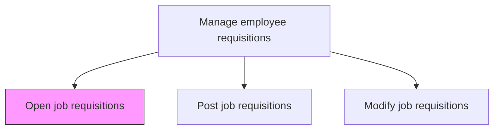
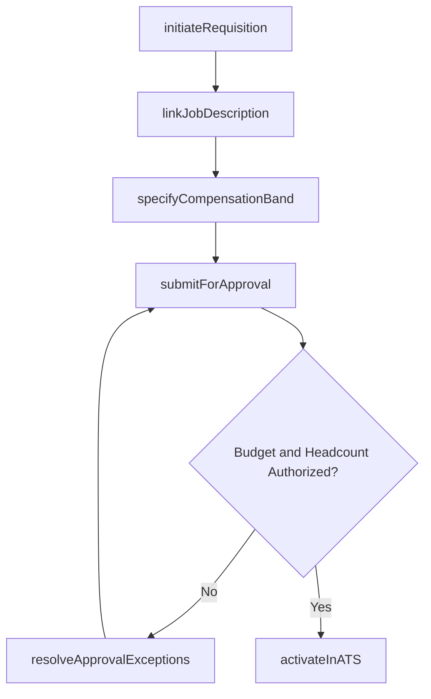

# Open job requisitions

> Business-as-Code definition for opening job requisitions. Models the creation, approval, and activation of requisitions in the applicant tracking system to initiate the hiring process.

## Overview

Developing specific job requisitions, and ensuring their accessibility. Create and open a job requisition to fill the vacant positions within the organization. Clearly describe the job title, department, fill date, and the requisite skills and qualifications for the job.

## Process Hierarchy



## GraphDL

```yaml
open:
  object: Job Requisitions
  actor: RecruitingCoordinator
  result: ActiveRequisition
```

## Actions

| Action | Description |
|--------|-------------|
| initiateRequisition | Create a new requisition record with title, department, hiring manager, and target fill date |
| linkJobDescription | Attach the approved job description, required qualifications, and competency profile to the requisition |
| specifyCompensationBand | Set salary range, grade level, equity eligibility, and any sign-on bonus parameters |
| submitForApproval | Route the requisition through the approval chain for headcount and budget authorization |
| resolveApprovalExceptions | Address approval holds by providing additional justification or modifying requisition parameters |
| activateInATS | Set the requisition to open status in the applicant tracking system, making it available for sourcing |

## Events

| Event | Description |
|-------|-------------|
| requisitionInitiated | New requisition record created with position details in the tracking system |
| jobDescriptionLinked | Approved job description and competency profile attached to the requisition |
| compensationBandSpecified | Salary range, grade level, and equity parameters defined |
| approvalSubmitted | Requisition routed through the headcount and budget approval workflow |
| approvalExceptionsResolved | Approval holds addressed and requisition cleared for activation |
| requisitionActivatedInATS | Requisition set to open status and visible to recruiting team |

## Searches

| Search | Description |
|--------|-------------|
| findOpenRequisitions | List active requisitions filtered by department, role family, or hiring manager |
| getPendingApprovals | Retrieve requisitions awaiting headcount or budget authorization |
| getRequisitionDetails | Access full requisition record including compensation band, description, and approval history |
| findRequisitionsByHiringManager | List all requisitions submitted by a specific hiring manager |

## Process Flow



## RACI Matrix

| Activity | Responsible | Accountable | Consulted | Informed |
|----------|-------------|-------------|-----------|----------|
| initiateRequisition | RecruitingCoordinator | HiringManager | HRBusinessPartner | TalentAcquisition |
| submitForApproval | RecruitingCoordinator | HiringManager | Finance | VP HR |
| resolveApprovalExceptions | HiringManager | VP HR | Finance | RecruitingCoordinator |
| activateInATS | RecruitingCoordinator | TalentAcquisitionManager | HiringManager | RecruitingTeam |

## Related Processes

| Process | Relationship |
|---------|-------------|
| 7.2.1.2 Develop and maintain job descriptions | Upstream - approved job descriptions are prerequisites for requisition creation |
| 7.2.1.4 Post job requisitions | Downstream - activated requisitions are posted to sourcing channels |
| 7.2.1.6 Notify hiring manager | Downstream - hiring manager notified when requisition is activated |

## Related Departments

| Department | Role |
|-----------|------|
| Talent Acquisition | Creates and activates requisitions in the ATS |
| Hiring Department | Initiates requisition requests and provides role justification |
| Finance | Authorizes headcount budget for new requisitions |
| Human Resources | Validates requisition alignment with staffing plan |

## Related Occupations

| Occupation | Involvement |
|-----------|-------------|
| Recruiting Coordinator | Creates requisition records and manages the approval workflow |
| Hiring Manager | Initiates position requests and provides business justification |
| HR Business Partner | Confirms role alignment with staffing plan and workforce strategy |

## KPIs

| KPI | Description | Unit |
|-----|-------------|------|
| Requisition Approval Cycle Time | Average days from requisition creation to final approval | Days |
| First-Pass Approval Rate | Percentage of requisitions approved without exception holds | % |
| Open Requisition Volume | Number of active open requisitions at any point in time | Count |
| Time to Activate | Average days from requisition creation to open status in ATS | Days |

## Usage

```typescript
import { openJobRequisitions } from '@headlessly/open-job-requisitions'

const requisitions = openJobRequisitions()

// Initiate a new requisition for a senior engineering role
const req = await requisitions.initiateRequisition({
  title: 'Senior Software Engineer',
  department: 'Engineering',
  hiringManager: 'mgr-1234',
  targetFillDate: '2026-09-01',
  headcountType: 'new-growth'
})

// Submit for budget and headcount approval
const approval = await requisitions.submitForApproval({
  requisitionId: req.id,
  approvalChain: ['engineering-director', 'finance-controller', 'vp-engineering'],
  justification: 'Critical hire for Q4 platform migration project'
})
```
