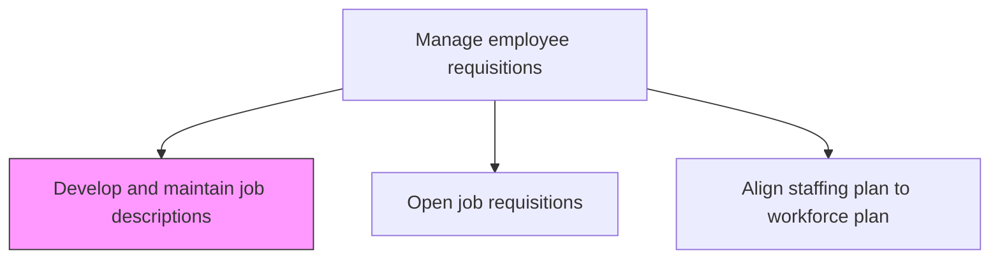
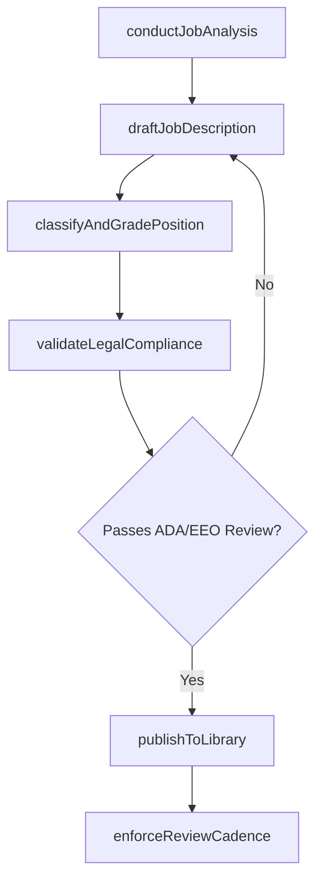

# Develop and maintain job descriptions

> Business-as-Code definition for developing and maintaining job descriptions. Models the creation, standardization, and ongoing revision of role definitions including responsibilities, qualifications, and compliance requirements.

## Overview

Creating descriptions for job requisitions. Define the normal components of a job description, such as the overall position description with general areas of responsibility listed, essential functions of the job described with a couple of examples of each, required knowledge, skills, abilities, required education and experience, a description of the physical demands, and a description of the work environment.

## Process Hierarchy



## GraphDL

```yaml
develop:
  object: And Maintain Job Descriptions
  actor: CompensationAnalyst
  result: StandardizedJobDescription
```

## Actions

| Action | Description |
|--------|-------------|
| conductJobAnalysis | Interview incumbents and managers, observe work activities, and review O*NET data to document role requirements |
| draftJobDescription | Author the description including title, essential functions, qualifications, physical demands, and work environment |
| classifyAndGradePosition | Assign FLSA classification, EEO category, job family, and compensation grade level |
| validateLegalCompliance | Review description against ADA accommodation language, EEO guidelines, and labor law requirements |
| publishToLibrary | Release the approved description to the centralized job description repository |
| enforceReviewCadence | Schedule periodic reviews, flag stale descriptions, and assign owners for updates |

## Events

| Event | Description |
|-------|-------------|
| jobAnalysisConducted | Role responsibilities, working conditions, and qualification requirements documented |
| jobDescriptionDrafted | Description authored with title, duties, qualifications, and physical requirements |
| positionClassifiedAndGraded | FLSA status, EEO category, job family, and compensation grade assigned |
| legalComplianceValidated | Description cleared against ADA, EEO, and labor law requirements |
| descriptionPublishedToLibrary | Approved description added to the centralized organizational repository |
| reviewCadenceEnforced | Periodic review dates assigned and stale description alerts configured |

## Searches

| Search | Description |
|--------|-------------|
| findJobDescriptions | List descriptions filtered by job family, grade level, department, or FLSA status |
| getDescriptionVersionHistory | Retrieve the full change log and version history for a specific job description |
| findStaleDescriptions | List descriptions that have passed their scheduled review date |
| searchByCompetencyRequirement | Find job descriptions that require a specific competency or certification |

## Process Flow



## RACI Matrix

| Activity | Responsible | Accountable | Consulted | Informed |
|----------|-------------|-------------|-----------|----------|
| conductJobAnalysis | CompensationAnalyst | VP HR | HiringManager | HRBusinessPartner |
| draftJobDescription | CompensationAnalyst | VP HR | Incumbent | TalentAcquisition |
| validateLegalCompliance | EmploymentAttorney | GeneralCounsel | CompensationAnalyst | VP HR |
| publishToLibrary | HRISAnalyst | VP HR | CompensationAnalyst | AllRecruiters |

## Related Processes

| Process | Relationship |
|---------|-------------|
| 7.2.1.3 Open job requisitions | Downstream - approved descriptions are attached when requisitions are opened |
| 7.1.4 Develop competency management models | Upstream - competency frameworks inform the qualifications section of descriptions |
| 7.2.1.1 Align staffing plan to workforce plan | Sibling - staffing alignment determines which descriptions need creation or update |

## Related Departments

| Department | Role |
|-----------|------|
| Human Resources | Creates, maintains, and governs the job description library |
| Legal | Reviews descriptions for regulatory compliance and ADA language |
| Compensation and Benefits | Classifies positions and assigns grade levels tied to pay bands |
| Hiring Departments | Provides role-specific context, essential functions, and qualification requirements |

## Related Occupations

| Occupation | Involvement |
|-----------|-------------|
| Compensation Analyst | Conducts job analysis, drafts descriptions, and classifies positions |
| Employment Attorney | Reviews descriptions for legal and regulatory compliance |
| Hiring Manager | Provides role context, validates essential functions, and approves content |

## KPIs

| KPI | Description | Unit |
|-----|-------------|------|
| Description Currency | Percentage of job descriptions reviewed within the last 24 months | % |
| Legal Compliance Rate | Percentage of descriptions passing compliance review without revision | % |
| Library Coverage | Percentage of active positions with a published job description | % |
| Draft Cycle Time | Average days from job analysis initiation to published description | Days |

## Usage

```typescript
import { developAndMaintainJobDescriptions } from '@headlessly/develop-and-maintain-job-descriptions'

const jobDescs = developAndMaintainJobDescriptions()

// Conduct job analysis for a new Data Engineer role
const analysis = await jobDescs.conductJobAnalysis({
  roleTitle: 'Data Engineer',
  department: 'Engineering',
  informants: ['incumbent', 'hiring-manager', 'team-lead'],
  onetReference: '15-1252.00',
  includePhysicalDemands: true
})

// Draft and classify the job description
const description = await jobDescs.draftJobDescription({
  analysisId: analysis.id,
  template: 'standard-technical',
  sections: ['essential-functions', 'qualifications', 'physical-demands', 'work-environment'],
  compensationGrade: 'E4'
})
```
