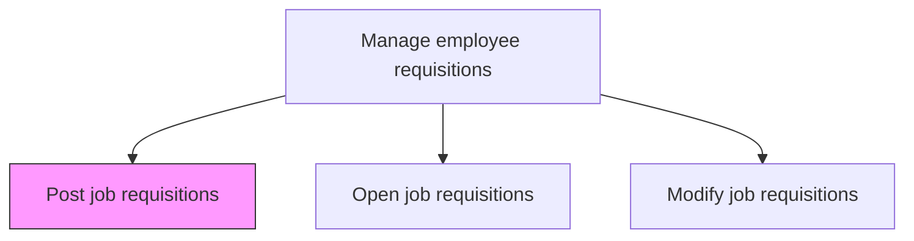
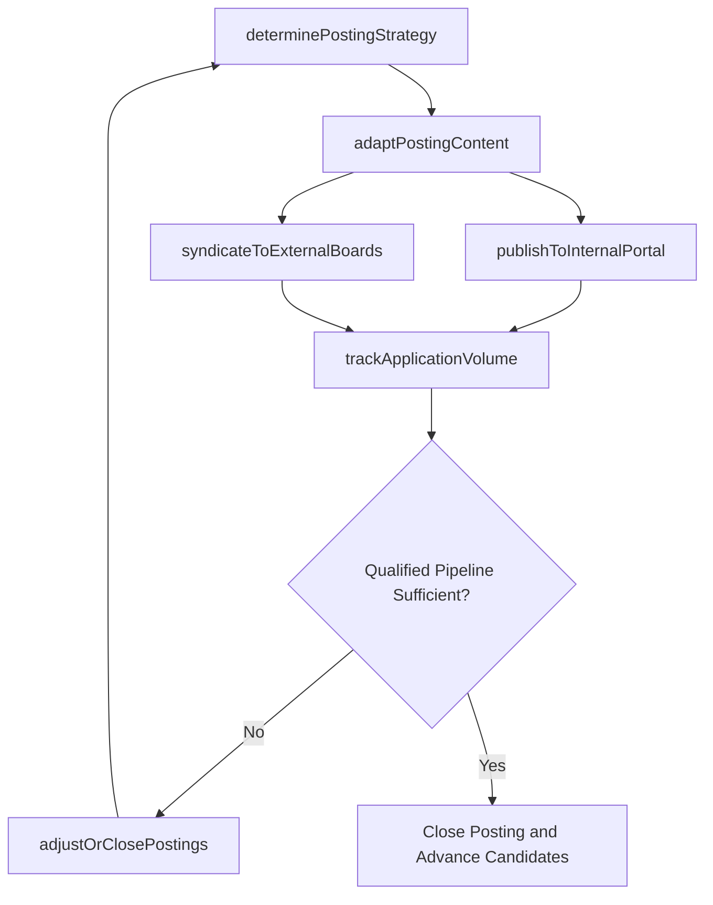

# Post job requisitions

> Business-as-Code definition for posting job requisitions. Models the distribution of approved job postings across internal boards, external job sites, and social media channels.

## Overview

Posting and advertising job descriptions. Display open job descriptions internally and externally. Use public portals, online portals, and websites to upload these requisitions in order for applications to be received.

## Process Hierarchy



## GraphDL

```yaml
post:
  object: Job Requisitions
  actor: Recruiter
  result: LiveJobPosting
```

## Actions

| Action | Description |
|--------|-------------|
| determinePostingStrategy | Select internal-only, external-only, or combined distribution based on role type, diversity goals, and sourcing strategy |
| adaptPostingContent | Tailor the job description for each channel's character limits, formatting, and keyword optimization requirements |
| publishToInternalPortal | Post the requisition on the internal careers site and trigger employee notification subscriptions |
| syndicateToExternalBoards | Distribute the posting to job boards, LinkedIn, Indeed, niche sites, and university platforms |
| trackApplicationVolume | Monitor applicant counts, source attribution, and quality indicators for each active posting |
| adjustOrClosePostings | Extend, boost, redirect, or close postings based on pipeline adequacy and time-to-fill progress |

## Events

| Event | Description |
|-------|-------------|
| postingStrategyDetermined | Distribution approach selected based on role type and sourcing goals |
| postingContentAdapted | Job posting formatted and optimized for each target channel |
| internalPortalPublished | Requisition posted on internal careers site and employee alerts triggered |
| externalBoardsSyndicated | Posting distributed to external job boards and social platforms |
| applicationVolumeTracked | Applicant counts and source attribution data recorded |
| postingAdjustedOrClosed | Posting extended, boosted, or closed based on pipeline status |

## Searches

| Search | Description |
|--------|-------------|
| findActivePostings | List currently live postings filtered by channel, role family, or department |
| getPostingPerformance | Retrieve views, click-through rates, and application counts per posting channel |
| findExpiringPostings | List postings approaching their scheduled expiration date |
| getSourceAttribution | Access applicant source breakdown for a specific posting |

## Process Flow



## RACI Matrix

| Activity | Responsible | Accountable | Consulted | Informed |
|----------|-------------|-------------|-----------|----------|
| determinePostingStrategy | Recruiter | TalentAcquisitionManager | HiringManager | Finance |
| publishToInternalPortal | RecruitingCoordinator | Recruiter | InternalComms | AllEmployees |
| syndicateToExternalBoards | Recruiter | TalentAcquisitionManager | EmployerBrandSpecialist | HiringManager |
| trackApplicationVolume | RecruitingCoordinator | Recruiter | HRAnalyst | TalentAcquisitionManager |

## Related Processes

| Process | Relationship |
|---------|-------------|
| 7.2.1.3 Open job requisitions | Upstream - requisition must be activated before it can be posted |
| 7.2.2 Recruit/source candidates | Downstream - postings generate the applicant pipeline for sourcing |
| 7.2.1.5 Modify job requisitions | Parallel - requisition modifications may require posting content updates |

## Related Departments

| Department | Role |
|-----------|------|
| Talent Acquisition | Manages posting strategy, distribution, and performance monitoring |
| Marketing | Supports employer brand content and social media amplification |
| IT | Maintains career portal, ATS integrations, and job board syndication feeds |

## Related Occupations

| Occupation | Involvement |
|-----------|-------------|
| Recruiter | Selects posting channels, manages distribution, and monitors pipeline |
| Recruiting Coordinator | Adapts posting content and publishes to internal and external platforms |
| Employer Brand Specialist | Ensures brand consistency and optimizes posting content for engagement |

## KPIs

| KPI | Description | Unit |
|-----|-------------|------|
| Application Rate | Number of applications received per active posting | Count |
| Channel Effectiveness | Qualified applicants generated per sourcing channel | Count |
| Posting Reach | Total views across all channels for a given posting | Count |
| Time to Post | Average days from requisition activation to live posting | Days |

## Usage

```typescript
import { postJobRequisitions } from '@headlessly/post-job-requisitions'

const posting = postJobRequisitions()

// Determine posting strategy and syndicate to channels
const strategy = await posting.determinePostingStrategy({
  requisitionId: 'req-5678',
  roleType: 'technical-senior',
  distribution: 'internal-and-external',
  diversityBoost: true,
  budget: 750
})

// Track application volume and source attribution
const metrics = await posting.trackApplicationVolume({
  requisitionId: 'req-5678',
  period: 'last-14-days',
  breakdownBy: ['channel', 'source', 'quality-tier']
})
```
