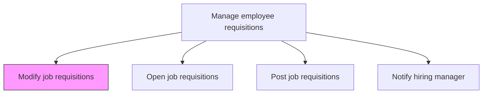
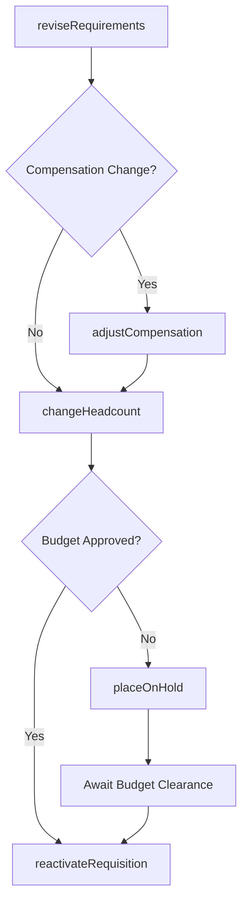

# Modify job requisitions

> Business-as-Code definition for modifying job requisitions. Models the update, cancellation, and reactivation of requisitions based on changing hiring needs, budget shifts, or position reclassifications.

## Overview

Making the necessary alterations to job requisitions. Revamp or revise the job requisitions in case a position is filled or is not vacant anymore, as well as in case of any new openings. (It involves Manage the internal/external job posting websites [10449] to make the necessary changes.)

## Process Hierarchy



## GraphDL

```yaml
modify:
  object: Job Requisitions
  actor: RecruitingCoordinator
  result: RevisedRequisition
```

## Actions

| Action | Description |
|--------|-------------|
| reviseRequirements | Update job title, qualifications, or reporting structure on the requisition |
| adjustCompensation | Modify salary range, bonus eligibility, or equity allocation |
| changeHeadcount | Increase or decrease the number of positions on a multi-fill requisition |
| placeOnHold | Freeze a requisition due to budget review, reorg, or hiring pause |
| reactivateRequisition | Reopen a previously paused or cancelled requisition for active sourcing |

## Events

| Event | Description |
|-------|-------------|
| requirementsRevised | Requisition job details updated with new qualifications or title |
| compensationAdjusted | Salary range or total compensation package modified |
| headcountChanged | Number of open positions on the requisition increased or decreased |
| requisitionPlacedOnHold | Requisition frozen and removed from active sourcing |
| requisitionReactivated | Previously paused requisition reopened for candidate sourcing |

## Searches

| Search | Description |
|--------|-------------|
| findModifiedRequisitions | List requisitions changed within a date range with modification types |
| getRequisitionAuditTrail | Retrieve the full change history for a specific requisition |
| findOnHoldRequisitions | List requisitions currently in paused or frozen status |
| getRequisitionVersionDiff | Compare two versions of a requisition to see what changed |

## Process Flow



## RACI Matrix

| Activity | Responsible | Accountable | Consulted | Informed |
|----------|-------------|-------------|-----------|----------|
| reviseRequirements | RecruitingCoordinator | Recruiter | HiringManager | HRBusinessPartner |
| adjustCompensation | CompensationAnalyst | TalentAcquisitionManager | Finance | HiringManager |
| placeOnHold | Recruiter | TalentAcquisitionManager | HiringManager | Candidates |

## Related Processes

| Process | Relationship |
|---------|-------------|
| 7.2.1.3 Open job requisitions | Upstream - original requisition that may require modification |
| 7.2.1.4 Post job requisitions | Downstream - postings must be updated to reflect changes |
| 7.2.1.6 Notify hiring manager | Downstream - manager notified of requisition modifications |
| 7.2.1.7 Manage requisition dates | Parallel - timeline adjustments triggered by modifications |

## Related Departments

| Department | Role |
|-----------|------|
| Talent Acquisition | Processes requisition modifications and updates ATS |
| Compensation | Reviews and approves salary range adjustments |
| Finance | Approves headcount and budget changes |
| Hiring Department | Initiates modification requests based on evolving needs |

## Related Occupations

| Occupation | Involvement |
|-----------|-------------|
| Recruiting Coordinator | Executes requisition changes in the ATS |
| Compensation Analyst | Validates pay range adjustments against market data |
| Hiring Manager | Requests modifications based on team changes |

## KPIs

| KPI | Description | Unit |
|-----|-------------|------|
| Modification Turnaround | Average hours from change request to requisition update | Hours |
| Posting Sync Accuracy | Percentage of postings reflecting current requisition details | % |
| Cancellation Rate | Percentage of opened requisitions cancelled before fill | % |
| Reactivation Rate | Percentage of paused requisitions later reactivated | % |

## Usage

```typescript
import { modifyJobRequisitions } from '@headlessly/modify-job-requisitions'

const requisitions = modifyJobRequisitions()

// Adjust compensation range after market analysis
await requisitions.adjustCompensation({
  requisitionId: 'req-5678',
  salaryMin: 145000,
  salaryMax: 185000,
  reason: 'market-adjustment'
})

// Freeze a requisition pending budget review
await requisitions.placeOnHold({
  requisitionId: 'req-5678',
  holdReason: 'budget-review',
  expectedResumeDate: '2025-09-01'
})
```
