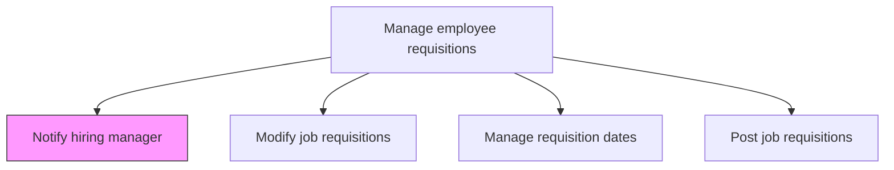
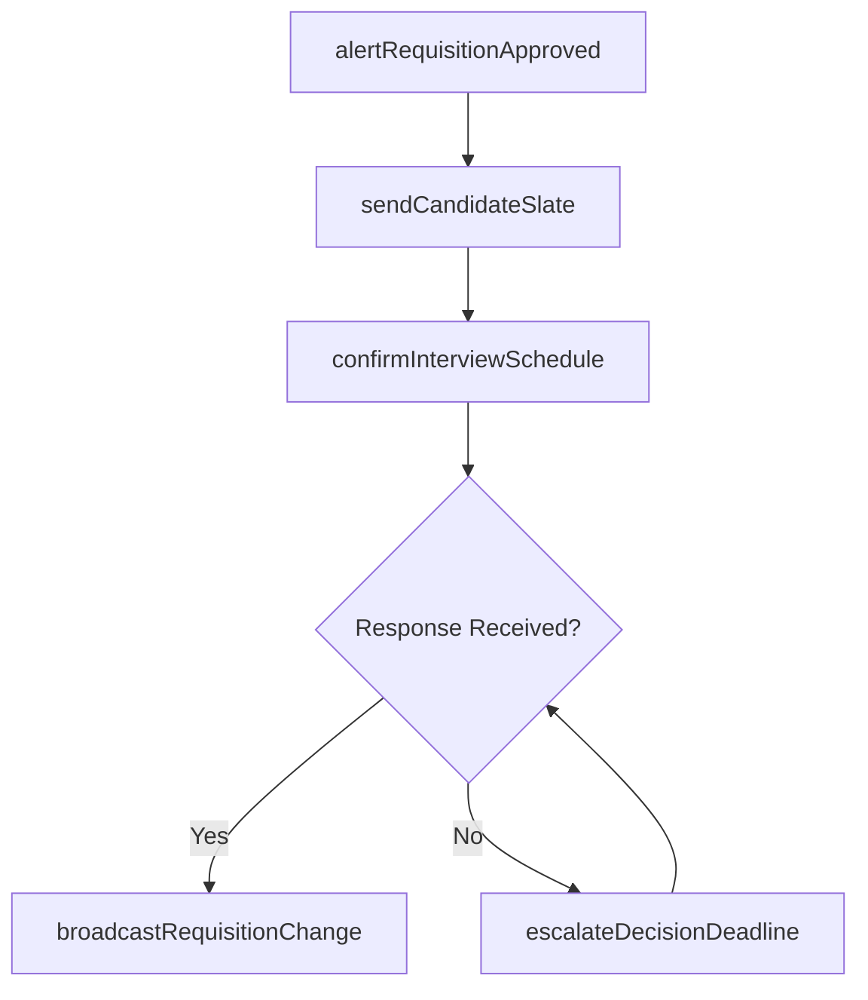

# Notify hiring manager

> Business-as-Code definition for notifying hiring managers. Models the automated and manual communication workflows that keep managers informed of requisition status, candidate pipeline milestones, and actions requiring their input.

## Overview

Informing and communicating with the hiring manager. Notify the manager responsible for the hiring process in cases of any new position openings or changes.

## Process Hierarchy



## GraphDL

```yaml
notify:
  object: Hiring Manager
  actor: RecruitingCoordinator
  result: ManagerAlert
```

## Actions

| Action | Description |
|--------|-------------|
| alertRequisitionApproved | Notify the hiring manager that their requisition has been approved and posted |
| sendCandidateSlate | Deliver a shortlist of qualified candidates for the manager's review |
| escalateDecisionDeadline | Remind the manager of pending interview feedback or selection decisions |
| broadcastRequisitionChange | Inform the manager when a requisition is modified, paused, or cancelled |
| confirmInterviewSchedule | Send confirmed interview calendar details to the hiring manager |

## Events

| Event | Description |
|-------|-------------|
| requisitionApprovalAlerted | Manager notified of requisition approval and posting activation |
| candidateSlateDelivered | Shortlisted candidates sent to hiring manager for review |
| decisionDeadlineEscalated | Reminder sent for overdue interview feedback or selection decision |
| requisitionChangeBroadcast | Manager informed of requisition modification or status change |
| interviewScheduleConfirmed | Interview calendar details delivered to hiring manager |

## Searches

| Search | Description |
|--------|-------------|
| findPendingAlerts | List notifications awaiting manager acknowledgment |
| getNotificationLog | Retrieve all notifications sent for a requisition or manager |
| findOverdueResponses | List managers with unacknowledged alerts past the SLA threshold |
| getManagerPreferences | Access notification channel and frequency preferences |

## Process Flow



## RACI Matrix

| Activity | Responsible | Accountable | Consulted | Informed |
|----------|-------------|-------------|-----------|----------|
| alertRequisitionApproved | ATSSystem | RecruitingCoordinator | Recruiter | HiringManager |
| sendCandidateSlate | Recruiter | TalentAcquisitionManager | HiringManager | HRBusinessPartner |
| escalateDecisionDeadline | RecruitingCoordinator | TalentAcquisitionManager | Recruiter | VP HR |

## Related Processes

| Process | Relationship |
|---------|-------------|
| 7.2.1.3 Open job requisitions | Upstream - requisition approval triggers initial notification |
| 7.2.1.5 Modify job requisitions | Upstream - modifications trigger change notifications |
| 7.2.1.7 Manage requisition dates | Parallel - date milestones trigger deadline escalations |
| 7.2.3.2 Interview candidates | Downstream - interview scheduling prompts manager confirmation |

## Related Departments

| Department | Role |
|-----------|------|
| Talent Acquisition | Manages notification workflows and escalation rules |
| Hiring Department | Receives and acts on notifications |
| IT | Maintains ATS notification engine and integrations |

## Related Occupations

| Occupation | Involvement |
|-----------|-------------|
| Recruiting Coordinator | Configures and monitors notification delivery |
| Recruiter | Curates candidate slates and triggers key alerts |
| Hiring Manager | Receives and acknowledges notifications |

## KPIs

| KPI | Description | Unit |
|-----|-------------|------|
| Acknowledgment Rate | Percentage of notifications acknowledged within 24 hours | % |
| Manager Response Time | Average hours from notification to manager action | Hours |
| Escalation Rate | Percentage of notifications requiring reminder escalation | % |
| Slate Review Time | Average hours for manager to review candidate shortlist | Hours |

## Usage

```typescript
import { notifyHiringManager } from '@headlessly/notify-hiring-manager'

const alerts = notifyHiringManager()

// Send a candidate shortlist for manager review
await alerts.sendCandidateSlate({
  requisitionId: 'req-5678',
  hiringManagerId: 'mgr-1234',
  candidateIds: ['cand-101', 'cand-102', 'cand-103']
})

// Escalate overdue interview feedback
await alerts.escalateDecisionDeadline({
  requisitionId: 'req-5678',
  hiringManagerId: 'mgr-1234',
  overdueDays: 3
})
```
