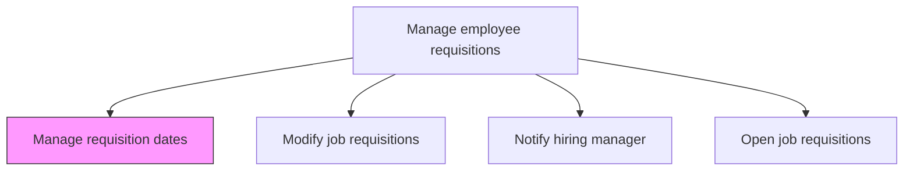
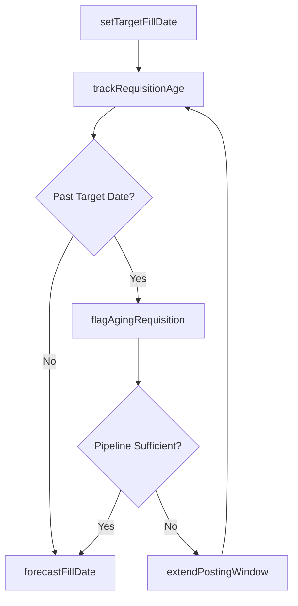

# Manage requisition dates

> Business-as-Code definition for managing requisition dates. Models the scheduling, tracking, and enforcement of key hiring milestones including open date, target fill date, posting expiration, and aging thresholds.

## Overview

Determining and managing the dates for the employee requisition process. Set target fill dates, monitor requisition aging, extend or shorten posting windows, and enforce service-level agreements between talent acquisition and hiring departments.

## Process Hierarchy



## GraphDL

```yaml
manage:
  object: Requisition Dates
  actor: RecruitingCoordinator
  result: RequisitionTimeline
```

## Actions

| Action | Description |
|--------|-------------|
| setTargetFillDate | Establish the expected date by which the position should be filled |
| extendPostingWindow | Lengthen the job posting duration when the candidate pipeline is insufficient |
| trackRequisitionAge | Monitor the number of days a requisition has been open against SLA thresholds |
| flagAgingRequisition | Mark requisitions that exceed the target fill date for escalation |
| forecastFillDate | Project an estimated fill date based on current pipeline velocity |

## Events

| Event | Description |
|-------|-------------|
| targetFillDateSet | Target fill date established or updated for the requisition |
| postingWindowExtended | Job posting duration lengthened to attract more candidates |
| requisitionAgeTracked | Requisition aging data refreshed against SLA benchmarks |
| agingRequisitionFlagged | Overdue requisition escalated for management attention |
| fillDateForecasted | Estimated fill date projected from current pipeline metrics |

## Searches

| Search | Description |
|--------|-------------|
| findAgingRequisitions | List requisitions exceeding their target fill date |
| getRequisitionTimeline | Retrieve key date milestones for a specific requisition |
| findExpiringPostings | List postings approaching their expiration date |
| getTimeToFillTrend | Retrieve historical time-to-fill data by department or role |

## Process Flow



## RACI Matrix

| Activity | Responsible | Accountable | Consulted | Informed |
|----------|-------------|-------------|-----------|----------|
| setTargetFillDate | Recruiter | TalentAcquisitionManager | HiringManager | HRBusinessPartner |
| trackRequisitionAge | RecruitingCoordinator | Recruiter | TalentAcquisitionManager | HiringManager |
| flagAgingRequisition | RecruitingCoordinator | TalentAcquisitionManager | VP HR | HiringManager |

## Related Processes

| Process | Relationship |
|---------|-------------|
| 7.2.1.3 Open job requisitions | Upstream - opening a requisition sets the initial target dates |
| 7.2.1.5 Modify job requisitions | Parallel - modifications may trigger date adjustments |
| 7.2.1.6 Notify hiring manager | Downstream - aging alerts sent to hiring managers |
| 7.2.2.1 Determine recruitment methods and channels | Downstream - timeline drives urgency of sourcing approach |

## Related Departments

| Department | Role |
|-----------|------|
| Talent Acquisition | Sets target dates and monitors requisition aging |
| Hiring Department | Agrees on target fill dates and urgency |
| HR Operations | Reports on time-to-fill SLA compliance |

## Related Occupations

| Occupation | Involvement |
|-----------|-------------|
| Recruiting Coordinator | Tracks requisition milestones and flags aging positions |
| Recruiter | Negotiates target dates with hiring managers |
| HR Analyst | Generates time-to-fill reporting and trend analysis |

## KPIs

| KPI | Description | Unit |
|-----|-------------|------|
| Time to Fill | Average days from requisition opening to offer acceptance | Days |
| SLA Compliance | Percentage of requisitions filled within target date | % |
| Aging Rate | Percentage of open requisitions past their target fill date | % |
| Forecast Accuracy | Deviation between forecasted and actual fill dates | Days |

## Usage

```typescript
import { manageRequisitionDates } from '@headlessly/manage-requisition-dates'

const timeline = manageRequisitionDates()

// Set a target fill date for a new requisition
await timeline.setTargetFillDate({
  requisitionId: 'req-5678',
  targetDate: '2025-10-15',
  urgency: 'high'
})

// Find requisitions that have exceeded their SLA
const aging = await timeline.findAgingRequisitions({
  department: 'engineering',
  overdueDaysMin: 14
})
```
