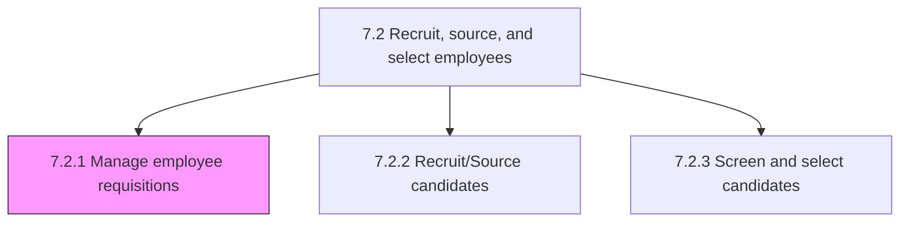
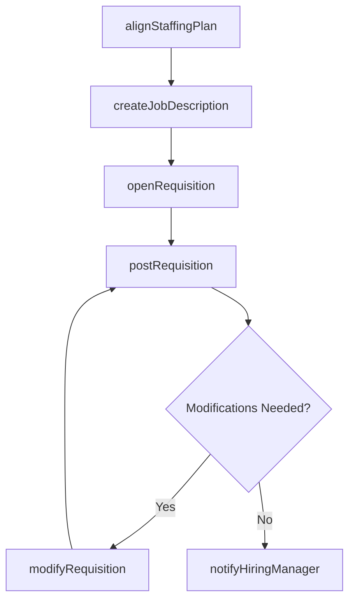

# Manage employee requisitions

> Business-as-Code definition for job requisition management. Models staffing alignment, job description development, requisition creation, posting, modification, and hiring manager notification.

## Overview

Handling the requirements for new employees. Create and open job requisitions by clearly defining the job descriptions. Post these requirements internally and externally, and modify them as appropriate. Manage the dates of the whole requisition process.

## Process Hierarchy



## GraphDL

```yaml
manage:
  object: Employee Requisitions
  actor: RequisitionCoordinator
  result: ApprovedRequisition
```

## Actions

| Action | Description |
|--------|-------------|
| alignStaffingPlan | Map hiring needs to workforce plan and business unit strategies |
| createJobDescription | Draft role requirements, qualifications, and responsibilities |
| openRequisition | Create and approve a new job requisition in the ATS |
| postRequisition | Publish job requisition to internal and external job boards |
| modifyRequisition | Update requisition details based on changing requirements |
| notifyHiringManager | Alert hiring manager of requisition status changes |

## Events

| Event | Description |
|-------|-------------|
| staffingPlanAligned | Hiring needs mapped to workforce plan |
| jobDescriptionCreated | Role requirements and qualifications documented |
| requisitionOpened | Job requisition created and approved |
| requisitionPosted | Job requisition published to hiring channels |
| requisitionModified | Requisition details updated |
| hiringManagerNotified | Hiring manager alerted of requisition activity |

## Searches

| Search | Description |
|--------|-------------|
| getOpenRequisitions | List open requisitions by department, role level, or date |
| getRequisitionStatus | Retrieve status and timeline for a specific requisition |
| getJobDescriptions | Query job descriptions by role family or department |

## Process Flow



## RACI Matrix

| Activity | Responsible | Accountable | Consulted | Informed |
|----------|-------------|-------------|-----------|----------|
| alignStaffingPlan | Workforce Planner | VP HR | Finance, Business Unit Heads | Talent Acquisition |
| createJobDescription | Hiring Manager | Talent Acquisition Manager | HR Business Partner | Compensation |
| openRequisition | Recruiter | Talent Acquisition Manager | Finance | Hiring Manager |
| postRequisition | Recruiter | Talent Acquisition Manager | Marketing | HRIS Admin |

## Sub-Processes

| ID | Name | Description |
|----|------|-------------|
| 7.2.1.1 | Align staffing plan to work force plan and business unit strategies/resource needs | Creating a correspondence between the plan for hiring new employees and the desired employee require |
| 7.2.1.2 | Develop and maintain job descriptions | Creating descriptions for job requisitions. Define the normal components of a job description, such  |
| 7.2.1.3 | Open job requisitions | Developing specific job requisitions, and ensuring their accessibility. Create and open a job requis |
| 7.2.1.4 | Post job requisitions | Posting and advertising job descriptions. Display open job descriptions internally and externally. U |
| 7.2.1.5 | Modify job requisitions | Making the necessary alterations to job requisitions. Revamp or revise the job requisitions in case  |
| 7.2.1.6 | Notify hiring manager | Informing and communicating with the hiring manager. Notify the manager responsible for the hiring p |
| 7.2.1.7 | Manage requisition dates | Determining and managing the dates for the employee requisition process. |

## Related Processes

| Process | Relationship |
|---------|-------------|
| 7.1.2 Develop and implement workforce strategy and policies | Upstream - workforce plan drives requisition needs |
| 7.2.2 Recruit/Source candidates | Downstream - posted requisitions trigger sourcing |
| 7.2.5 Manage applicant information | Parallel - requisitions link to applicant records |

## Related Departments

| Department | Role |
|-----------|------|
| Talent Acquisition | Manages requisition workflow and job postings |
| Hiring Departments | Define role requirements and approve requisitions |
| Finance | Approves headcount budget for new positions |

## Related Occupations

| Occupation | Involvement |
|-----------|-------------|
| Recruiter | Coordinates requisition creation and posting |
| Hiring Manager | Defines requirements and approves requisitions |

## KPIs

| KPI | Description | Unit |
|-----|-------------|------|
| Requisition Approval Time | Average days from requisition creation to approval | Days |
| Requisition Fill Rate | Percentage of approved requisitions filled within target | % |
| Job Description Accuracy | Percentage of requisitions requiring zero modifications | % |

## Usage

```typescript
import { manageEmployeeRequisitions } from '@headlessly/manage-employee-requisitions'

const requisitions = manageEmployeeRequisitions()

// Open a requisition
const req = await requisitions.openRequisition({
  title: 'Product Manager',
  department: 'product',
  level: 'L4',
  headcountType: 'new-position',
  targetStartDate: '2025-06-01'
})

// Post the requisition
await requisitions.postRequisition({
  requisitionId: req.id,
  channels: ['internal', 'linkedin', 'careers-page']
})
```
