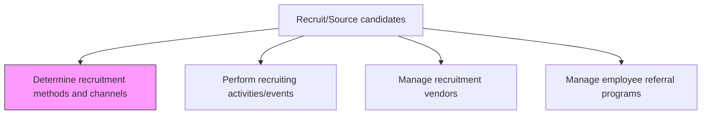
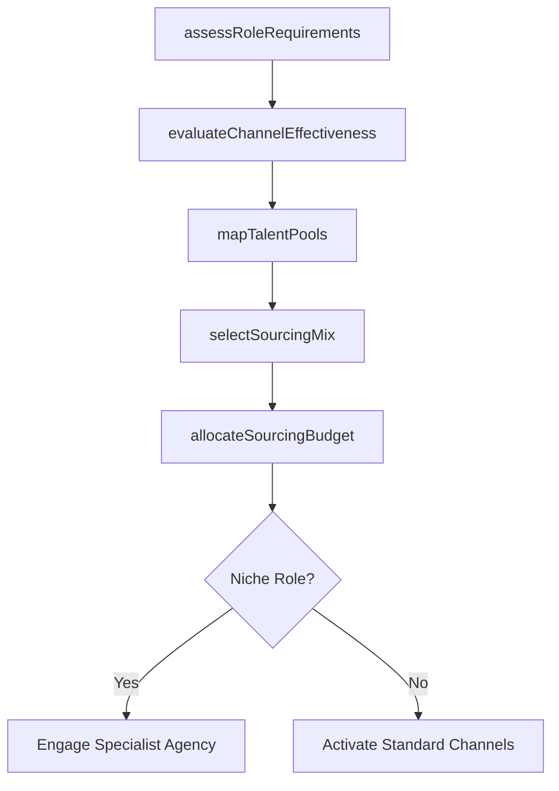

# Determine recruitment methods and channels

> Business-as-Code definition for determining recruitment methods and channels. Models the strategic selection and prioritization of sourcing approaches -- job boards, headhunters, social media, campus recruiting, internal mobility -- to maximize qualified candidate flow for each role type.

## Overview

Defining the methods and channels for recruitments in order to maximize the amount of candidate availability. Use channels such as headhunting, job postings, job portals, networking websites, and media advertising. Choose from the various methods of recruitment such as internal/external third-party sourcing.

## Process Hierarchy



## GraphDL

```yaml
determine:
  object: Recruitment Methods And Channels
  actor: TalentAcquisitionManager
  result: SourcingStrategy
```

## Actions

| Action | Description |
|--------|-------------|
| assessRoleRequirements | Evaluate the seniority, skills, and urgency of the open position to guide channel selection |
| evaluateChannelEffectiveness | Analyze historical cost-per-hire and quality-of-hire data across sourcing channels |
| selectSourcingMix | Choose the combination of job boards, agencies, social media, and internal channels |
| allocateSourcingBudget | Distribute the recruitment budget across selected channels based on expected ROI |
| mapTalentPools | Identify passive candidate communities, alumni networks, and industry groups to target |

## Events

| Event | Description |
|-------|-------------|
| roleRequirementsAssessed | Position analyzed for seniority, skills, and sourcing urgency |
| channelEffectivenessEvaluated | Historical channel performance data reviewed and ranked |
| sourcingMixSelected | Combination of recruitment channels chosen for the requisition |
| sourcingBudgetAllocated | Budget distributed across selected channels |
| talentPoolsMapped | Target communities and passive candidate pools identified |

## Searches

| Search | Description |
|--------|-------------|
| findChannelPerformance | Retrieve cost-per-hire and conversion rates by sourcing channel |
| getChannelsByRole | List recommended channels for a given role type or department |
| getSourcingBudgetStatus | View remaining budget allocation across active channels |
| findTopPerformingChannels | Rank channels by quality-of-hire or time-to-fill metrics |

## Process Flow



## RACI Matrix

| Activity | Responsible | Accountable | Consulted | Informed |
|----------|-------------|-------------|-----------|----------|
| assessRoleRequirements | Recruiter | TalentAcquisitionManager | HiringManager | HRBusinessPartner |
| evaluateChannelEffectiveness | HRAnalyst | TalentAcquisitionManager | Recruiter | Finance |
| allocateSourcingBudget | TalentAcquisitionManager | VP HR | Finance | Recruiter |

## Related Processes

| Process | Relationship |
|---------|-------------|
| 7.2.2.2 Perform recruiting activities/events | Downstream - selected channels drive event planning |
| 7.2.2.3 Manage recruitment vendors | Downstream - vendor engagement follows channel selection |
| 7.2.2.5 Manage recruitment channels | Downstream - ongoing channel management after initial selection |
| 7.2.1.1 Align staffing plan to workforce plan | Upstream - workforce plan informs sourcing priorities |

## Related Departments

| Department | Role |
|-----------|------|
| Talent Acquisition | Owns channel strategy and sourcing budget allocation |
| Finance | Approves recruitment budget and tracks spend |
| Marketing | Supports employer branding across chosen channels |
| IT | Provides ATS integrations with job boards and platforms |

## Related Occupations

| Occupation | Involvement |
|-----------|-------------|
| Talent Acquisition Manager | Sets sourcing strategy and allocates budget |
| Recruiter | Provides field insight on channel performance |
| HR Analyst | Analyzes channel effectiveness data |

## KPIs

| KPI | Description | Unit |
|-----|-------------|------|
| Channel Yield Ratio | Percentage of applicants per channel who advance to interview | % |
| Cost Per Qualified Applicant | Recruitment spend per channel divided by qualified applicants | USD |
| Source of Hire | Distribution of successful hires across sourcing channels | % |
| Channel ROI | Revenue value of hire versus channel investment | Ratio |

## Usage

```typescript
import { determineRecruitmentMethodsAndChannels } from '@headlessly/determine-recruitment-methods-and-channels'

const sourcing = determineRecruitmentMethodsAndChannels()

// Evaluate channel performance for engineering roles
const channels = await sourcing.evaluateChannelEffectiveness({
  roleFamily: 'engineering',
  region: 'North America',
  lookbackMonths: 12
})

// Select and activate a sourcing mix
await sourcing.selectSourcingMix({
  requisitionId: 'req-8901',
  channels: ['linkedin', 'github-jobs', 'employee-referral'],
  budgetCap: 5000
})
```
