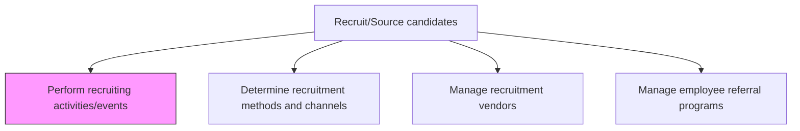
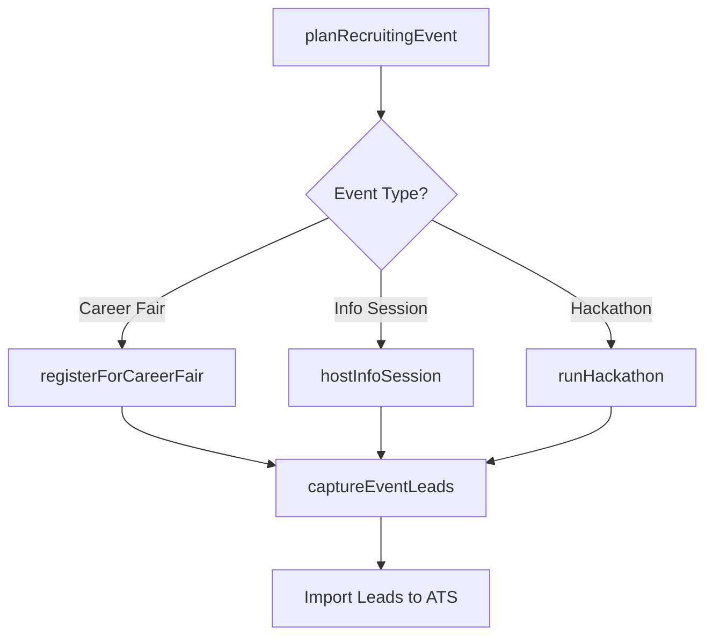

# Perform recruiting activities/events

> Business-as-Code definition for performing recruiting activities and events. Models the planning, execution, and follow-up of talent attraction events such as career fairs, campus recruiting, hackathons, open houses, and information sessions.

## Overview

Organizing and executing recruiting activities and events. Activities and events include on-campus hiring, refresher courses, information sessions, career fairs, etc. to increase the coverage of the sourcing in order to ensure that the most deserving and appropriate candidates are hired.

## Process Hierarchy



## GraphDL

```yaml
perform:
  object: Recruiting Events
  actor: Recruiter
  result: EventOutcome
```

## Actions

| Action | Description |
|--------|-------------|
| planRecruitingEvent | Define event type, venue, date, staffing, and target candidate personas |
| registerForCareerFair | Secure booth space and logistics for university or industry career fairs |
| hostInfoSession | Conduct employer branding presentations and Q&A sessions for prospective candidates |
| runHackathon | Organize competitive coding or design challenges to evaluate technical talent |
| captureEventLeads | Collect candidate contact information and resumes during the event |

## Events

| Event | Description |
|-------|-------------|
| recruitingEventPlanned | Event logistics, staffing, and target audience finalized |
| careerFairRegistered | Booth space and materials confirmed for upcoming career fair |
| infoSessionHosted | Employer branding presentation delivered to prospective candidates |
| hackathonCompleted | Technical challenge event concluded with participant scores recorded |
| eventLeadsCaptured | Candidate contact details and resumes collected and imported into ATS |

## Searches

| Search | Description |
|--------|-------------|
| findUpcomingEvents | List scheduled recruiting events by type, date, or region |
| getEventLeadCount | Retrieve the number of candidate leads captured per event |
| getEventROI | Calculate cost-per-lead and cost-per-hire from specific events |
| findEventsByConversion | Rank recruiting events by lead-to-hire conversion rate |

## Process Flow



## RACI Matrix

| Activity | Responsible | Accountable | Consulted | Informed |
|----------|-------------|-------------|-----------|----------|
| planRecruitingEvent | Recruiter | TalentAcquisitionManager | EmployerBrandManager | HiringManagers |
| registerForCareerFair | RecruitingCoordinator | Recruiter | UniversityRelations | Finance |
| captureEventLeads | RecruitingCoordinator | Recruiter | ITSystems | TalentAcquisitionManager |

## Related Processes

| Process | Relationship |
|---------|-------------|
| 7.2.2.1 Determine recruitment methods and channels | Upstream - channel strategy drives event selection |
| 7.2.2.3 Manage recruitment vendors | Parallel - vendor-sponsored events or staffing support |
| 7.2.2.5 Manage recruitment channels | Downstream - event channels require ongoing management |
| 7.2.3.1 Identify and deploy candidate selection tools | Downstream - event leads enter the screening pipeline |

## Related Departments

| Department | Role |
|-----------|------|
| Talent Acquisition | Plans and staffs recruiting events |
| Marketing | Provides employer branding collateral and event promotion |
| University Relations | Manages campus recruiting partnerships |
| Finance | Approves event budgets and tracks spend |

## Related Occupations

| Occupation | Involvement |
|-----------|-------------|
| Recruiter | Represents the employer and engages candidates at events |
| Recruiting Coordinator | Handles event logistics and lead capture |
| Employer Brand Manager | Develops event messaging and marketing materials |

## KPIs

| KPI | Description | Unit |
|-----|-------------|------|
| Leads Per Event | Average number of candidate leads captured per recruiting event | Count |
| Event Conversion Rate | Percentage of event leads who advance to phone screen | % |
| Cost Per Event Lead | Total event cost divided by leads captured | USD |
| Offer Rate from Events | Percentage of event-sourced candidates who receive an offer | % |

## Usage

```typescript
import { performRecruitingActivitiesEvents } from '@headlessly/perform-recruiting-activities-events'

const events = performRecruitingActivitiesEvents()

// Plan an upcoming campus recruiting event
await events.planRecruitingEvent({
  type: 'career-fair',
  venue: 'MIT Stata Center',
  date: '2025-10-15',
  targetRoles: ['software-engineer', 'data-scientist']
})

// Retrieve leads captured from recent events
const leads = await events.captureEventLeads({
  eventId: 'evt-2345',
  importToATS: true
})
```
